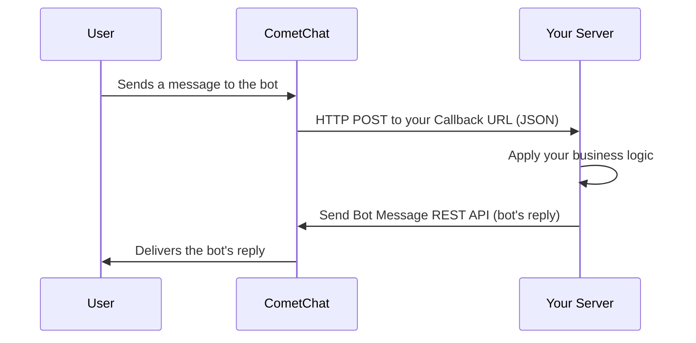

In CometChat, Custom bots are unique users capable of autonomously sending and receiving messages.

Users can interact with bots through private one-on-one conversations or within group chats. When a bot receives a message, whether from an individual chat or a group, CometChat relays that message to a `Callback URL` that you configure. Upon receiving the message, you can process it according to your business logic and send a response using CometChat's API.

<Note>
A **custom bot** lets you bring your own backend and logic — CometChat only forwards messages to your callback URL and posts your responses back. If you would rather configure an agent (tools, knowledge base, MCP servers) without running your own orchestration, use CometChat's native [Agent Builder APIs](/rest-api/ai-agents-apis/overview) instead.
</Note>

The flow at a glance:



## Create a callback endpoint

### Callback endpoint requirements

1. Your callback endpoint must be accessible over HTTPS. This is essential to ensure the security and integrity of data transmission.
2. This URL should be publicly accessible from the internet.
3. Ensure that your endpoint supports the HTTP POST method. Event payloads will be delivered via HTTP POST requests in JSON format.
4. Configure your endpoint to respond immediately to the CometChat server with a 200 OK response.

### Security

It is recommended to set up a Basic Authentication that is usually used for server-to-server calls. This requires you to configure a username and password. Whenever your callback endpoint is triggered, the HTTP Header will contain:

```html
Authorization: Basic <Base64-encoded-credentials>
```

## Configuring a bot

### Create a user

CometChat requires each bot to be linked to a user account. This approach offers a significant benefit: It allows you to log in as the bot at any time and send personalized responses.

Therefore, before setting up a bot, you must first create a new user. You can create a user from CometChat dashboard or make use of CometChat's [Create user](/rest-api/users/create) REST API to do so.

### Create a bot

<Frame>
  
</Frame>

After you've set up a user, you can proceed to create a new bot.

1. Login to [CometChat](https://app.cometchat.com/login) dashboard and select your app.
2. Navigate to **AI Agents** > **Custom Bots** in the left-hand menu.
3. Add a new bot.
4. Configure the bot by saving the following details:

* UID: The identifier (UID) of the user that was created in the previous step.
* URL: The callback URL of your bot.
* Group Setting: Select the criteria for relaying a group message to your bot.
* Security: It is recommended to enable authentication for your callback URL.

5. Enable the bot.
6. Save the configuration.

The actual development and behavior of the bot are completely in your hands. All you need to do is provide a Callback URL, and CometChat will then automatically relay all messages that meet the specified criteria to that URL.

### Responding as a bot

After your bot's callback endpoint has received and processed a message, and you're ready to send a response back, make use of CometChat's [Send Bot Message](/rest-api/messages/send-bot-message) REST API to do so. This API posts a message authored by the bot's UID (`POST /bots/{uid}/messages`).

<Note>
The exact JSON shape CometChat POSTs to your Callback URL is not documented on this page. Log the incoming request body from your endpoint to inspect it, or contact the CometChat team for the current payload reference.
</Note>

## Next steps

<CardGroup cols={2}>
  <Card title="Custom Agents" icon="robot" href="/ai-chatbots/custom-agents">
    Configure a custom agent the same way as a custom bot.
  </Card>
  <Card title="Send Bot Message (REST API)" icon="paper-plane" href="/rest-api/messages/send-bot-message">
    Post the bot's reply back into the conversation.
  </Card>
  <Card title="Create User (REST API)" icon="user-plus" href="/rest-api/users/create">
    Create the user account that backs the bot.
  </Card>
  <Card title="Agent Builder APIs" icon="wand-magic-sparkles" href="/rest-api/ai-agents-apis/overview">
    Build native agents with tools and knowledge bases instead.
  </Card>
</CardGroup>
