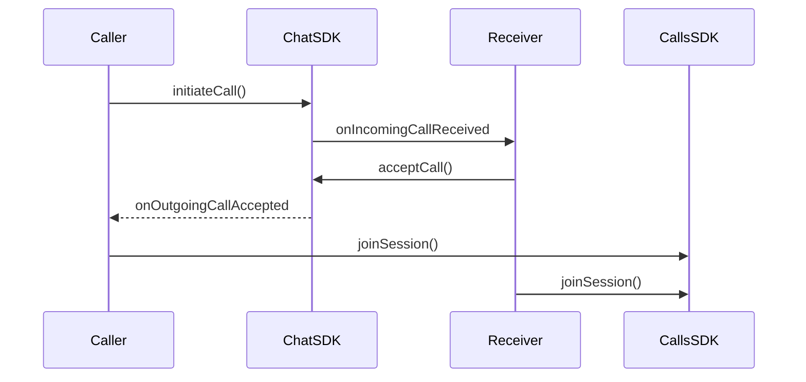
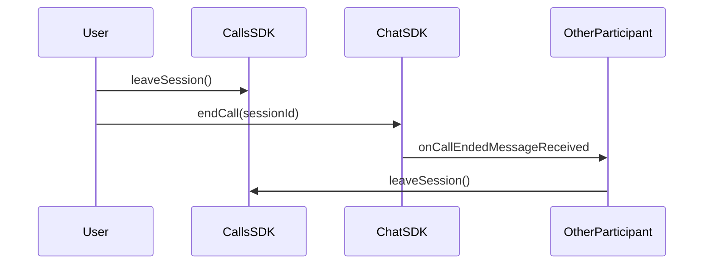

Implement incoming and outgoing call notifications with accept/reject functionality. Ringing enables real-time call signaling between users, allowing them to initiate calls and respond to incoming call requests.

<Note>
Ringing functionality requires the CometChat Chat SDK for Flutter to be integrated alongside the Calls SDK. The Chat SDK handles call signaling (initiating, accepting, rejecting calls), while the Calls SDK manages the actual call session.
</Note>

## How Ringing Works

The ringing flow involves two SDKs working together:

1. **Chat SDK** - Handles call signaling (initiate, accept, reject, cancel)
2. **Calls SDK** - Manages the actual call session once accepted



<Warning>
**Ringing imports BOTH SDKs, and both declare `User`.** `cometchat_calls_sdk` and `cometchat_sdk`
each export a `User` class, so importing both barrels makes the name ambiguous and the file will
not compile. Hide it from one import:

```dart
import 'package:cometchat_calls_sdk/cometchat_calls_sdk.dart' hide User;
import 'package:cometchat_sdk/cometchat_sdk.dart';
```

Pick whichever side your code actually uses; the Chat SDK's `User` is the one the signalling
callbacks hand you.
</Warning>

## Initiate a Call

Use the Chat SDK to initiate a call to a user or group:

```dart
String receiverID = "USER_ID";
String receiverType = CometChatReceiverType.user;
String callType = CometChatCallType.video;

Call call = Call(
  receiverUid: receiverID,
  receiverType: receiverType,
  type: callType,
);

CometChat.initiateCall(call,
  onSuccess: (Call call) {
    debugPrint("Call initiated: ${call.sessionId}");
    // Show outgoing call UI
  },
  onError: (CometChatException e) {
    debugPrint("Call initiation failed: ${e.message}");
  },
);
```

| Parameter | Type | Description |
|-----------|------|-------------|
| `receiverID` | String | UID of the user or GUID of the group to call |
| `receiverType` | String | `CometChatReceiverType.user` or `CometChatReceiverType.group` |
| `callType` | String | `CometChatCallType.video` or `CometChatCallType.audio` |

## Call Timeout

If the receiver does not answer, the call is eventually marked `unanswered` and the caller
receives the `onOutgoingCallRejected` callback.

<Warning>
**The timeout is server-side and cannot be set from the client.** `CometChat.initiateCall` takes
only the `Call` object plus `onSuccess` / `onError` — there is no `timeout` parameter in the
Flutter SDK. To end an unanswered call earlier than the server does, cancel it yourself with
`CometChat.rejectCall(sessionId, CometChatCallStatus.cancelled)` on a timer you own.
</Warning>

## Listen for Incoming Calls

Register a call listener to receive incoming call notifications:

```dart
String listenerID = "UNIQUE_LISTENER_ID";

class _AppCallListener with CallListener {
  @override
  void onIncomingCallReceived(Call call) {
    debugPrint("Incoming call from: ${(call.callInitiator as User?)?.name}");
    // Show incoming call UI with accept/reject options
  }

  @override
  void onOutgoingCallAccepted(Call call) {
    debugPrint("Call accepted, joining session...");
    final sessionId = call.sessionId;
    if (sessionId != null) joinCallSession(sessionId);
  }

  @override
  void onOutgoingCallRejected(Call call) {
    debugPrint("Call rejected");
    // Dismiss outgoing call UI
  }

  @override
  void onIncomingCallCancelled(Call call) {
    debugPrint("Incoming call cancelled");
    // Dismiss incoming call UI
  }

  @override
  void onCallEndedMessageReceived(Call call) {
    debugPrint("Call ended");
  }
}

CometChat.addCallListener(listenerID, _AppCallListener());
```

| Callback | Description |
|----------|-------------|
| `onIncomingCallReceived` | A new incoming call is received |
| `onOutgoingCallAccepted` | The receiver accepted your outgoing call |
| `onOutgoingCallRejected` | The receiver rejected your outgoing call, or the call timed out as unanswered |
| `onIncomingCallCancelled` | The caller cancelled the incoming call |
| `onCallEndedMessageReceived` | The call has ended |

<Warning>
Remember to remove the call listener when it's no longer needed to prevent memory leaks. In Flutter, you must manually remove listeners in your widget's `dispose()` method:
```dart
CometChat.removeCallListener(listenerID);
```
</Warning>

## Accept a Call

When an incoming call is received, accept it using the Chat SDK:

```dart
void acceptIncomingCall(String sessionId) {
  CometChat.acceptCall(sessionId,
    onSuccess: (Call call) {
      debugPrint("Call accepted");
      final sessionId = call.sessionId;
      if (sessionId != null) joinCallSession(sessionId);
    },
    onError: (CometChatException e) {
      debugPrint("Accept call failed: ${e.message}");
    },
  );
}
```

## Reject a Call

Reject an incoming call:

```dart
void rejectIncomingCall(String sessionId) {
  String status = CometChatCallStatus.rejected;

  CometChat.rejectCall(sessionId, status,
    onSuccess: (Call call) {
      debugPrint("Call rejected");
      // Dismiss incoming call UI
    },
    onError: (CometChatException e) {
      debugPrint("Reject call failed: ${e.message}");
    },
  );
}
```

## Cancel a Call

Cancel an outgoing call before it's answered:

```dart
void cancelOutgoingCall(String sessionId) {
  String status = CometChatCallStatus.cancelled;

  CometChat.rejectCall(sessionId, status,
    onSuccess: (Call call) {
      debugPrint("Call cancelled");
      // Dismiss outgoing call UI
    },
    onError: (CometChatException e) {
      debugPrint("Cancel call failed: ${e.message}");
    },
  );
}
```

## Join the Call Session

After accepting a call (or when your outgoing call is accepted), join the call session using the Calls SDK:

```dart
void joinCallSession(String sessionId) {
  SessionSettings sessionSettings = SessionSettingsBuilder()
      .setType(SessionType.video)
      .build();

  CometChatCalls.joinSession(
    sessionId: sessionId,
    sessionSettings: sessionSettings,
    onSuccess: (Widget? callWidget) {
      debugPrint("Joined call session");
      // Place callWidget in your widget tree to render the call UI
    },
    onError: (CometChatCallsException e) {
      debugPrint("Failed to join: ${e.message}");
    },
  );
}
```

<Note>
In Flutter, `joinSession` returns a `Widget?` through the `onSuccess` callback. You must place this widget in your Flutter widget tree to render the call UI. See [Join Session](/calls/flutter/join-session) for more details.
</Note>

## End a Call

Properly ending a call requires coordination between both SDKs to ensure all participants are notified and call logs are recorded correctly.

<Warning>
Always call `CometChat.endCall()` when ending a call. This notifies the other participant and ensures the call is properly logged. Without this, the other user won't know the call has ended and call logs may be incomplete.
</Warning>



When using the default call UI, listen for the end call button click using `ButtonClickListeners` and call `endCall()`:

```dart
class _ButtonClickListener extends ButtonClickListeners {
  @override
  void onLeaveSessionButtonClicked() {
    endCall(currentSessionId);
  }
}

CallSession? callSession = CallSession.getInstance();

// Listen for end call button click
callSession?.addButtonClickListener(_ButtonClickListener());

void endCall(String sessionId) {
  // 1. Leave the call session (Calls SDK)
  CallSession.getInstance()?.leaveSession();

  // 2. Notify other participants (Chat SDK)
  CometChat.endCall(sessionId,
    onSuccess: (Call call) {
      debugPrint("Call ended successfully");
      Navigator.of(context).pop();
    },
    onError: (CometChatException e) {
      debugPrint("End call failed: ${e.message}");
      Navigator.of(context).pop();
    },
  );
}
```

The other participant receives `onCallEndedMessageReceived` callback and should leave the session:

```dart
CometChat.addCallListener(listenerID, CallListener(
  onCallEndedMessageReceived: (Call call) {
    CallSession.getInstance()?.leaveSession();
    Navigator.of(context).pop();
  },
  // Other callbacks...
));
```

## Call Status Values

| Status | Description |
|--------|-------------|
| `initiated` | Call has been initiated but not yet answered |
| `ongoing` | Call is currently in progress |
| `busy` | Receiver is busy on another call |
| `rejected` | Receiver rejected the call |
| `cancelled` | Caller cancelled before receiver answered |
| `ended` | Call ended normally |
| `missed` | Receiver didn't answer in time |
| `unanswered` | Call was not answered within the timeout duration |
