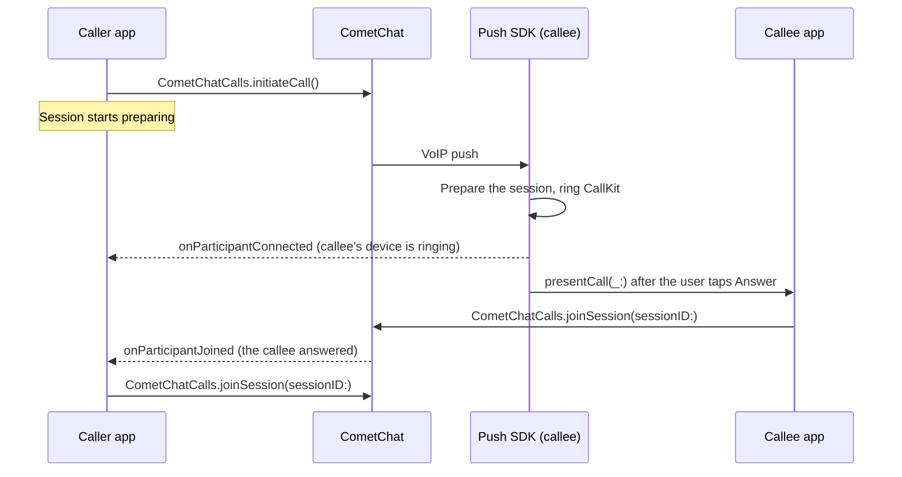

Ring another user, let them answer or decline, and join the call when they answer. The Calls SDK
places and ends the call. On the receiving device, the
[Push Notifications SDK](/calls/ios/voip-calling) rings it through CallKit and hands it to
your app when the user answers.

<Note>
  This flow needs **no Chat SDK**. If your app rings with the Chat SDK today
  (`CometChat.initiateCall`, `acceptCall`, `CallListener`), see the
  [ringing migration guide](/calls/ios/ringing-migration).
</Note>

{/* TODO(RC): every API on this page is from calls-core 5.1.3-team (5.1.2-team binary) + Push SDK 2.0.0-alpha.5. Type-check the snippets against the RC frameworks before publishing. */}

## How ringing works



Some things work differently from Chat SDK ringing:

- **The receiving device always rings through CallKit**, even when your app is in the
  foreground. There is no in-app incoming-call screen to build.
- **The caller has no "accepted" or "rejected" callback.** The caller watches the call's session
  instead: the callee joining means they answered, and the session closing while it rings means
  they declined, were busy, or did not answer.
- **Session settings are fixed when the session is prepared.** The settings you pass to
  `joinSession` for a ringing call are ignored.

## Before you start

- The Calls SDK is [set up](/calls/ios/setup) and the user is
  [logged in](/calls/ios/authentication) on both devices.
- The **receiving** app has the Push Notifications SDK's Calls product set up. See
  [VoIP Calling](/calls/ios/voip-calling). Without it the callee's device
  never rings.

## Place a call

`initiateCall` creates the call on the server and rings the receiver. It also starts preparing
the session in the background, so joining is almost instant once the callee answers.

```swift
import CometChatCallsSDK

let options = InitiateCallOptions()
options.type = CallSessionType.audio            // or CallSessionType.video — always set it
options.receiverType = CallReceiverType.user
options.sessionSettings = SessionSettingsBuilder()
    .setSessionType(.voice)
    .startVideoPaused(true)
    .setPeerCall(true)                          // 1:1 call: ends for both when either leaves
    .build()

CometChatCalls.initiateCall(receiver: "cometchat-uid-2", options: options, onSuccess: { call in
    // The callee is ringing. Keep call.sessionId — you need it to cancel or join.
    print("Ringing session \(call.sessionId)")
}, onError: { error in
    print("Call failed: \(error?.errorDescription ?? "")")
})
```

<Warning>
  **`options.type` defaults to video.** Always set it. An audio call placed without it rings the
  callee as a video call.
</Warning>

<Note>
  `options.sessionSettings` are the settings the session is prepared with. They are fixed from
  this point: the settings you pass to `joinSession` later are ignored. Build them the way you
  want the call to start.

  For a 1:1 call, include `setPeerCall(true)`. The callee's session is prepared as a peer call,
  so the call ends for both sides when either one leaves. Without it, the caller stays in the
  session alone after the callee hangs up.
</Note>

`initiateCall` fails with `SESSION_ALREADY_ACTIVE` while this device is joining or in another call.
Leave that call first.

| `InitiateCallOptions` | Values | Default |
|---|---|---|
| `type` | `CallSessionType.audio` · `CallSessionType.video` | `video` |
| `receiverType` | `CallReceiverType.user` · `CallReceiverType.group` | `user` |
| `sessionSettings` | `SessionSettingsBuilder.SessionSettings` | Default session settings |

`onSuccess` receives an `InitiatedCall`:

| Property | Description |
|---|---|
| `sessionId` | The call's session ID. Use it with `joinSession` and `endCall` |
| `receiver` / `receiverType` | Who the call was placed to |
| `type` | `audio` or `video` |
| `status` | `initiated` |
| `initiatedAt` | When the call was created, in seconds |
| `session` | The `CallSession` being prepared for this call |

## Watch for the callee's answer

Listen on the call's session. Add the listeners **before** you call `initiateCall`, so you don't
miss an early event:

```swift
final class OutgoingCallObserver: NSObject, SessionStatusListener, ParticipantEventListener {

    func start() {
        CallSession.shared.addSessionStatusListener(self)
        CallSession.shared.addParticipantEventListener(self)
    }

    func stop() {
        CallSession.shared.removeSessionStatusListener(self)
        CallSession.shared.removeParticipantEventListener(self)
    }

    // The callee's device received the call and is ringing.
    func onParticipantConnected(participant: Participant) {
        // Show "Ringing…"
    }

    // The callee answered. Join the session now (see below).
    func onParticipantJoined(participant: Participant) {
        // Stop your ring timer, then join.
    }

    // The session closed while ringing: the callee declined, was busy, or didn't answer.
    func onConnectionClosed() {
        // Show "Call ended" and dismiss.
    }
}
```

| Event while ringing | Meaning |
|---|---|
| `onParticipantConnected` | The callee's device received the call and is ringing |
| `onParticipantJoined` | The callee answered. This is the only "accepted" signal |
| `onConnectionClosed` | The call ended before anyone answered |

Ignore a second `onParticipantJoined`. It can arrive when the callee rejoins, and you must not join
twice.

## Cancel a call

To stop ringing before the callee answers, end the call with the `cancelled` status:

```swift
CometChatCalls.endCall(sessionID: sessionId, status: EndCallStatus.cancelled, onSuccess: {
    // The callee's device stops ringing.
}, onError: { error in
    // The callee may have answered or declined at the same moment. The call is over either way.
})
```

`onSuccess` carries no data. `endCall` also tears down the session that `initiateCall` was
preparing, so you don't need to call `leave()` yourself.

<Warning>
  If your outgoing-call screen closes for any other reason while the call is still ringing, cancel
  the call too. Otherwise the callee keeps ringing for a call nobody is waiting on.
</Warning>

## Stop ringing after a timeout

Start a timer when `initiateCall` succeeds, and end the call as `unanswered` when it fires:

```swift
let ringTimeout: TimeInterval = 45   // the callee's ring window when the push carries none

ringTimer = DispatchWorkItem { [weak self] in
    guard let self else { return }
    CometChatCalls.endCall(sessionID: sessionId, status: EndCallStatus.unanswered,
                           onSuccess: { }, onError: { _ in })
    // Show "No answer" and dismiss.
}
DispatchQueue.main.asyncAfter(deadline: .now() + ringTimeout, execute: ringTimer!)
```

Cancel the timer in `onParticipantJoined` and `onConnectionClosed`.

The callee's device also stops ringing on its own. Its ring window runs from the moment the server
created the call, so for a 1:1 call it usually ends first and reports `unanswered` itself. Your
`onConnectionClosed` then fires before your timer does. Keep the timer anyway: it covers a callee
whose device never received the push.

{/* TODO(RC): the iOS reference app (cometchatconnect) still sends `cancelled` on the 1:1 ring timer; the SDK doc comment and the Android reference app send `unanswered`. Confirm with the Calls team. */}

## Join when the callee answers

In `onParticipantJoined`, join by session ID. This takes over the session `initiateCall`
prepared, so the call connects almost instantly:

```swift
CometChatCalls.joinSession(
    sessionID: sessionId,
    callSetting: SessionSettingsBuilder().build(),   // ignored — the settings from initiateCall apply
    container: callViewContainer,
    onSuccess: { _ in
        // In the call.
    },
    onError: { error in
        print("Join failed: \(error?.errorDescription ?? "")")
    }
)
```

From here the call is an ordinary session. See [Join a session](/calls/ios/join-session) and
[Events](/calls/ios/events).

## Ring a group

Pass a group's GUID and `CallReceiverType.group`. Every member's device rings through CallKit.

```swift
let options = InitiateCallOptions()
options.type = CallSessionType.video
options.receiverType = CallReceiverType.group
options.sessionSettings = SessionSettingsBuilder()
    .setSessionType(.video)
    .build()                                    // no setPeerCall: a group call goes on when someone leaves

CometChatCalls.initiateCall(receiver: "group-guid", options: options, onSuccess: { call in
    // Members are ringing.
}, onError: { error in
    print("Call failed: \(error?.errorDescription ?? "")")
})
```

A group call differs from a 1:1 call in these ways:

| | 1:1 call | Group call |
|---|---|---|
| Caller joins | On `onParticipantJoined` | On the **first** `onParticipantJoined`. Later answers just join the call |
| A member declines | The call ends as `rejected` for the caller | Only that member's ring stops. Nothing is sent, and the call goes on for everyone else |
| A member's ring window runs out | The call ends as `unanswered` | Only that member's ring stops. The call goes on |
| Caller's ring timer fires with no answer | `endCall` with `EndCallStatus.unanswered` | `endCall` with `EndCallStatus.cancelled` |
| Someone leaves after joining | The call ends for both (`setPeerCall(true)`) | The call goes on for the others, the caller included |

The receiving side needs no extra code. `IncomingCall.isPeerCall` is `false` for a group call, and
`IncomingCall.receiverUid` holds the group's GUID. The push doesn't carry the group's name. Fetch
it yourself if your call screen shows it.

{/* TODO(RC): confirm with the Calls team (a) that `cancelled` is the right status for the group ring timer on iOS too (Android reference app: unanswered is per member), and (b) whether the dashboard ringing v2 toggle covers groups. */}

## Show outgoing calls in CallKit (optional)

If the caller's app also links the Push Notifications SDK's Calls product, report outgoing calls
to CallKit. The call then survives a cellular interruption, appears in Recents and can be ended
from the lock screen.

```swift
import CometChatPushNotificationsCalls

// When the session joins:
CometChatPushNotificationsCalls.reportOutgoingCall(sessionId: sessionId, calleeName: "Alice", hasVideo: false)
CometChatPushNotificationsCalls.reportCallConnected(sessionId: sessionId)

// When the call is over (safe to call more than once):
CometChatPushNotificationsCalls.reportCallEnded(sessionId: sessionId)
```

These calls do nothing for an answered incoming call. The SDK already has that call in CallKit.

## Receive a call

On the receiving device, the Push Notifications SDK does the ringing:

1. A VoIP push arrives, in any app state, including when the app was terminated.
2. The SDK prepares the session and rings CallKit.
3. The user taps **Answer**. The SDK calls your delegate's `presentCall(_:)`.
4. Your app presents its call screen and joins with
   `CometChatCalls.joinSession(sessionID: call.sessionId, …)`.

```swift
func presentCall(_ call: IncomingCall) -> Bool {
    // Present your call screen, then join call.sessionId.
    return true
}
```

Join within 20 seconds of `presentCall`. If you return `false`, have no delegate, or don't join
in time, the SDK ends the call as `failed`. The full setup is on
[VoIP Calling](/calls/ios/voip-calling#3-present-the-call).

## Decline a call

The user declines from the CallKit screen. For a 1:1 call, the SDK ends the call for the caller
with the `rejected` status, or with `busy` when the user is already on another call. For a group
call, only this device stops ringing. Your app writes no code for this.

To answer or decline from your own UI, call
`CometChatPushNotificationsCalls.answer(sessionId:)` or `decline(sessionId:)`. These do exactly
what CallKit's buttons do.

## Observe incoming calls (optional)

To update your UI or logs when a call rings or stops ringing on this device, add an incoming-call
listener. It is informational only: CallKit already shows the call.

```swift
final class IncomingCallLogger: NSObject, CometChatIncomingCallListener {

    func onIncomingCallReceived(call: CometChatIncomingCall) {
        print("Ringing: \(call.sessionId) from \(call.callerName ?? "")")
    }

    func onIncomingCallEnded(call: CometChatIncomingCall, reason: String) {
        // reason is the call's status: cancelled, rejected, busy, ended, unanswered,
        // ongoing (answered on another device), or failed / filtered
    }
}

CometChatCalls.addIncomingCallListener("incoming-call-logger", logger)
// Later:
CometChatCalls.removeIncomingCallListener("incoming-call-logger")
```

Listeners are held weakly. Keep a strong reference to `logger`.

`onIncomingCallEnded` fires once per call, and never for a call answered on this device. Its
`reason` is the server's call status, not a `CallEndReason`:

| `reason` | Meaning |
|---|---|
| `cancelled` | The caller cancelled before anyone answered |
| `rejected` | Declined on this device |
| `busy` | Declined because this user was on another call |
| `unanswered` | Nobody answered within the ring window |
| `ongoing` | Answered on another of the callee's devices |
| `ended` | The call ended before it was answered here (for example, the session closed) |
| `failed` | The call could not be set up |
| `filtered` | Dropped before ringing |

<Warning>
  The Calls SDK's `CometChatIncomingCall` has the same name as the UI Kit's incoming-call screen.
  In a file that imports both `CometChatCallsSDK` and `CometChatUIKitSwift`, write
  `CometChatCallsSDK.CometChatIncomingCall`, or the compiler reports the type as ambiguous.
</Warning>

{/* TODO(RC): the name clash with the UI Kit's CometChatIncomingCall is raised with the Calls team; drop this Warning if the SDK type is renamed. */}

## End a call in progress

Once both sides have joined, leave the session as in any other call:

```swift
CallSession.shared.leave()
```

`leave()` replaces `leaveSession()`, which is deprecated.

## Status values

**`EndCallStatus`** — the status you pass to `endCall`:

| Value | Who sends it | When |
|---|---|---|
| `EndCallStatus.cancelled` | Caller | The caller gives up before the callee answers |
| `EndCallStatus.unanswered` | Caller | The caller's ring timer fired with no answer (1:1 calls) |
| `EndCallStatus.rejected` | Callee | The callee declines (the default) |
| `EndCallStatus.busy` | Callee | The callee is already on another call |

The Push Notifications SDK sends `rejected` and `busy` for you when the user declines a 1:1 call
from CallKit, and `unanswered` when a 1:1 call rings out on the callee's device.

**`CallEndReason`** — why a call stopped ringing on the receiving device (`callDidEnd` on the push
delegate). The incoming-call listener reports call statuses instead; see
[Observe incoming calls](#observe-incoming-calls-optional).

| Value | Meaning |
|---|---|
| `answeredElsewhere` | Answered on another of the callee's devices |
| `cancelled` | The caller cancelled before anyone answered |
| `declined` | Declined on this device |
| `timedOut` | Nobody answered within the ring window |
| `remoteEnded` | The other side ended the call |
| `failed` | The call could not be set up or joined |
| `filtered` | Dropped before ringing: stale, duplicate, not for this user, or blocked by Focus |
| `answered` | Answered on this device. Never delivered to `callDidEnd` |
