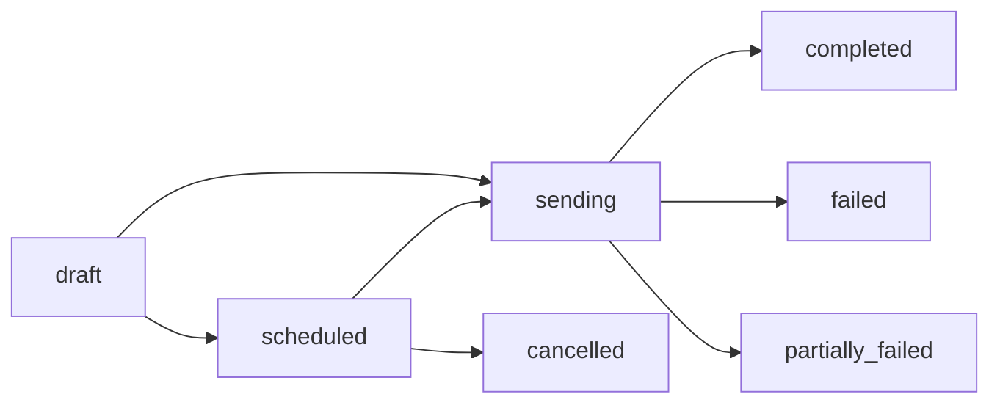

A campaign is a batch notification send to a targeted list of users. Campaigns provide scheduling, delivery tracking, and lifecycle management on top of the core notification send.

## Campaign vs Direct Notification

| | Campaign | Direct Notification |
|-|----------|-------------------|
| Entry point | Dashboard wizard | API: `POST /notifications/messages` |
| Recipients | CSV upload, User picker | `receivers` array in request body |
| Scheduling | Immediate or scheduled | Always immediate |
| Tracking | Full lifecycle (status, sent/failed counts) | Notification row created, no campaign-level tracking |
| Sequences | Supported (multi-step) | Not supported |

## Creating a Campaign

The dashboard wizard walks you through four steps:

<Steps>
  <Step title="Recipients">
    Choose your input mode:
    - **CSV** — Upload a file with a `user_id` column and optional variable columns
    - **User picker** — Select from the Users list
  </Step>
  <Step title="Select Template">
    Pick an approved template. The template determines the content and delivery channels.
  </Step>
  <Step title="Compose">
    Enter campaign name, set per-user variables, and add an optional analytics tag.
  </Step>
  <Step title="Review & Send">
    Review the summary. Choose **Send Now** or **Schedule** for a future date/time.
  </Step>
</Steps>

## Scheduling

| Option | Description |
|--------|-------------|
| Send Now | Immediate dispatch |
| Schedule | Set a future date/time (Unix timestamp) |
| Recurring | Not supported |

<Note>
You can click "Send Now" on a scheduled campaign to override the schedule and send immediately.
</Note>

## Campaign Status Flow

| Status | Description |
|--------|-------------|
| `draft` | Campaign created but not yet sent or scheduled |
| `scheduled` | Queued for future delivery |
| `sending` | Currently dispatching to recipients |
| `completed` | All recipients processed successfully |
| `failed` | All recipients failed |
| `partially_failed` | Some recipients succeeded, some failed |
| `cancelled` | Cancelled before send time |

## Cancel and Delete

- **Cancel** — Cancels a scheduled or draft campaign. Cannot cancel once `sending` has started.
- **Pause** — Not supported. Once sending starts, it runs to completion.
- **Delete** — Only draft campaigns can be deleted. Cancelled campaigns cannot be deleted.

## Campaign Properties

| Field | Type | Description |
|-------|------|-------------|
| `name` | string | Campaign name |
| `templateId` | string | Template CUID |
| `templateVersion` | number | Pinned template version |
| `status` | enum | `draft` \| `scheduled` \| `sending` \| `completed` \| `failed` \| `partially_failed` \| `cancelled` |
| `scheduledAt` | number | Unix timestamp (null for immediate) |
| `totalTargets` | number | Total recipients |
| `sentCount` | number | Successfully delivered |
| `failedCount` | number | Failed deliveries |
| `tag` | string | Optional analytics tag |

## Limits

| Limit | Value |
|-------|-------|
| Max recipients per campaign | 10,000 |
| Max concurrent campaigns | No hard limit |
| Max campaigns per app | No hard limit |
