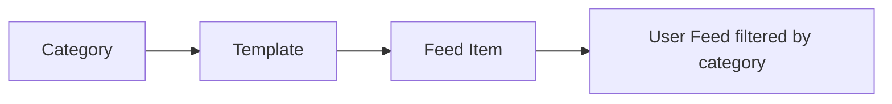

Categories are labels used to organize templates and filter notification feed items. When a template has a category assigned, all notifications sent with that template carry the category — allowing end-users to filter their feed by category.

## How Categories Work



- A template has a `templateCategory` field (category name)
- Feed items inherit `templateCategory` and `categoryId` from the template
- The feed API supports filtering: `GET /notification-feed?category=Marketing`
- The `categoryFilterEnabled` flag on the template channel controls whether filtering is active

## Managing Categories

1. Go to **Categories** in the sidebar
2. **Create** — Click "Create Category" → Enter name and optional description → Save
3. **Edit** — Click a category → Update name or description → Save
4. **Delete** — Click delete → Confirm removal

## Category Properties

| Field | Type | Description |
|-------|------|-------------|
| `name` | string | Category name (unique per app) |
| `description` | string | Optional description |

## Feed Filtering

End-users can filter their notification feed by category using the SDK or feed API:

```
GET /notification-feed?category=Marketing
```

This only works when `categoryFilterEnabled` is set to `true` on the template's channel configuration.

## Limits

| Limit | Value |
|-------|-------|
| Max categories per app | No hard limit |
| Duplicate names | Not allowed (returns 409 error) |
