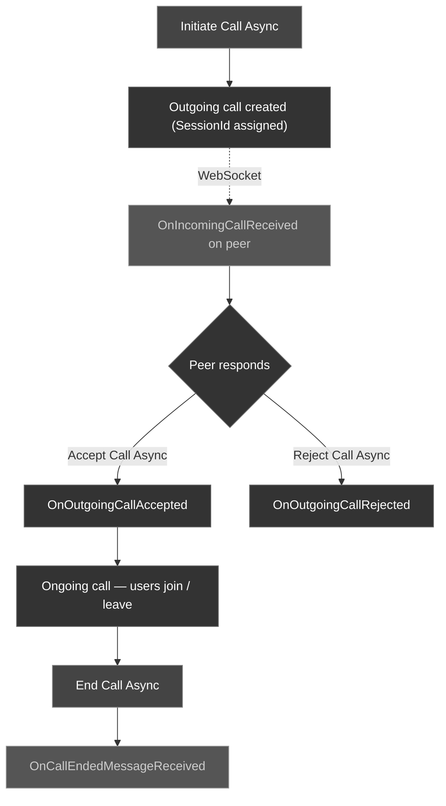

The CometChat Unreal SDK lets players ring each other for **voice and video calls** — a 1:1 "party" call to a friend, or a group call to a whole squad. You initiate, accept, reject, and end calls with latent async nodes, and listen for incoming calls and live participant changes through delegates on the `UCometChatSubsystem`.

<Info>
These nodes manage **call signaling and metadata** — who is ringing whom, session IDs, accept/reject/end state, and the participant roster. The actual **audio/video media transport** (microphone, camera, speaker, and rendering the call UI) is handled by the separate **CometChat Calls SDK / Calls UI Kit**. This page covers the signaling layer: everything you need to set up, route, and tear down a call. Hand the resulting `SessionId` to the Calls SDK/UI to start streaming media.
</Info>

---

## Call Lifecycle

A call flows through initiation on the caller, a signal to the receiver, an accept/reject decision, an ongoing phase, and finally an end.



<Warning>
**Bind the call delegates before you expect any calls** — ideally right after login, in `BeginPlay`. An `OnIncomingCallReceived` that fires before you've bound the delegate is missed, and the player never sees the incoming-call UI. See [Real-Time Call Events](#real-time-call-events) below.
</Warning>

---

## Initiate a Call

Ring another player (1:1) or a whole squad (group). You describe **who** to call and **what kind** of call on an `FCometChatCall` struct, then pass it to the node. The receiver and call type live on the call's `BaseMessage`:

- `BaseMessage.ReceiverUid` — the callee's UID (for 1:1) or the group's GUID (for a squad call)
- `BaseMessage.ReceiverType` — `"user"` for a 1:1 call, `"group"` for a squad call
- `BaseMessage.Type` — `"audio"` for a voice call, `"video"` for a video call

<Tabs>
<Tab title="Blueprint">
Call the **Initiate Call Async** node.

| Parameter | Type | Description |
| --------- | ---- | ----------- |
| Call | `FCometChatCall` | The call to place. Set the receiver via `BaseMessage.ReceiverUid`, `BaseMessage.ReceiverType` (`"user"` or `"group"`), and the call kind via `BaseMessage.Type` (`"audio"` or `"video"`) |

**On Success** returns an `FCometChatCall` with the server-assigned `SessionId` and a `CallStatus` of `initiated`. Store the `SessionId` — you need it to end the call later.
</Tab>
<Tab title="C++">
```cpp
#include "AsyncActions/CometChatInitiateCallAction.h"

void AMyActor::StartPartyVoiceCall(const FString& FriendUid)
{
    // Describe the call: who to ring, and what kind.
    FCometChatCall Call;
    Call.BaseMessage.ReceiverUid  = FriendUid;      // squadmate's UID (or a group GUID)
    Call.BaseMessage.ReceiverType = TEXT("user");   // "user" for 1:1, "group" for a squad call
    Call.BaseMessage.Type         = TEXT("audio");  // "audio" for voice, "video" for video

    auto* Action = UCometChatInitiateCallAction::InitiateCallAsync(this, Call);
    Action->OnSuccess.AddDynamic(this, &AMyActor::OnCallInitiated);
    Action->OnFailure.AddDynamic(this, &AMyActor::OnError);
    Action->Activate();
}

void AMyActor::OnCallInitiated(const FCometChatCall& Call)
{
    // Keep the SessionId — you'll need it to end (or hand off) the call.
    ActiveSessionId = Call.SessionId;
    UE_LOG(LogTemp, Log, TEXT("Ringing %s... session %s"),
        *Call.CallReceiverUser.Name, *Call.SessionId);
}

void AMyActor::OnError(const FCometChatError& Error)
{
    UE_LOG(LogTemp, Error, TEXT("Call operation failed: %s"), *Error.Message);
}
```
</Tab>
</Tabs>

<Tip>
To ring an entire squad instead of one friend, set `BaseMessage.ReceiverType = TEXT("group")` and `BaseMessage.ReceiverUid` to the group's `Guid`. Everything else about the flow is identical.
</Tip>

---

## Accept a Call

When `OnIncomingCallReceived` fires, show your incoming-call UI. If the player taps **Accept**, answer the call with its `SessionId`.

<Tabs>
<Tab title="Blueprint">
Call the **Accept Call Async** node.

| Parameter | Type | Description |
| --------- | ---- | ----------- |
| Session Id | `FString` | The `SessionId` of the incoming call (from the `FCometChatCall` delivered by `OnIncomingCallReceived`) |

**On Success** returns the connected `FCometChatCall`. Hand its `SessionId` to the Calls SDK/UI to begin streaming audio/video.
</Tab>
<Tab title="C++">
```cpp
#include "AsyncActions/CometChatAcceptCallAction.h"

void AMyActor::AcceptIncomingCall(const FString& SessionId)
{
    auto* Action = UCometChatAcceptCallAction::AcceptCallAsync(this, SessionId);
    Action->OnSuccess.AddDynamic(this, &AMyActor::OnCallAccepted);
    Action->OnFailure.AddDynamic(this, &AMyActor::OnError);
    Action->Activate();
}

void AMyActor::OnCallAccepted(const FCometChatCall& Call)
{
    // The call is connected — pass the SessionId to the Calls SDK/UI
    // to start streaming voice/video.
    UE_LOG(LogTemp, Log, TEXT("Joined call %s"), *Call.SessionId);
}
```
</Tab>
</Tabs>

---

## Reject a Call

Decline an incoming call, or signal that the player is already busy in another call. The `Status` is a call-status string that tells the caller why the call was turned down.

<Tabs>
<Tab title="Blueprint">
Call the **Reject Call Async** node.

| Parameter | Type | Description |
| --------- | ---- | ----------- |
| Session Id | `FString` | The `SessionId` of the incoming call to reject |
| Status | `FString` | The rejection status — `"rejected"` when the player declines, or `"busy"` when they're already in a call |

**On Success** returns the `FCometChatCall` with its updated `CallStatus`. The caller receives `OnOutgoingCallRejected`.
</Tab>
<Tab title="C++">
```cpp
#include "AsyncActions/CometChatRejectCallAction.h"

void AMyActor::DeclineIncomingCall(const FString& SessionId)
{
    // Status is a call-status string: "rejected" (declined) or "busy" (already in a call).
    auto* Action = UCometChatRejectCallAction::RejectCallAsync(this, SessionId, TEXT("rejected"));
    Action->OnSuccess.AddDynamic(this, &AMyActor::OnCallRejected);
    Action->OnFailure.AddDynamic(this, &AMyActor::OnError);
    Action->Activate();
}

void AMyActor::OnCallRejected(const FCometChatCall& Call)
{
    UE_LOG(LogTemp, Log, TEXT("Declined call %s (%s)"), *Call.SessionId, *Call.CallStatus);
}
```
</Tab>
</Tabs>

<Info>
Use `"busy"` to auto-decline when the player is already on a call — check [`HasActiveCall`](#querying-the-active-call) before showing the accept prompt and reject with `"busy"` if one is already in progress. This tells the caller the player is reachable but occupied, rather than deliberately declining.
</Info>

---

## End a Call

Hang up an active or ringing call. Either party can end it, and both sides receive `OnCallEndedMessageReceived`.

<Tabs>
<Tab title="Blueprint">
Call the **End Call Async** node.

| Parameter | Type | Description |
| --------- | ---- | ----------- |
| Session Id | `FString` | The `SessionId` of the call to end |

**On Success** returns the final `FCometChatCall` with a `CallStatus` of `ended`.
</Tab>
<Tab title="C++">
```cpp
#include "AsyncActions/CometChatEndCallAction.h"

void AMyActor::HangUp(const FString& SessionId)
{
    auto* Action = UCometChatEndCallAction::EndCallAsync(this, SessionId);
    Action->OnSuccess.AddDynamic(this, &AMyActor::OnCallEnded);
    Action->OnFailure.AddDynamic(this, &AMyActor::OnError);
    Action->Activate();
}

void AMyActor::OnCallEnded(const FCometChatCall& Call)
{
    UE_LOG(LogTemp, Log, TEXT("Call %s ended"), *Call.SessionId);
    ActiveSessionId.Empty();
}
```
</Tab>
</Tabs>

---

## Querying the Active Call

The subsystem tracks the current call so any part of your game — a HUD widget, a pause menu, a lobby controller — can ask whether a call is in progress without threading the `FCometChatCall` through your own state. Both are `BlueprintPure` (no execution pin) and safe to call every frame.

<Tabs>
<Tab title="Blueprint">
- **Has Active Call** (`BlueprintPure`) returns a `bool` — `true` when a call is currently in progress. Use it to gate a "Call" button or to show an in-call indicator.
- **Get Active Call** (`BlueprintPure`) returns the current `FCometChatCall`. When there's no active call, the returned struct is empty (blank `SessionId`).
</Tab>
<Tab title="C++">
```cpp
UCometChatSubsystem* Chat = GetGameInstance()->GetSubsystem<UCometChatSubsystem>();

// Guard: don't start a new call while one is already live.
if (Chat->HasActiveCall())
{
    FCometChatCall Current = Chat->GetActiveCall();
    UE_LOG(LogTemp, Log, TEXT("Already in call %s with %s"),
        *Current.SessionId, *Current.CallReceiverUser.Name);
}
else
{
    StartPartyVoiceCall(TEXT("cometchat-uid-2"));
}
```
</Tab>
</Tabs>

---

## The FCometChatCall Struct

Every call node returns an `FCometChatCall`, and it's also the payload of most call delegates. The `SessionId` is the key you use across accept/reject/end.

| Property | Type | Description |
| -------- | ---- | ----------- |
| `BaseMessage` | `FCometChatMessage` | The underlying call message. Holds the receiver (`ReceiverUid`, `ReceiverType`) and the call kind (`Type`: `"audio"` or `"video"`) |
| `SessionId` | `FString` | Unique session identifier for this call — pass it to Accept, Reject, and End |
| `CallStatus` | `FString` | Current status, e.g. `"initiated"`, `"ongoing"`, `"ended"`, `"rejected"`, `"busy"`, `"cancelled"` |
| `Action` | `FString` | The most recent call action, e.g. `"initiated"`, `"accepted"`, `"rejected"`, `"ended"` |
| `InitiatedAt` | `int64` | Unix timestamp when the call was initiated |
| `JoinedAt` | `int64` | Unix timestamp when the call was joined (`0` if not yet joined) |
| `CallInitiator` | `FCometChatUser` | The user who started the call |
| `CallReceiverUser` | `FCometChatUser` | The receiving user (populated for 1:1 calls) |
| `CallReceiverGroup` | `FCometChatGroup` | The receiving group (populated for group/squad calls) |

<Tip>
Read `CallStatus` and `Action` to drive your call UI state machine — e.g. switch from a "Ringing..." overlay to an in-call HUD when `CallStatus` becomes `"ongoing"`, and tear it down on `"ended"`, `"rejected"`, or `"cancelled"`.
</Tip>

---

## Real-Time Call Events

Call signaling arrives over the WebSocket as delegates on the `UCometChatSubsystem`. They fire on the **Game Thread**, so you can update UI directly. There are two groups: **CallListener** events (ring, accept, reject, cancel, end) and **OngoingCallListener** events (live participant and media state during a connected call).

### Binding the Delegates

<Tabs>
<Tab title="Blueprint">
1. Get a reference to the **CometChat Subsystem**
2. Drag off the Subsystem pin and search for the delegate name (e.g., **On Incoming Call Received**)
3. Select **Bind Event** to wire it to a custom event node
4. The custom event automatically gets the correct parameter type (e.g., `FCometChatCall`)
</Tab>
<Tab title="C++">
```cpp
void AMyActor::BeginPlay()
{
    Super::BeginPlay();

    UCometChatSubsystem* Chat = GetGameInstance()->GetSubsystem<UCometChatSubsystem>();

    // CallListener — bind these before you expect any calls.
    Chat->OnIncomingCallReceived.AddDynamic(this, &AMyActor::HandleIncomingCall);
    Chat->OnOutgoingCallAccepted.AddDynamic(this, &AMyActor::HandleCallAccepted);
    Chat->OnOutgoingCallRejected.AddDynamic(this, &AMyActor::HandleCallRejected);
    Chat->OnIncomingCallCancelled.AddDynamic(this, &AMyActor::HandleCallCancelled);
    Chat->OnCallEndedMessageReceived.AddDynamic(this, &AMyActor::HandleCallEnded);

    // OngoingCallListener — participant + media state during a live call.
    Chat->OnCallUserJoined.AddDynamic(this, &AMyActor::HandleUserJoined);
    Chat->OnCallUserLeft.AddDynamic(this, &AMyActor::HandleUserLeft);
    Chat->OnOngoingCallEnded.AddDynamic(this, &AMyActor::HandleOngoingCallEnded);
}

void AMyActor::HandleIncomingCall(const FCometChatCall& Call)
{
    // Show an incoming-call overlay: caller name + Accept / Decline buttons.
    UE_LOG(LogTemp, Log, TEXT("Incoming %s call from %s (session %s)"),
        *Call.BaseMessage.Type, *Call.CallInitiator.Name, *Call.SessionId);
}
```
</Tab>
</Tabs>

### CallListener Events

Bind these before expecting calls — they cover the full ring/answer/hang-up handshake. Every payload is an `FCometChatCall`.

| Delegate | Payload | Fires When |
| -------- | ------- | ---------- |
| `OnIncomingCallReceived` | `FCometChatCall` | An incoming call arrives for the logged-in player — show the answer UI |
| `OnOutgoingCallAccepted` | `FCometChatCall` | A call you initiated was accepted by the peer |
| `OnOutgoingCallRejected` | `FCometChatCall` | A call you initiated was rejected (declined or `busy`) |
| `OnIncomingCallCancelled` | `FCometChatCall` | The caller cancelled an incoming call before you answered — dismiss the answer UI |
| `OnCallEndedMessageReceived` | `FCometChatCall` | A call-ended system message arrived (the call finished on either side) |

### OngoingCallListener Events

These fire during a connected call to keep your in-call HUD — the participant roster, mute badges, recording indicator — in sync.

| Delegate | Payload | Fires When |
| -------- | ------- | ---------- |
| `OnCallUserJoined` | `FCometChatUser` | A player joins the ongoing call |
| `OnCallUserLeft` | `FCometChatUser` | A player leaves the ongoing call |
| `OnCallError` | `FCometChatError` | An error occurs during the ongoing call |
| `OnOngoingCallEnded` | `FCometChatCall` | The ongoing call ends |
| `OnCallUserListUpdated` | `TArray<FCometChatUser>` | The full participant list changes — rebuild the roster |
| `OnAudioModesUpdated` | `TArray<FCometChatAudioMode>` | The available audio output modes change |
| `OnRecordingStarted` | `FCometChatUser` | A participant starts recording the call |
| `OnRecordingStopped` | `FCometChatUser` | A participant stops recording the call |
| `OnUserMuted` | `FCometChatUserMutedEvent` | A participant is muted |
| `OnCallSwitchedToVideo` | `FCometChatCallSwitchedToVideoEvent` | The call is upgraded from audio to video |

<Tabs>
<Tab title="Blueprint">
Bind to **On Call User Joined** / **On Call User List Updated** to refresh your in-call roster widget, and **On Ongoing Call Ended** to tear down the call HUD.
</Tab>
<Tab title="C++">
```cpp
void AMyActor::HandleUserJoined(const FCometChatUser& User)
{
    UE_LOG(LogTemp, Log, TEXT("%s joined the call"), *User.Name);
}

void AMyActor::HandleUserLeft(const FCometChatUser& User)
{
    UE_LOG(LogTemp, Log, TEXT("%s left the call"), *User.Name);
}

void AMyActor::HandleOngoingCallEnded(const FCometChatCall& Call)
{
    UE_LOG(LogTemp, Log, TEXT("Ongoing call %s ended"), *Call.SessionId);
    // Close the in-call HUD.
}
```
</Tab>
</Tabs>

---

## Ongoing Call Event Structs

A few OngoingCallListener delegates carry their own event structs rather than a bare `FCometChatCall` or `FCometChatUser`.

### FCometChatAudioMode

Delivered as a `TArray<FCometChatAudioMode>` by `OnAudioModesUpdated` — the set of audio outputs the player can switch between, with the active one flagged.

| Property | Type | Description |
| -------- | ---- | ----------- |
| `Mode` | `FString` | Audio output identifier (e.g. `"SPEAKER"`, `"EARPIECE"`, `"BLUETOOTH"`, `"HEADPHONES"`) |
| `bIsSelected` | `bool` | `true` if this mode is currently active |

### FCometChatUserMutedEvent

Payload of `OnUserMuted`.

| Property | Type | Description |
| -------- | ---- | ----------- |
| `MutedUser` | `FCometChatUser` | The participant who was muted |
| `MutedBy` | `FCometChatUser` | The participant who performed the mute |

### FCometChatCallSwitchedToVideoEvent

Payload of `OnCallSwitchedToVideo` — fires when an audio call is upgraded to video.

| Property | Type | Description |
| -------- | ---- | ----------- |
| `SessionId` | `FString` | The session that switched to video |
| `InitiatedBy` | `FCometChatUser` | The user who requested the switch to video |
| `AcceptedBy` | `FCometChatUser` | The user who accepted the switch to video |

<Warning>
The failure handler for every call async node uses the simple `(const FCometChatError& Error)` signature. The listener-style `OnCallError` delegate, by contrast, provides a full `FCometChatError` struct (`Code`, `Message`, `Details`) — see [Real-Time Events → FCometChatError](/sdk/unreal/real-time-events#error-handling-fcometchaterror).
</Warning>

---

## Next Steps

<CardGroup cols={2}>
  <Card title="Real-Time Events" icon="bolt" href="/sdk/unreal/real-time-events">
    Bind the full set of subsystem delegates — messages, presence, groups, and calls.
  </Card>
  <Card title="API Reference" icon="book" href="/sdk/unreal/reference">
    Full struct, enum, and node reference for the Unreal SDK.
  </Card>
</CardGroup>
