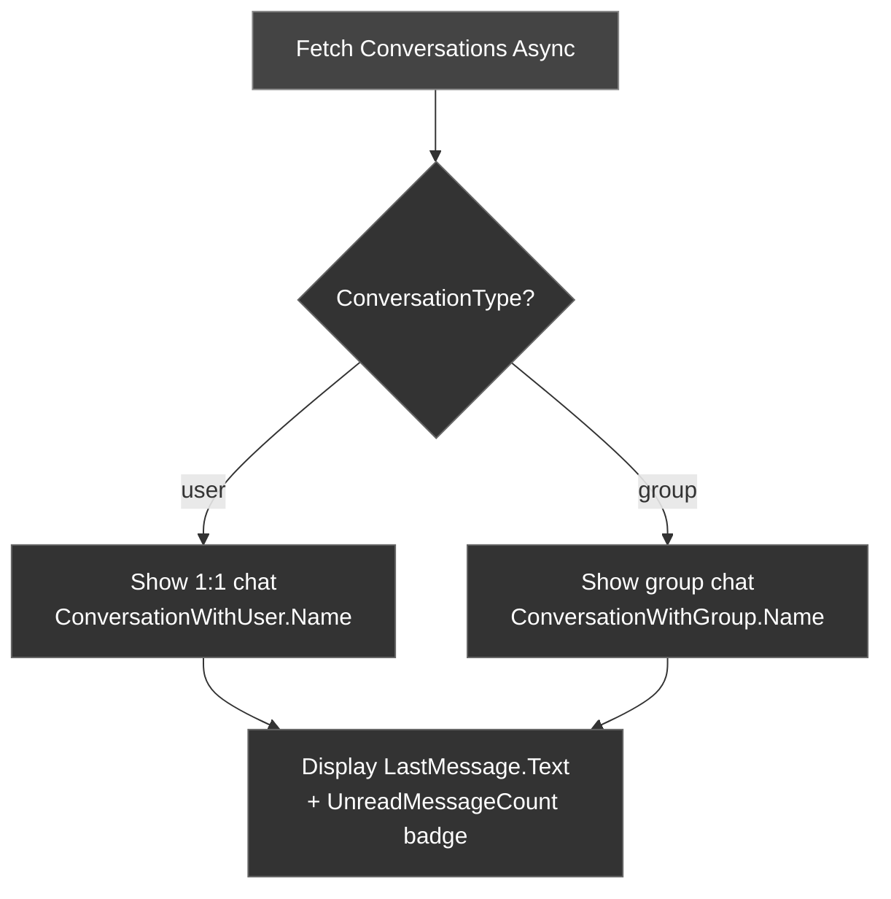

Conversations represent the chat threads a user is part of — both 1:1 and group. Use the **Fetch Conversations Async** node to retrieve the list with unread counts, last messages, and metadata.

---

## Fetch Conversations

<Tabs>
<Tab title="Blueprint">
**Use case:** build the recent-chats list — one row per thread showing the other party's name, the last-message preview, and an unread badge.

<Frame>
  
</Frame>

**Blueprint flow**

1. Create an `FCometChatConversationsRequest` struct
2. Set filters (conversation type, tags, unread only, etc.)
3. Call the **Fetch Conversations Async** node
4. **On Success** → **For Each Loop** over the returned `TArray<FCometChatConversation>` → build a row from the name, `LastMessage.Text`, and an `UnreadMessageCount` badge
5. **On Failure** → a **Handle Fetch Error** custom event that takes an `FCometChatError` → **Break** it, show `Message`, and log `Code` for triage
</Tab>
<Tab title="C++">
```cpp
void AMyActor::FetchConversations()
{
    FCometChatConversationsRequest Request;
    Request.Limit = 20;
    // Request.ConversationType = TEXT("group"); // optional filter

    auto* Action = UCometChatFetchConversationsAction::FetchConversations(this, Request);
    Action->OnSuccess.AddDynamic(this, &AMyActor::HandleConversations);
    Action->OnFailure.AddDynamic(this, &AMyActor::HandleError);
    Action->Activate();
}

void AMyActor::HandleConversations(const TArray<FCometChatConversation>& Conversations)
{
    for (const auto& Conv : Conversations)
    {
        FString Name = Conv.ConversationType == TEXT("user")
            ? Conv.ConversationWithUser.Name
            : Conv.ConversationWithGroup.Name;

        UE_LOG(LogTemp, Log, TEXT("%s — Unread: %d — Last: %s"),
            *Name, Conv.UnreadMessageCount, *Conv.LastMessage.Text);
    }
}
```
</Tab>
</Tabs>

### Reference: sample UI

The bundled sample panel fills its recent-chats list using the **native C++ SDK** directly rather than the async node. In your own game code, prefer the **Fetch Conversations Async** node above — it hops results back to the Game Thread for you.

```cpp
// From UCometChatPanel::FetchPersonalChats() — CometChatPanel.cpp
// Native C++ SDK call (chatsdk::), shown for reference. Prefer the async node in game code.
void UCometChatPanel::FetchPersonalChats()
{
    auto* Sub = GetSubsystem();
    if (!Sub || !Sub->GetSdk()) return;

    chatsdk::ConversationsRequestBuilder req;
    req.limit = 50;
    req.conversation_type = "user";           // "user" or "group"

    Sub->GetSdk()->fetch_conversations(req,
        [this](const std::string& err, const std::vector<chatsdk::Conversation>& convs)
        {
            // Native callback runs off the game thread — hop back before touching UMG
            AsyncTask(ENamedThreads::GameThread, [this, convs]()
            {
                PersonalConversations.Empty();
                for (auto& c : convs)
                    PersonalConversations.Add(CometChatConversions::ToUnreal(c));
                RebuildPersonalList();        // redraw the recent-chats list
            });
        });
}
```

---

## FCometChatConversationsRequest

Configure the request to filter and paginate results.

| Property | Type | Default | Description |
| -------- | ---- | ------- | ----------- |
| `Limit` | `int32` | `30` | Max conversations per page |
| `ConversationType` | `FString` | — | Filter: `user` or `group` |
| `bWithUserAndGroupTags` | `bool` | `false` | Include user/group tags |
| `Tags` | `TArray<FString>` | — | Filter by conversation tags |
| `bWithTags` | `bool` | `false` | Include tags in response |
| `UserTags` | `TArray<FString>` | — | Filter by user tags |
| `GroupTags` | `TArray<FString>` | — | Filter by group tags |
| `bIncludeBlockedUsers` | `bool` | `false` | Include blocked users |
| `bWithBlockedInfo` | `bool` | `false` | Include blocked info |
| `SearchKeyword` | `FString` | — | Search conversations |
| `bUnread` | `bool` | `false` | Only unread conversations |
| `Page` | `int32` | `0` | Page number |
| `bHideAgentic` | `bool` | `false` | Hide AI/bot conversations |
| `bOnlyAgentic` | `bool` | `false` | Only AI/bot conversations |

---

## FCometChatConversation

The struct returned for each conversation.

| Property | Type | Description |
| -------- | ---- | ----------- |
| `ConversationId` | `FString` | Unique conversation identifier |
| `ConversationType` | `FString` | `user` or `group` |
| `LastMessage` | `FCometChatMessage` | Most recent message in the conversation |
| `ConversationWithUser` | `FCometChatUser` | The other user (populated for 1:1 conversations) |
| `ConversationWithGroup` | `FCometChatGroup` | The group (populated for group conversations) |
| `UnreadMessageCount` | `int32` | Number of unread messages |
| `UpdatedAt` | `int64` | Last activity timestamp |
| `Tags` | `TArray<FString>` | Conversation tags |
| `UnreadMentionsCount` | `int32` | Number of unread mentions |
| `LastReadMessageId` | `int64` | ID of last read message |
| `LatestMessageId` | `int64` | ID of latest message |

---

## Conversation Flow



<Tip>
**Pagination**: Set `Page` to fetch subsequent pages. Check if the returned array count equals `Limit` to determine if more pages exist.
</Tip>

---

## Conversation Actions

Beyond listing conversations, you can operate on a single thread by its participant — the other user's **UID** for a 1:1 chat, or the group's **GUID** for a group chat. Always pass the matching `ConversationType` (`user` or `group`) alongside it.

### Get a Conversation

<Tabs>
<Tab title="Blueprint">
Call the **Get Conversation Async** node.

| Parameter | Type | Description |
| --------- | ---- | ----------- |
| Conversation With | `FString` | The other user's UID (1:1) or the group's GUID |
| Conversation Type | `FString` | `user` or `group` |

**On Success** returns the matching `FCometChatConversation`, including its `UnreadMessageCount`, `LastMessage`, and tags.
</Tab>
<Tab title="C++">
```cpp
#include "AsyncActions/CometChatGetConversationAction.h"

void AMyActor::OpenConversation()
{
    auto* Action = UCometChatGetConversationAction::GetConversationAsync(
        this,
        TEXT("cometchat-uid-2"),  // other user's UID (or a group GUID)
        TEXT("user")              // "user" or "group"
    );
    Action->OnSuccess.AddDynamic(this, &AMyActor::OnConversationLoaded);
    Action->OnFailure.AddDynamic(this, &AMyActor::OnError);
    Action->Activate();
}

void AMyActor::OnConversationLoaded(const FCometChatConversation& Conversation)
{
    UE_LOG(LogTemp, Log, TEXT("Unread: %d — Last: %s"),
        Conversation.UnreadMessageCount, *Conversation.LastMessage.Text);
}

void AMyActor::OnError(const FCometChatError& Error)
{
    UE_LOG(LogTemp, Error, TEXT("Conversation op failed: %s"), *Error.Message);
}
```
</Tab>
</Tabs>

### Delete a Conversation

<Tabs>
<Tab title="Blueprint">
**Use case:** let the user swipe or long-press a row to remove that thread from their recent-chats list.

Call the **Delete Conversation Async** node.

| Parameter | Type | Description |
| --------- | ---- | ----------- |
| Conversation With | `FString` | The other user's UID (1:1) or the group's GUID |
| Conversation Type | `FString` | `user` or `group` |

**On Success** returns a `FString` result message confirming the deletion.

**Blueprint flow**

1. On the row's **Delete** button **On Clicked**, read that row's UID/GUID and `ConversationType`
2. Call **Delete Conversation Async**
3. **On Success** (`FString` result) → **Remove Index** from your conversation array → refresh the list widget
4. **On Failure** → a **Handle Error** event taking an `FCometChatError` → **Break** it, show `Message`, and leave the row in place
</Tab>
<Tab title="C++">
```cpp
#include "AsyncActions/CometChatDeleteConversationAction.h"

void AMyActor::DeleteConversation()
{
    auto* Action = UCometChatDeleteConversationAction::DeleteConversationAsync(
        this,
        TEXT("cometchat-uid-2"),  // other user's UID (or a group GUID)
        TEXT("user")              // "user" or "group"
    );
    Action->OnSuccess.AddDynamic(this, &AMyActor::OnConversationDeleted);
    Action->OnFailure.AddDynamic(this, &AMyActor::OnError);
    Action->Activate();
}

void AMyActor::OnConversationDeleted(const FString& Result)
{
    UE_LOG(LogTemp, Log, TEXT("Conversation deleted: %s"), *Result);
}
```
</Tab>
</Tabs>

<Note>
Deleting a conversation removes it from **this** user's list only — it does not delete the messages for the other participant.
</Note>

### Tag a Conversation

<Tabs>
<Tab title="Blueprint">
**Use case:** pin or favorite a thread — write a `pinned` (or `favorite`) tag so you can float it to the top of the list.

Call the **Tag Conversation Async** node to attach custom tags (for pinning, foldering, or labeling a thread).

| Parameter | Type | Description |
| --------- | ---- | ----------- |
| Conversation With | `FString` | The other user's UID (1:1) or the group's GUID |
| Conversation Type | `FString` | `user` or `group` |
| Tags | `TArray<FString>` | The tags to set on the conversation |

**On Success** returns the updated `FCometChatConversation` with its new `Tags`.

**Blueprint flow**

1. On the row's **Pin** toggle **On Clicked**, build a `Tags` array (add or drop `pinned`)
2. Call **Tag Conversation Async** with the row's UID/GUID and type
3. **On Success** (`FCometChatConversation`) → read `Tags`, update the pin icon, and re-sort the list
4. **On Failure** → a **Handle Error** event taking an `FCometChatError` → **Break** it, show `Message`, and revert the toggle
</Tab>
<Tab title="C++">
```cpp
#include "AsyncActions/CometChatTagConversationAction.h"

void AMyActor::PinConversation()
{
    TArray<FString> Tags;
    Tags.Add(TEXT("pinned"));
    Tags.Add(TEXT("guild-mates"));

    auto* Action = UCometChatTagConversationAction::TagConversationAsync(
        this,
        TEXT("cometchat-uid-2"),  // other user's UID (or a group GUID)
        TEXT("user"),             // "user" or "group"
        Tags
    );
    Action->OnSuccess.AddDynamic(this, &AMyActor::OnConversationTagged);
    Action->OnFailure.AddDynamic(this, &AMyActor::OnError);
    Action->Activate();
}

void AMyActor::OnConversationTagged(const FCometChatConversation& Result)
{
    UE_LOG(LogTemp, Log, TEXT("Now tagged with %d tag(s)"), Result.Tags.Num());
}
```
</Tab>
</Tabs>

### Mark a Conversation Read

<Tabs>
<Tab title="Blueprint">
**Use case:** when the user opens a thread, clear its unread badge in one call instead of marking each message.

Call the **Mark Conversation Read Async** node to clear the unread badge for an entire thread in one call.

| Parameter | Type | Description |
| --------- | ---- | ----------- |
| Conversation With | `FString` | The other user's UID (1:1) or the group's GUID |
| Conversation Type | `FString` | `user` or `group` |

**On Success** returns a `FString` result message.

**Blueprint flow**

1. On **Open Conversation**, call **Mark Conversation Read Async** with the thread's UID/GUID and type
2. **On Success** (`FString`) → set that row's `UnreadMessageCount` to `0` and hide the badge
3. **On Failure** → a **Handle Error** event taking an `FCometChatError` → **Break** it, log `Code` / `Message`, and leave the badge until the next fetch
</Tab>
<Tab title="C++">
```cpp
#include "AsyncActions/CometChatMarkConversationReadAction.h"

void AMyActor::MarkThreadRead()
{
    auto* Action = UCometChatMarkConversationReadAction::MarkConversationReadAsync(
        this,
        TEXT("cometchat-uid-2"),  // other user's UID (or a group GUID)
        TEXT("user")              // "user" or "group"
    );
    Action->OnSuccess.AddDynamic(this, &AMyActor::OnConversationRead);
    Action->OnFailure.AddDynamic(this, &AMyActor::OnError);
    Action->Activate();
}

void AMyActor::OnConversationRead(const FString& Result)
{
    UE_LOG(LogTemp, Log, TEXT("Conversation marked read: %s"), *Result);
}
```
</Tab>
</Tabs>

### Mark a Conversation Delivered

<Tabs>
<Tab title="Blueprint">
Call the **Mark Conversation Delivered Async** node to send delivery receipts for a whole thread at once.

| Parameter | Type | Description |
| --------- | ---- | ----------- |
| Conversation With | `FString` | The other user's UID (1:1) or the group's GUID |
| Conversation Type | `FString` | `user` or `group` |

**On Success** returns a `FString` result message.
</Tab>
<Tab title="C++">
```cpp
#include "AsyncActions/CometChatMarkConversationDeliveredAction.h"

void AMyActor::MarkThreadDelivered()
{
    auto* Action = UCometChatMarkConversationDeliveredAction::MarkConversationDeliveredAsync(
        this,
        TEXT("cometchat-uid-2"),  // other user's UID (or a group GUID)
        TEXT("user")              // "user" or "group"
    );
    Action->OnSuccess.AddDynamic(this, &AMyActor::OnConversationDelivered);
    Action->OnFailure.AddDynamic(this, &AMyActor::OnError);
    Action->Activate();
}

void AMyActor::OnConversationDelivered(const FString& Result)
{
    UE_LOG(LogTemp, Log, TEXT("Conversation marked delivered: %s"), *Result);
}
```
</Tab>
</Tabs>

---

## Muting Conversations

Muting silences notifications for a thread without leaving it or removing it from the list. You mute and unmute in batches, and you can query which conversations are currently muted.

### Mute Conversations

<Tabs>
<Tab title="Blueprint">
Call the **Mute Conversations Async** node with an array of `FCometChatMutedConversation` entries.

| Parameter | Type | Description |
| --------- | ---- | ----------- |
| Conversations | `TArray<FCometChatMutedConversation>` | The conversations to mute, each with an `Id`, `Type`, and `Until` |

**On Success** fires with **no payload** — the mute has been applied.
</Tab>
<Tab title="C++">
```cpp
#include "AsyncActions/CometChatMuteConversationsAction.h"

void AMyActor::MuteGuildChat()
{
    FCometChatMutedConversation ToMute;
    ToMute.Id    = TEXT("group-abc-123");  // UID for a user, GUID for a group
    ToMute.Type  = TEXT("group");          // "user" or "group"
    ToMute.Until = 0;                      // 0 = mute indefinitely

    TArray<FCometChatMutedConversation> Conversations;
    Conversations.Add(ToMute);

    auto* Action = UCometChatMuteConversationsAction::MuteConversationsAsync(this, Conversations);
    Action->OnSuccess.AddDynamic(this, &AMyActor::OnConversationsMuted);
    Action->OnFailure.AddDynamic(this, &AMyActor::OnError);
    Action->Activate();
}

void AMyActor::OnConversationsMuted()
{
    // No payload — notifications are now silenced for the requested threads
}
```
</Tab>
</Tabs>

### Unmute Conversations

<Tabs>
<Tab title="Blueprint">
Call the **Unmute Conversations Async** node with an array of `FCometChatUnmutedConversation` entries.

| Parameter | Type | Description |
| --------- | ---- | ----------- |
| Conversations | `TArray<FCometChatUnmutedConversation>` | The conversations to unmute, each with an `Id` and `Type` |

**On Success** fires with **no payload**.
</Tab>
<Tab title="C++">
```cpp
#include "AsyncActions/CometChatUnmuteConversationsAction.h"

void AMyActor::UnmuteGuildChat()
{
    FCometChatUnmutedConversation ToUnmute;
    ToUnmute.Id   = TEXT("group-abc-123");  // UID for a user, GUID for a group
    ToUnmute.Type = TEXT("group");          // "user" or "group"

    TArray<FCometChatUnmutedConversation> Conversations;
    Conversations.Add(ToUnmute);

    auto* Action = UCometChatUnmuteConversationsAction::UnmuteConversationsAsync(this, Conversations);
    Action->OnSuccess.AddDynamic(this, &AMyActor::OnConversationsUnmuted);
    Action->OnFailure.AddDynamic(this, &AMyActor::OnError);
    Action->Activate();
}

void AMyActor::OnConversationsUnmuted()
{
    // No payload — notifications are restored
}
```
</Tab>
</Tabs>

### Get Muted Conversations

<Tabs>
<Tab title="Blueprint">
Call the **Get Muted Conversations Async** node (no parameters) to list every conversation the current user has muted.

**On Success** returns a `TArray<FCometChatMutedConversation>`.
</Tab>
<Tab title="C++">
```cpp
#include "AsyncActions/CometChatGetMutedConversationsAction.h"

void AMyActor::LoadMutedConversations()
{
    auto* Action = UCometChatGetMutedConversationsAction::GetMutedConversationsAsync(this);
    Action->OnSuccess.AddDynamic(this, &AMyActor::OnMutedConversations);
    Action->OnFailure.AddDynamic(this, &AMyActor::OnError);
    Action->Activate();
}

void AMyActor::OnMutedConversations(const TArray<FCometChatMutedConversation>& Result)
{
    for (const FCometChatMutedConversation& Muted : Result)
    {
        UE_LOG(LogTemp, Log, TEXT("Muted %s (%s) until %lld"),
            *Muted.Id, *Muted.Type, Muted.Until);
    }
}
```
</Tab>
</Tabs>

### FCometChatMutedConversation

| Property | Type | Description |
| -------- | ---- | ----------- |
| `Id` | `FString` | The other user's UID (1:1) or the group's GUID |
| `Type` | `FString` | `user` or `group` |
| `Until` | `int64` | Unix-ms timestamp to mute until; use `0` to mute with no expiry |

### FCometChatUnmutedConversation

| Property | Type | Description |
| -------- | ---- | ----------- |
| `Id` | `FString` | The other user's UID (1:1) or the group's GUID |
| `Type` | `FString` | `user` or `group` |

---

## Unread Counts

These nodes return the raw unread tallies the server tracks. Each resolves to a `FString` — the app-wide count comes back as a JSON object you parse, while the scoped nodes return a single count string.

### Get Unread Count

<Tabs>
<Tab title="Blueprint">
Call the **Get Unread Count Async** node (no parameters).

**On Success** returns a `FString` (`JsonResult`) — a JSON object of unread counts across all conversations.
</Tab>
<Tab title="C++">
```cpp
#include "AsyncActions/CometChatGetUnreadCountAction.h"

void AMyActor::LoadUnreadCounts()
{
    auto* Action = UCometChatGetUnreadCountAction::GetUnreadCountAsync(this);
    Action->OnSuccess.AddDynamic(this, &AMyActor::OnUnreadCount);
    Action->OnFailure.AddDynamic(this, &AMyActor::OnError);
    Action->Activate();
}

void AMyActor::OnUnreadCount(const FString& JsonResult)
{
    // JsonResult is a JSON object — parse it with FJsonSerializer
    UE_LOG(LogTemp, Log, TEXT("Unread counts: %s"), *JsonResult);
}
```
</Tab>
</Tabs>

### Get Unread Count For a User

<Tabs>
<Tab title="Blueprint">
Call the **Get Unread Count For User Async** node.

| Parameter | Type | Description |
| --------- | ---- | ----------- |
| UID | `FString` | The other user's UID |

**On Success** returns a `FString` unread count for that 1:1 conversation.
</Tab>
<Tab title="C++">
```cpp
#include "AsyncActions/CometChatGetUnreadCountForUserAction.h"

void AMyActor::LoadUserUnread()
{
    auto* Action = UCometChatGetUnreadCountForUserAction::GetUnreadCountForUserAsync(
        this, TEXT("cometchat-uid-2"));
    Action->OnSuccess.AddDynamic(this, &AMyActor::OnScopedUnread);
    Action->OnFailure.AddDynamic(this, &AMyActor::OnError);
    Action->Activate();
}

void AMyActor::OnScopedUnread(const FString& Result)
{
    UE_LOG(LogTemp, Log, TEXT("Unread: %s"), *Result);
}
```
</Tab>
</Tabs>

### Get Unread Count For a Group

<Tabs>
<Tab title="Blueprint">
Call the **Get Unread Count For Group Async** node.

| Parameter | Type | Description |
| --------- | ---- | ----------- |
| GUID | `FString` | The group's unique identifier |

**On Success** returns a `FString` unread count for that group.
</Tab>
<Tab title="C++">
```cpp
#include "AsyncActions/CometChatGetUnreadCountForGroupAction.h"

void AMyActor::LoadGroupUnread()
{
    auto* Action = UCometChatGetUnreadCountForGroupAction::GetUnreadCountForGroupAsync(
        this, TEXT("group-abc-123"));
    Action->OnSuccess.AddDynamic(this, &AMyActor::OnScopedUnread);
    Action->OnFailure.AddDynamic(this, &AMyActor::OnError);
    Action->Activate();
}
```
</Tab>
</Tabs>

### Get Unread Count For All Users

<Tabs>
<Tab title="Blueprint">
Call the **Get Unread Count All Users Async** node (no parameters).

**On Success** returns a `FString` of the combined unread count across all 1:1 conversations.
</Tab>
<Tab title="C++">
```cpp
#include "AsyncActions/CometChatGetUnreadCountAllUsersAction.h"

void AMyActor::LoadAllUsersUnread()
{
    auto* Action = UCometChatGetUnreadCountAllUsersAction::GetUnreadCountAllUsersAsync(this);
    Action->OnSuccess.AddDynamic(this, &AMyActor::OnScopedUnread);
    Action->OnFailure.AddDynamic(this, &AMyActor::OnError);
    Action->Activate();
}
```
</Tab>
</Tabs>

### Get Unread Count For All Groups

<Tabs>
<Tab title="Blueprint">
Call the **Get Unread Count All Groups Async** node (no parameters).

**On Success** returns a `FString` of the combined unread count across all groups.
</Tab>
<Tab title="C++">
```cpp
#include "AsyncActions/CometChatGetUnreadCountAllGroupsAction.h"

void AMyActor::LoadAllGroupsUnread()
{
    auto* Action = UCometChatGetUnreadCountAllGroupsAction::GetUnreadCountAllGroupsAsync(this);
    Action->OnSuccess.AddDynamic(this, &AMyActor::OnScopedUnread);
    Action->OnFailure.AddDynamic(this, &AMyActor::OnError);
    Action->Activate();
}
```
</Tab>
</Tabs>

<Tip>
These nodes return **raw JSON/count strings** that you parse yourself. For rendering a conversation list UI, the per-conversation `UnreadMessageCount` field already included in each `FCometChatConversation` from **Fetch Conversations** is usually more convenient — you get the counts and the last message in a single fetch, with no extra parsing.
</Tip>

---

## Best Practices

<Tip>
**Badge from the conversation, not the count endpoints.** Each `FCometChatConversation` from **Fetch Conversations** already carries `UnreadMessageCount` and `LastMessage` — draw your unread badges straight from that single fetch. Keep the list live by refreshing rows from the **On Message Received** delegate as new messages arrive, so badges tick up without another round trip. Reserve the **Get Unread Count** JSON endpoints for app-icon or tab totals where you truly need a server-wide tally.
</Tip>

<Warning>
**Don't re-fetch the whole list on every new message.** Calling **Fetch Conversations** again for each incoming message hammers the network and makes the list flicker as it rebuilds. Instead, when **On Message Received** fires, find the affected conversation row, bump its `UnreadMessageCount`, swap in the new `LastMessage`, and move it to the top — update the one row, not the whole list.
</Warning>

---

## Handling Failures

Every async node exposes an **On Failure** pin (and each C++ action a bindable `OnFailure`) that delivers an `FCometChatError`. Always wire it: a deleted thread, a stale GUID, or a network blip should surface a message, not fail silently.

| Field | Type | Description |
| ----- | ---- | ----------- |
| `Code` | `FString` | Machine-readable error code (e.g. `ERR_GUID_NOT_FOUND`) — branch on this |
| `Message` | `FString` | Human-readable summary — safe to show in a toast |
| `Details` | `FString` | Raw server payload for logging and triage |

<Tabs>
<Tab title="Blueprint">
1. Drag off the node's **On Failure** execution pin
2. Route it to a **Handle Conversation Error** custom event that takes an `FCometChatError`
3. **Break** the struct to read `Code`, `Message`, and `Details`
4. **Switch on String** (`Code`) → on `ERR_GUID_NOT_FOUND`, remove the row; otherwise show `Message` in a toast and log `Details`
</Tab>
<Tab title="C++">
```cpp
void AMyActor::HandleConversationError(const FCometChatError& Error)
{
    // Code is machine-readable, Message is user-facing, Details is the raw payload
    UE_LOG(LogTemp, Error, TEXT("Conversation op failed [%s]: %s"),
        *Error.Code, *Error.Message);

    if (Error.Code == TEXT("ERR_GUID_NOT_FOUND"))
    {
        // The thread no longer exists — drop it from the local list
        RemoveConversationRow();
        return;
    }

    // Log the raw payload for anything unexpected, then let the user retry
    UE_LOG(LogTemp, Verbose, TEXT("Details: %s"), *Error.Details);
    ShowRetryToast(Error.Message);
}
```
</Tab>
</Tabs>

---

## Next Steps

<CardGroup cols={2}>
  <Card title="Send a Message" icon="paper-plane" href="/sdk/unreal/send-message">
    Send messages in a conversation.
  </Card>
  <Card title="Real-Time Events" icon="bolt" href="/sdk/unreal/real-time-events">
    Listen for new messages to update the conversation list.
  </Card>
</CardGroup>
