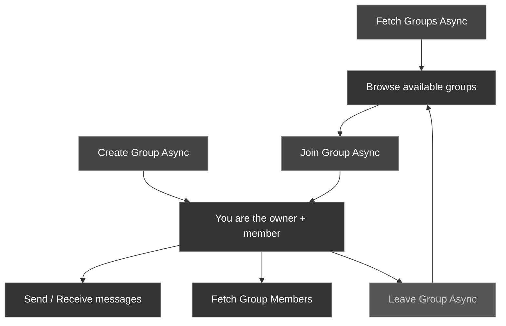

Groups let multiple users communicate in a shared conversation. The CometChat Unreal SDK provides async nodes for creating groups, joining existing ones, leaving, and sending/receiving group messages.

### Group Lifecycle



---

## Create a Group

Create a new group with a name and an initial set of member UIDs.

<Tabs>
<Tab title="Blueprint">
Call the **Create Group Async** node.

| Parameter | Type | Description |
| --------- | ---- | ----------- |
| Name | `FString` | Display name for the group |
| Member Ids | `TArray<FString>` | UIDs of users to add as initial members |

**On Success** returns an `FCometChatGroup` with the server-assigned `Guid`.
</Tab>
<Tab title="C++">
```cpp
#include "AsyncActions/CometChatCreateGroupAction.h"

void AMyActor::CreateLobbyGroup()
{
    TArray<FString> Members;
    Members.Add(TEXT("cometchat-uid-1"));
    Members.Add(TEXT("cometchat-uid-2"));
    Members.Add(TEXT("cometchat-uid-3"));

    auto* Action = UCometChatCreateGroupAction::CreateGroupAsync(
        this,
        TEXT("Game Lobby"),  // Group name
        Members              // Initial members
    );
    Action->OnSuccess.AddDynamic(this, &AMyActor::OnGroupCreated);
    Action->OnFailure.AddDynamic(this, &AMyActor::OnGroupCreateFailed);
    Action->Activate();
}

void AMyActor::OnGroupCreated(const FCometChatGroup& Group)
{
    UE_LOG(LogTemp, Log, TEXT("Group created: %s (GUID: %s)"),
        *Group.Name, *Group.Guid);
}

void AMyActor::OnGroupCreateFailed(const FString& Error)
{
    UE_LOG(LogTemp, Error, TEXT("Create group failed: %s"), *Error);
}
```
</Tab>
</Tabs>

---

## Join a Group

Join an existing group by its GUID.

<Tabs>
<Tab title="Blueprint">
<Frame>
  
</Frame>

Call the **Join Group Async** node.

| Parameter | Type | Description |
| --------- | ---- | ----------- |
| Guid | `FString` | The unique identifier of the group to join |

**On Success** fires with no output — the user is now a member.
</Tab>
<Tab title="C++">
```cpp
#include "AsyncActions/CometChatJoinGroupAction.h"

void AMyActor::JoinGroup(const FString& Guid)
{
    auto* Action = UCometChatJoinGroupAction::JoinGroupAsync(this, Guid);
    Action->OnSuccess.AddDynamic(this, &AMyActor::OnGroupJoined);
    Action->OnFailure.AddDynamic(this, &AMyActor::OnJoinFailed);
    Action->Activate();
}

void AMyActor::OnGroupJoined()
{
    UE_LOG(LogTemp, Log, TEXT("Successfully joined the group"));
}

void AMyActor::OnJoinFailed(const FString& Error)
{
    UE_LOG(LogTemp, Error, TEXT("Join failed: %s"), *Error);
}
```
</Tab>
</Tabs>

---

## Leave a Group

Leave a group you're currently a member of.

<Tabs>
<Tab title="Blueprint">
<Frame>
  
</Frame>

Call the **Leave Group Async** node.

| Parameter | Type | Description |
| --------- | ---- | ----------- |
| Guid | `FString` | The unique identifier of the group to leave |

**On Success** fires with no output.
</Tab>
<Tab title="C++">
```cpp
#include "AsyncActions/CometChatLeaveGroupAction.h"

void AMyActor::LeaveGroup(const FString& Guid)
{
    auto* Action = UCometChatLeaveGroupAction::LeaveGroupAsync(this, Guid);
    Action->OnSuccess.AddDynamic(this, &AMyActor::OnGroupLeft);
    Action->OnFailure.AddDynamic(this, &AMyActor::OnLeaveFailed);
    Action->Activate();
}

void AMyActor::OnGroupLeft()
{
    UE_LOG(LogTemp, Log, TEXT("Left the group"));
}

void AMyActor::OnLeaveFailed(const FString& Error)
{
    UE_LOG(LogTemp, Error, TEXT("Leave failed: %s"), *Error);
}
```
</Tab>
</Tabs>

---

## Fetch Groups

Retrieve a list of groups with optional search and filters.

<Tabs>
<Tab title="Blueprint">
<Frame>
  
</Frame>

Call the **Fetch Groups Async** node with an `FCometChatGroupsRequest` struct. Set `bJoinedOnly = true` to only fetch groups the user has joined, or leave it `false` to browse all available groups.
</Tab>
<Tab title="C++">
```cpp
#include "AsyncActions/CometChatFetchGroupsAction.h"

void AMyActor::FetchGroups()
{
    FCometChatGroupsRequest Request;
    Request.Limit = 20;
    Request.bJoinedOnly = true;

    auto* Action = UCometChatFetchGroupsAction::FetchGroups(this, Request);
    Action->OnSuccess.AddDynamic(this, &AMyActor::OnGroupsFetched);
    Action->OnFailure.AddDynamic(this, &AMyActor::OnFetchFailed);
    Action->Activate();
}
```
</Tab>
</Tabs>

---

## Group Member Management

Once a group exists, use these nodes to fetch its members, add new ones, and moderate (kick/ban/unban), and change a member's role.

### Fetch Members

<Tabs>
<Tab title="Blueprint">
Call the **Fetch Group Members Async** node with an `FCometChatGroupMembersRequest` struct (set `GUID` to the target group).
</Tab>
<Tab title="C++">
```cpp
#include "AsyncActions/CometChatFetchGroupMembersAction.h"

void AMyActor::FetchMembers(const FString& Guid)
{
    FCometChatGroupMembersRequest Request;
    Request.GUID = Guid;
    Request.Limit = 30;

    auto* Action = UCometChatFetchGroupMembersAction::FetchGroupMembersAsync(this, Request);
    Action->OnSuccess.AddDynamic(this, &AMyActor::OnMembersFetched);
    Action->OnFailure.AddDynamic(this, &AMyActor::OnFetchFailed);
    Action->Activate();
}

void AMyActor::OnMembersFetched(const TArray<FCometChatGroupMember>& Members)
{
    for (const FCometChatGroupMember& Member : Members)
    {
        UE_LOG(LogTemp, Log, TEXT("%s — %s"), *Member.User.Name, *Member.Scope);
    }
}
```
</Tab>
</Tabs>

### Add Members

<Tabs>
<Tab title="Blueprint">
Call the **Add Members Async** node with the group `Guid` and a `TArray<FCometChatGroupMember>` (set each entry's `User.Uid` and `Scope`, typically `"participant"`).
</Tab>
<Tab title="C++">
```cpp
#include "AsyncActions/CometChatAddMembersAction.h"

void AMyActor::AddMemberToGroup(const FString& Guid, const FString& Uid)
{
    FCometChatGroupMember NewMember;
    NewMember.User.Uid = Uid;
    NewMember.Scope = TEXT("participant");

    auto* Action = UCometChatAddMembersAction::AddMembersAsync(this, Guid, { NewMember });
    Action->OnSuccess.AddDynamic(this, &AMyActor::OnMemberAdded);
    Action->OnFailure.AddDynamic(this, &AMyActor::OnAddFailed);
    Action->Activate();
}
```
</Tab>
</Tabs>

### Kick, Ban, and Unban

**Kick** removes a member — they can rejoin. **Ban** removes them and prevents rejoining until **Unban** is called.

<Tabs>
<Tab title="Blueprint">
Call **Kick Member Async**, **Ban Member Async**, or **Unban Member Async** with the target `Uid` and the group `Guid`. Fetch **Fetch Banned Members Async** (same request shape as fetching members) to list who's currently banned.
</Tab>
<Tab title="C++">
```cpp
#include "AsyncActions/CometChatKickMemberAction.h"
#include "AsyncActions/CometChatBanMemberAction.h"
#include "AsyncActions/CometChatUnbanMemberAction.h"
#include "AsyncActions/CometChatFetchBannedMembersAction.h"

void AMyActor::BanMember(const FString& Uid, const FString& Guid)
{
    auto* Action = UCometChatBanMemberAction::BanMemberAsync(this, Uid, Guid);
    Action->OnSuccess.AddDynamic(this, &AMyActor::OnMemberBanned);
    Action->OnFailure.AddDynamic(this, &AMyActor::OnActionFailed);
    Action->Activate();
}
```
</Tab>
</Tabs>

<Warning>
Ban and unban only take effect for other members — the SDK does not let a member ban themselves or the group owner. The server enforces this, but you should also gate the ban/kick/promote/demote UI controls in your app by the logged-in user's own scope (see the permission model below) so unauthorized options aren't even shown.
</Warning>

### Promote and Demote (Change Scope)

A member's role (`participant` → `moderator` → `admin`) is changed with the same node in either direction.

<Tabs>
<Tab title="Blueprint">
Call the **Change Scope Async** node with the target `Uid`, the group `Guid`, and the new `Scope` (`"participant"`, `"moderator"`, or `"admin"`).
</Tab>
<Tab title="C++">
```cpp
#include "AsyncActions/CometChatChangeScopeAction.h"

void AMyActor::PromoteToModerator(const FString& Uid, const FString& Guid)
{
    auto* Action = UCometChatChangeScopeAction::ChangeScopeAsync(this, Uid, Guid, TEXT("moderator"));
    Action->OnSuccess.AddDynamic(this, &AMyActor::OnScopeChanged);
    Action->OnFailure.AddDynamic(this, &AMyActor::OnActionFailed);
    Action->Activate();
}
```
</Tab>
</Tabs>

<Tip>
**Permission model**: only `admin`/owner can promote someone to `admin`. A `moderator` can promote a `participant` to `moderator` and kick/ban members with a strictly lower scope than their own, but cannot touch another `admin` or the owner. Read the logged-in user's own scope from `FCometChatGroup.Scope` (or check `UserUid == Group.Owner`) before deciding which member actions to show.
</Tip>

<Info>
Listen for `OnGroupMemberKicked`, `OnGroupMemberBanned`, `OnGroupMemberUnbanned`, and `OnGroupMemberScopeChanged` on the subsystem to keep member lists in sync in real time — including changes made by other admins/moderators. See [Real-Time Events](/sdk/unreal/real-time-events).
</Info>

---

## Send a Group Message

Send a text message to all members of a group. See [Send a Message → Group Messages](/sdk/unreal/send-message#send-a-group-message) for details.

---

## Fetch Group Message History

Retrieve previous messages from a group with pagination. See [Receive Messages → Group Messages](/sdk/unreal/receive-messages#fetch-group-messages) for details.

---

## FCometChatGroup Properties

| Property | Type | Description |
| -------- | ---- | ----------- |
| `Guid` | `FString` | Server-assigned unique group identifier |
| `Name` | `FString` | Group display name |
| `Description` | `FString` | Group description text |
| `MemberIds` | `TArray<FString>` | UIDs of current group members |

---

## Next Steps

<CardGroup cols={2}>
  <Card title="Send a Message" icon="paper-plane" href="/sdk/unreal/send-message">
    Send messages to users and groups.
  </Card>
  <Card title="Real-Time Events" icon="bolt" href="/sdk/unreal/real-time-events">
    Listen for messages, presence, typing, and more.
  </Card>
</CardGroup>
