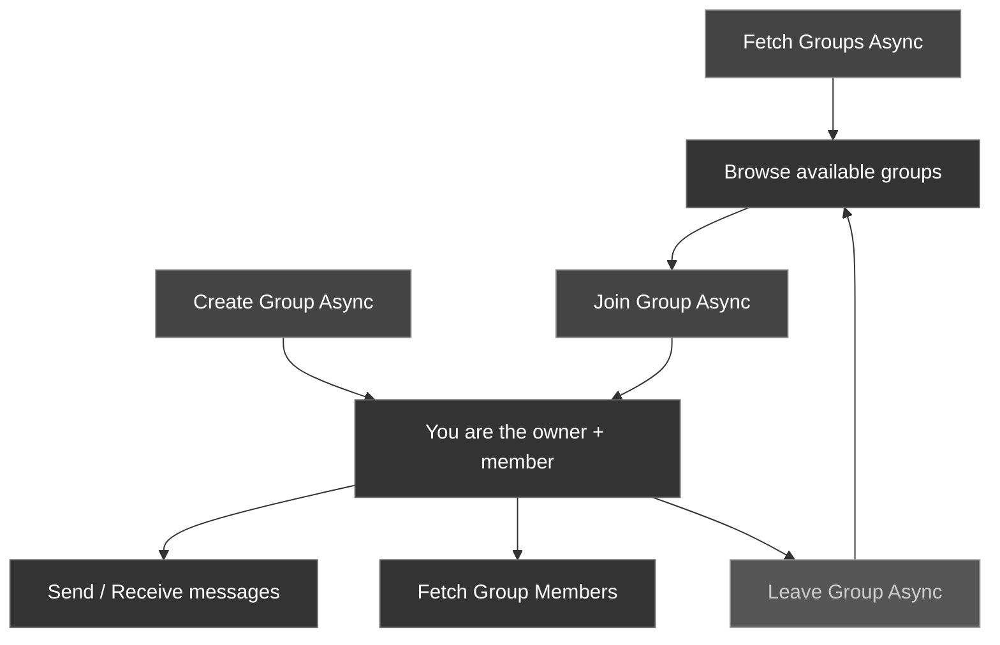

Groups let multiple users communicate in a shared conversation. The CometChat Unreal SDK provides async nodes for creating groups, joining existing ones, leaving, and sending/receiving group messages.

### Group Lifecycle



---

## Create a Group

Create a new group by building an `FCometChatGroup` and passing it to the node. Set at least `Name` and `Type`; the server assigns the `Guid` and makes the caller the group **owner**.

<Tabs>
<Tab title="Blueprint">
Call the **Create Group Async** node with an `FCometChatGroup` struct.

| Parameter | Type | Description |
| --------- | ---- | ----------- |
| Group | `FCometChatGroup` | The group to create. Set `Name` and `Type` (`public`, `private`, or `password`). For a `password` group, also set `Password`. Leave `Guid` empty to let the server assign one, or set your own. |

**On Success** returns the created `FCometChatGroup` with its server-assigned `Guid`.

**Use case — host a lobby.** When the host taps *Create Lobby*, create a `public` group so anyone can join, then open its chat view.

**Blueprint flow**

1. **Make FCometChatGroup** — set `Name` (for example, "Arena Lobby") and `Type` = `public`.
2. **Create Group Async** — pass the struct.
3. **On Success** (returns `Group`) → open the group chat with `Group.Guid`, then refresh your group list.
4. **On Failure** (returns `Error`) → show a toast with `Error.Message` and keep the create form open so the host can retry.
</Tab>
<Tab title="C++">
```cpp
#include "AsyncActions/CometChatCreateGroupAction.h"

void AMyActor::CreateLobbyGroup()
{
    FCometChatGroup Group;
    Group.Name = TEXT("Game Lobby");
    Group.Type = TEXT("public");         // public | private | password
    // Group.Password = TEXT("secret");  // required only when Type == "password"

    auto* Action = UCometChatCreateGroupAction::CreateGroupAsync(this, Group);
    Action->OnSuccess.AddDynamic(this, &AMyActor::OnGroupCreated);
    Action->OnFailure.AddDynamic(this, &AMyActor::OnGroupCreateFailed);
    Action->Activate();
}

void AMyActor::OnGroupCreated(const FCometChatGroup& Group)
{
    UE_LOG(LogTemp, Log, TEXT("Group created: %s (GUID: %s)"),
        *Group.Name, *Group.Guid);
}

void AMyActor::OnGroupCreateFailed(const FCometChatError& Error)
{
    UE_LOG(LogTemp, Error, TEXT("Create group failed: %s"), *Error.Message);
}
```
</Tab>
</Tabs>

<Tip>
To seed a group with initial members, create it first, then call **Add Members Async** (see [Group Member Management](#group-member-management)). The group `Type` controls join behavior: anyone can join a `public` group, a `private` group requires being added/invited, and a `password` group requires the password on join.
</Tip>

---

## Join a Group

Join an existing group by its GUID.

<Tabs>
<Tab title="Blueprint">
<Frame>
  
</Frame>

Call the **Join Group Async** node.

| Parameter | Type | Description |
| --------- | ---- | ----------- |
| GUID | `FString` | The unique identifier of the group to join |
| Group Type | `FString` | The group's type: `public`, `private`, or `password` |
| Password | `FString` | The group password — required only when Group Type is `password`; otherwise pass an empty string |

**On Success** returns the joined `FCometChatGroup`.

**Use case — join a guild.** From the guild browser, a player taps a group. For a `password` group, prompt for the password first, then join.

**Blueprint flow**

1. **Join Group Async** — pass `GUID`, `Group Type`, and `Password` (empty for non-password groups).
2. **On Success** (returns `Group`) → open the group chat and refresh the joined-groups list.
3. **On Failure** (returns `Error`) → branch on `Error.Code` (see [Handle join failures](#handle-join-failures)) to show the right message.
</Tab>
<Tab title="C++">
```cpp
#include "AsyncActions/CometChatJoinGroupAction.h"

void AMyActor::JoinGroup(const FString& Guid)
{
    auto* Action = UCometChatJoinGroupAction::JoinGroupAsync(
        this,
        Guid,
        TEXT("public"),  // group type: public | private | password
        TEXT("")         // password (only needed for password groups)
    );
    Action->OnSuccess.AddDynamic(this, &AMyActor::OnGroupJoined);
    Action->OnFailure.AddDynamic(this, &AMyActor::OnJoinFailed);
    Action->Activate();
}

void AMyActor::OnGroupJoined(const FCometChatGroup& Group)
{
    UE_LOG(LogTemp, Log, TEXT("Joined group: %s"), *Group.Name);
}

void AMyActor::OnJoinFailed(const FCometChatError& Error)
{
    UE_LOG(LogTemp, Error, TEXT("Join failed: %s"), *Error.Message);
}
```
</Tab>
</Tabs>

### Handle join failures

Wrong passwords, private-group restrictions, and full groups all surface on **On Failure** as an `FCometChatError`. Branch on `Error.Code` so players see a useful message instead of a generic failure.

<Tabs>
<Tab title="Blueprint">
Wire **Join Group Async → On Failure** into a **Switch on String** driven by `Error.Code`:

1. `ERR_WRONG_GROUP_PASS` → reopen the password prompt and let the player retry.
2. `ERR_ALREADY_JOINED` → treat as success and open the group chat.
3. `ERR_GUID_NOT_FOUND` → tell the player the group no longer exists and refresh the list.
4. **Default** → show `Error.Message`; transient network failures land here and are safe to retry.
</Tab>
<Tab title="C++">
```cpp
void AMyActor::OnJoinFailed(const FCometChatError& Error)
{
    if (Error.Code == TEXT("ERR_WRONG_GROUP_PASS"))
    {
        ShowPasswordPrompt();          // let the player re-enter the password
    }
    else if (Error.Code == TEXT("ERR_ALREADY_JOINED"))
    {
        OpenGroupChat();               // already a member — just enter
    }
    else if (Error.Code == TEXT("ERR_GUID_NOT_FOUND"))
    {
        RefreshGroupList();            // group was deleted — refresh the browser
    }
    else
    {
        // Network or unexpected error — safe to retry.
        UE_LOG(LogTemp, Error, TEXT("Join failed [%s]: %s"), *Error.Code, *Error.Message);
    }
}
```
</Tab>
</Tabs>

<Info>
See the [Error Guide](/articles/error-guide) for the full list of `Error.Code` values — including `ERR_EMPTY_GROUP_PASS`, `ERR_GROUP_JOIN_NOT_ALLOWED`, and `ERR_NO_VACANCY`.
</Info>

---

## Leave a Group

Leave a group you're currently a member of.

<Tabs>
<Tab title="Blueprint">
<Frame>
  
</Frame>

Call the **Leave Group Async** node.

| Parameter | Type | Description |
| --------- | ---- | ----------- |
| Guid | `FString` | The unique identifier of the group to leave |

**On Success** fires with no output.
</Tab>
<Tab title="C++">
```cpp
#include "AsyncActions/CometChatLeaveGroupAction.h"

void AMyActor::LeaveGroup(const FString& Guid)
{
    auto* Action = UCometChatLeaveGroupAction::LeaveGroupAsync(this, Guid);
    Action->OnSuccess.AddDynamic(this, &AMyActor::OnGroupLeft);
    Action->OnFailure.AddDynamic(this, &AMyActor::OnLeaveFailed);
    Action->Activate();
}

void AMyActor::OnGroupLeft()
{
    UE_LOG(LogTemp, Log, TEXT("Left the group"));
}

void AMyActor::OnLeaveFailed(const FCometChatError& Error)
{
    UE_LOG(LogTemp, Error, TEXT("Leave failed: %s"), *Error.Message);
}
```
</Tab>
</Tabs>

---

## Fetch Groups

Retrieve a list of groups with optional search and filters.

<Tabs>
<Tab title="Blueprint">
<Frame>
  
</Frame>

Call the **Fetch Groups Async** node with an `FCometChatGroupsRequest` struct. Set `bJoinedOnly = true` to only fetch groups the user has joined, or leave it `false` to browse all available groups.
</Tab>
<Tab title="C++">
```cpp
#include "AsyncActions/CometChatFetchGroupsAction.h"

void AMyActor::FetchGroups()
{
    FCometChatGroupsRequest Request;
    Request.Limit = 20;
    Request.bJoinedOnly = true;

    auto* Action = UCometChatFetchGroupsAction::FetchGroups(this, Request);
    Action->OnSuccess.AddDynamic(this, &AMyActor::OnGroupsFetched);
    Action->OnFailure.AddDynamic(this, &AMyActor::OnFetchFailed);
    Action->Activate();
}
```
</Tab>
</Tabs>

---

## Group Administration

### Get a Group

Fetch a single group's current details by GUID.

<Tabs>
<Tab title="Blueprint">
Call the **Get Group Async** node with the group `GUID`. **On Success** returns an `FCometChatGroup`.
</Tab>
<Tab title="C++">
```cpp
#include "AsyncActions/CometChatGetGroupAction.h"

void AMyActor::GetGroup(const FString& Guid)
{
    auto* Action = UCometChatGetGroupAction::GetGroupAsync(this, Guid);
    Action->OnSuccess.AddDynamic(this, &AMyActor::OnGroupFetched);
    Action->OnFailure.AddDynamic(this, &AMyActor::OnError);
    Action->Activate();
}

void AMyActor::OnGroupFetched(const FCometChatGroup& Group)
{
    UE_LOG(LogTemp, Log, TEXT("%s — %d members, owner %s"), *Group.Name, Group.MembersCount, *Group.Owner);
}
```
</Tab>
</Tabs>

### Get Joined Groups

Fetch the GUIDs of every group the logged-in user currently belongs to.

<Tabs>
<Tab title="Blueprint">
Call the **Get Joined Groups Async** node (no parameters). **On Success** returns a `TArray<FString>` of group GUIDs.
</Tab>
<Tab title="C++">
```cpp
#include "AsyncActions/CometChatGetJoinedGroupsAction.h"

void AMyActor::GetJoinedGroups()
{
    auto* Action = UCometChatGetJoinedGroupsAction::GetJoinedGroupsAsync(this);
    Action->OnSuccess.AddDynamic(this, &AMyActor::OnJoinedGroups);
    Action->OnFailure.AddDynamic(this, &AMyActor::OnError);
    Action->Activate();
}

void AMyActor::OnJoinedGroups(const TArray<FString>& Guids)
{
    UE_LOG(LogTemp, Log, TEXT("Joined %d groups"), Guids.Num());
}
```
</Tab>
</Tabs>

### Update a Group

Update a group's name, description, icon, type, or metadata (requires `admin`/owner scope).

<Tabs>
<Tab title="Blueprint">
Call the **Update Group Async** node with an `FCometChatGroup` whose `Guid` identifies the group and whose other fields carry the new values. **On Success** returns the updated `FCometChatGroup`.
</Tab>
<Tab title="C++">
```cpp
#include "AsyncActions/CometChatUpdateGroupAction.h"

void AMyActor::RenameGroup(const FString& Guid)
{
    FCometChatGroup Group;
    Group.Guid = Guid;
    Group.Name = TEXT("Champions Lobby");
    Group.Description = TEXT("Ranked players only");

    auto* Action = UCometChatUpdateGroupAction::UpdateGroupAsync(this, Group);
    Action->OnSuccess.AddDynamic(this, &AMyActor::OnGroupUpdated);
    Action->OnFailure.AddDynamic(this, &AMyActor::OnError);
    Action->Activate();
}
```
</Tab>
</Tabs>

### Transfer Ownership

Hand group ownership to another member.

<Tabs>
<Tab title="Blueprint">
Call the **Transfer Ownership Async** node with the group `GUID` and the new owner's `UID`. Only the current owner can transfer ownership.
</Tab>
<Tab title="C++">
```cpp
#include "AsyncActions/CometChatTransferOwnershipAction.h"

void AMyActor::TransferOwnership(const FString& Guid, const FString& NewOwnerUid)
{
    auto* Action = UCometChatTransferOwnershipAction::TransferOwnershipAsync(this, Guid, NewOwnerUid);
    Action->OnSuccess.AddDynamic(this, &AMyActor::OnOwnershipTransferred);
    Action->OnFailure.AddDynamic(this, &AMyActor::OnError);
    Action->Activate();
}
```
</Tab>
</Tabs>

### Delete a Group

Permanently delete a group (owner only).

<Tabs>
<Tab title="Blueprint">
Call the **Delete Group Async** node with the group `GUID`.
</Tab>
<Tab title="C++">
```cpp
#include "AsyncActions/CometChatDeleteGroupAction.h"

void AMyActor::DeleteGroup(const FString& Guid)
{
    auto* Action = UCometChatDeleteGroupAction::DeleteGroupAsync(this, Guid);
    Action->OnSuccess.AddDynamic(this, &AMyActor::OnGroupDeleted);
    Action->OnFailure.AddDynamic(this, &AMyActor::OnError);
    Action->Activate();
}
```
</Tab>
</Tabs>

<Warning>
**Delete Group** is irreversible — the group and its message history are removed for all members. Gate it behind an owner-only confirmation in your UI.
</Warning>

### Online Member Count

Get the number of currently-online members across one or more groups.

<Tabs>
<Tab title="Blueprint">
Call the **Get Online Group Member Count Async** node with a `TArray<FString>` of group GUIDs.
</Tab>
<Tab title="C++">
```cpp
#include "AsyncActions/CometChatGetOnlineGroupMemberCountAction.h"

void AMyActor::GetOnlineCounts(const TArray<FString>& Guids)
{
    auto* Action = UCometChatGetOnlineGroupMemberCountAction::GetOnlineGroupMemberCountAsync(this, Guids);
    Action->OnSuccess.AddDynamic(this, &AMyActor::OnOnlineCounts);
    Action->OnFailure.AddDynamic(this, &AMyActor::OnError);
    Action->Activate();
}
```
</Tab>
</Tabs>

---

## Group Member Management

Once a group exists, use these nodes to fetch its members, add new ones, and moderate (kick/ban/unban), and change a member's role.

### Fetch Members

<Tabs>
<Tab title="Blueprint">
Call the **Fetch Group Members Async** node with an `FCometChatGroupMembersRequest` struct (set `GUID` to the target group).
</Tab>
<Tab title="C++">
```cpp
#include "AsyncActions/CometChatFetchGroupMembersAction.h"

void AMyActor::FetchMembers(const FString& Guid)
{
    FCometChatGroupMembersRequest Request;
    Request.GUID = Guid;
    Request.Limit = 30;

    auto* Action = UCometChatFetchGroupMembersAction::FetchGroupMembersAsync(this, Request);
    Action->OnSuccess.AddDynamic(this, &AMyActor::OnMembersFetched);
    Action->OnFailure.AddDynamic(this, &AMyActor::OnFetchFailed);
    Action->Activate();
}

void AMyActor::OnMembersFetched(const TArray<FCometChatGroupMember>& Members)
{
    for (const FCometChatGroupMember& Member : Members)
    {
        UE_LOG(LogTemp, Log, TEXT("%s — %s"), *Member.User.Name, *Member.Scope);
    }
}
```
</Tab>
</Tabs>

### Reference: sample UI — Fetch Group Members

The bundled sample panel loads members with the **native C++ SDK API** (`Sub->GetSdk()->fetch_group_members(...)`) and rebuilds its list on the game thread. In your own game, prefer the **Fetch Group Members Async** node shown above, which already marshals the result to the game thread for you. This snippet is trimmed to the SDK call and refresh.

```cpp
// Trimmed from CometChatPanel.cpp — UCometChatPanel::FetchGroupMembers()
void UCometChatPanel::FetchGroupMembers()
{
    auto* Sub = GetSubsystem();
    if (!Sub || !Sub->GetSdk() || ActiveChatId.IsEmpty()) return;

    chatsdk::GroupMembersRequestBuilder req;
    req.guid  = TCHAR_TO_UTF8(*ActiveChatId);
    req.limit = 50;

    Sub->GetSdk()->fetch_group_members(req,
        [this](const std::string& err, const std::vector<chatsdk::GroupMember>& members)
        {
            // The SDK callback runs off the game thread — hop back before touching UI.
            AsyncTask(ENamedThreads::GameThread, [this, members]()
            {
                CurrentGroupMembers.Empty();
                for (const auto& m : members)
                {
                    FCometChatGroupMember um;
                    um.User  = CometChatConversions::ToUnreal(m.user);
                    um.Scope = UTF8_TO_TCHAR(m.scope.c_str());
                    // Skip anyone we just banned — the server can still return them for a
                    // moment after the ban (replication lag), which would re-add them.
                    if (BannedUidFilter.Contains(um.User.Uid)) continue;
                    CurrentGroupMembers.Add(um);
                }
                RebuildGroupMembersList();   // refresh the list once data arrives
            });
        }
    );
}
```

<Info>
This is the native C++ SDK surface used by the sample UI. Blueprint and C++ game code should call **Fetch Group Members Async** (see [Fetch Members](#fetch-members)) instead, so you never have to marshal threads yourself.
</Info>

### Add Members

<Tabs>
<Tab title="Blueprint">
Call the **Add Members Async** node with the group `Guid` and a `TArray<FCometChatGroupMember>` (set each entry's `User.Uid` and `Scope`, typically `"participant"`).
</Tab>
<Tab title="C++">
```cpp
#include "AsyncActions/CometChatAddMembersAction.h"

void AMyActor::AddMemberToGroup(const FString& Guid, const FString& Uid)
{
    FCometChatGroupMember NewMember;
    NewMember.User.Uid = Uid;
    NewMember.Scope = TEXT("participant");

    auto* Action = UCometChatAddMembersAction::AddMembersAsync(this, Guid, { NewMember });
    Action->OnSuccess.AddDynamic(this, &AMyActor::OnMemberAdded);
    Action->OnFailure.AddDynamic(this, &AMyActor::OnAddFailed);
    Action->Activate();
}
```
</Tab>
</Tabs>

### Kick, Ban, and Unban

**Kick** removes a member — they can rejoin. **Ban** removes them and prevents rejoining until **Unban** is called.

<Tabs>
<Tab title="Blueprint">
Call **Kick Member Async**, **Ban Member Async**, or **Unban Member Async** with the target `Uid` and the group `Guid`. Fetch **Fetch Banned Members Async** (same request shape as fetching members) to list who's currently banned.

**Use case — moderate a lobby.** A moderator taps a disruptive member and chooses *Ban* to remove them and stop them rejoining.

**Blueprint flow**

1. **Ban Member Async** — pass the target `Uid` and the group `Guid`.
2. **On Success** → remove the member from your active list, add them to the banned list, then refetch both to reconcile.
3. **On Failure** (returns `Error`) → show `Error.Message`; `ERR_GROUP_NO_CLEARANCE` means the caller lacks the scope to ban this member (for example, a moderator targeting an admin).
</Tab>
<Tab title="C++">
```cpp
#include "AsyncActions/CometChatKickMemberAction.h"
#include "AsyncActions/CometChatBanMemberAction.h"
#include "AsyncActions/CometChatUnbanMemberAction.h"
#include "AsyncActions/CometChatFetchBannedMembersAction.h"

void AMyActor::BanMember(const FString& Uid, const FString& Guid)
{
    auto* Action = UCometChatBanMemberAction::BanMemberAsync(this, Uid, Guid);
    Action->OnSuccess.AddDynamic(this, &AMyActor::OnMemberBanned);
    Action->OnFailure.AddDynamic(this, &AMyActor::OnActionFailed);
    Action->Activate();
}
```
</Tab>
</Tabs>

<Warning>
Ban and unban only take effect for other members — the SDK does not let a member ban themselves or the group owner. The server enforces this, but you should also gate the ban/kick/promote/demote UI controls in your app by the logged-in user's own scope (see the permission model below) so unauthorized options aren't even shown.
</Warning>

### Reference: sample UI — Ban Member

The sample panel bans a member with the **native C++ SDK API** (`Sub->GetSdk()->ban_group_member(...)`) and then reconciles its lists. In your own game, prefer the **Ban Member Async** node shown above — this snippet is trimmed to show the success/refresh pattern.

```cpp
// Trimmed from CometChatPanel.cpp — UCometChatPanel::OnMemberBanClicked()
void UCometChatPanel::OnMemberBanClicked()
{
    auto* Sub = GetSubsystem();
    if (!Sub || !Sub->GetSdk() || SelectedMemberUid.IsEmpty()) return;

    const FString BannedUid = SelectedMemberUid;
    Sub->GetSdk()->ban_group_member(TCHAR_TO_UTF8(*BannedUid), TCHAR_TO_UTF8(*ActiveChatId),
        [this, BannedUid](const std::string& err)
        {
            // The SDK callback runs off the game thread — hop back before touching UI.
            AsyncTask(ENamedThreads::GameThread, [this, err, BannedUid]()
            {
                if (!err.empty()) { ShowSnackbar(TEXT("Failed to ban member")); return; }

                ShowSnackbar(TEXT("Member banned"));
                // Optimistic update: move the member to the banned list now. A refetch races
                // replication and often still returns the banned member, so we also add them
                // to BannedUidFilter until the server catches up.
                BannedUidFilter.Add(BannedUid);
                for (int32 i = CurrentGroupMembers.Num() - 1; i >= 0; --i)
                {
                    if (CurrentGroupMembers[i].User.Uid == BannedUid)
                    {
                        BannedMembers.Add(CurrentGroupMembers[i]);
                        CurrentGroupMembers.RemoveAt(i);
                    }
                }
                RebuildGroupMembersList();
                RebuildBannedMembersList();
                FetchGroupMembers();   // reconcile active list with the server
                FetchBannedMembers();  // reconcile banned list with the server
            });
        }
    );
}
```

<Tip>
**Best practice — update locally, then reconcile.** Gate kick/ban/promote/demote controls by the caller's own `Scope` (or an owner check) so only authorized moderators see them. After a successful action, update your local member and banned lists immediately for a responsive UI, then refetch to reconcile with the server.
</Tip>

<Warning>
**Bad practice — trusting an immediate refetch.** Don't show moderation controls to a `participant`, and don't assume a fetch fired right after a ban/kick/scope-change already reflects it. The server needs a moment to replicate, so a naive refetch can re-add the member you just removed — which is why the sample keeps a short-lived `BannedUidFilter` until the reconcile catches up.
</Warning>

### Promote and Demote (Change Scope)

A member's role (`participant` → `moderator` → `admin`) is changed with the same node in either direction.

<Tabs>
<Tab title="Blueprint">
Call the **Change Scope Async** node with the target `Uid`, the group `Guid`, and the new `Scope` (`"participant"`, `"moderator"`, or `"admin"`).

**Use case — promote to moderator.** The owner promotes a trusted player so they can help moderate the group.

**Blueprint flow**

1. **Change Scope Async** — pass the target `Uid`, the group `Guid`, and `Scope` = `moderator`.
2. **On Success** → refetch the member list so the new role badge shows.
3. **On Failure** (returns `Error`) → show `Error.Message`; `ERR_SAME_SCOPE` means the member already has that scope, and `ERR_GROUP_NO_SCOPE_CLEARANCE` means the caller can't change this member's scope.
</Tab>
<Tab title="C++">
```cpp
#include "AsyncActions/CometChatChangeScopeAction.h"

void AMyActor::PromoteToModerator(const FString& Uid, const FString& Guid)
{
    auto* Action = UCometChatChangeScopeAction::ChangeScopeAsync(this, Uid, Guid, TEXT("moderator"));
    Action->OnSuccess.AddDynamic(this, &AMyActor::OnScopeChanged);
    Action->OnFailure.AddDynamic(this, &AMyActor::OnActionFailed);
    Action->Activate();
}
```
</Tab>
</Tabs>

<Tip>
**Permission model**: only `admin`/owner can promote someone to `admin`. A `moderator` can promote a `participant` to `moderator` and kick/ban members with a strictly lower scope than their own, but cannot touch another `admin` or the owner. Read the logged-in user's own scope from `FCometChatGroup.Scope` (or check `UserUid == Group.Owner`) before deciding which member actions to show.
</Tip>

<Info>
Listen for `OnGroupMemberKicked`, `OnGroupMemberBanned`, `OnGroupMemberUnbanned`, and `OnGroupMemberScopeChanged` on the subsystem to keep member lists in sync in real time — including changes made by other admins/moderators. See [Real-Time Events](/sdk/unreal/real-time-events).
</Info>

---

## Send a Group Message

Send a text message to all members of a group. See [Send a Message → Group Messages](/sdk/unreal/send-message#send-a-group-message) for details.

---

## Fetch Group Message History

Retrieve previous messages from a group with pagination. See [Receive Messages → Group Messages](/sdk/unreal/receive-messages#fetch-group-messages) for details.

---

## FCometChatGroup Properties

| Property | Type | Description |
| -------- | ---- | ----------- |
| `Guid` | `FString` | Server-assigned unique group identifier |
| `Name` | `FString` | Group display name |
| `Description` | `FString` | Group description text |
| `Type` | `FString` | `public`, `private`, or `password` |
| `Password` | `FString` | Password (for `password`-type groups) |
| `Icon` | `FString` | URL to the group's icon image |
| `Owner` | `FString` | UID of the group owner |
| `Scope` | `FString` | The logged-in user's scope in this group (`admin`, `moderator`, `participant`) |
| `MembersCount` | `int32` | Number of members |
| `bHasJoined` | `bool` | Whether the logged-in user is a member |
| `JoinedAt` | `int64` | When the logged-in user joined |
| `bIsBannedFromGroup` | `bool` | Whether the logged-in user is banned from this group |
| `Metadata` | `FString` | Custom metadata JSON |
| `Tags` | `TArray<FString>` | Group tags |
| `CreatedAt` | `int64` | Creation timestamp |
| `UpdatedAt` | `int64` | Last update timestamp |

<Info>
The member list is not a field on the group — fetch it separately with **Fetch Group Members Async** (see [Group Member Management](#group-member-management)).
</Info>

---

## Next Steps

<CardGroup cols={2}>
  <Card title="Send a Message" icon="paper-plane" href="/sdk/unreal/send-message">
    Send messages to users and groups.
  </Card>
  <Card title="Real-Time Events" icon="bolt" href="/sdk/unreal/real-time-events">
    Listen for messages, presence, typing, and more.
  </Card>
</CardGroup>
