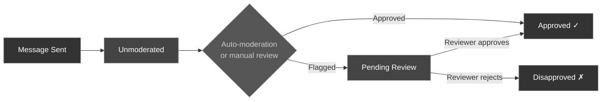

The CometChat Unreal SDK provides moderation tools to let users report inappropriate content. You can flag messages with a reason, fetch available flag reasons, and track moderation status on messages.

---

## Flag a Message

Use the **Flag Message Async** node to report a message for moderation review.

<Tabs>
<Tab title="Blueprint">
<Frame>
  
</Frame>

1. Create an `FCometChatFlagDetail` struct with the `ReasonId` and optional `Remark`
2. Call the **Flag Message Async** node with the message ID (`int64`) and flag detail
3. Handle **On Success** (message flagged) or **On Failure** (receives an `FCometChatError`)
</Tab>
<Tab title="C++">
```cpp
void AMyActor::FlagMessage(int64 MessageId)
{
    FCometChatFlagDetail FlagDetail;
    FlagDetail.ReasonId = TEXT("spam");           // an Id from Get Flag Reasons
    FlagDetail.Remark = TEXT("This message is spam");

    auto* Action = UCometChatFlagMessageAction::FlagMessageAsync(this, MessageId, FlagDetail);
    Action->OnSuccess.AddDynamic(this, &AMyActor::HandleFlagSuccess);
    Action->OnFailure.AddDynamic(this, &AMyActor::HandleFlagFailed);
    Action->Activate();
}

void AMyActor::HandleFlagSuccess(const FString& Result)
{
    UE_LOG(LogTemp, Log, TEXT("Message flagged: %s"), *Result);
}

void AMyActor::HandleFlagFailed(const FCometChatError& Error)
{
    UE_LOG(LogTemp, Error, TEXT("Flag failed: %s"), *Error.Message);
}
```
</Tab>
</Tabs>

---

## Get Flag Reasons

Fetch the list of available reasons a user can select when flagging a message.

<Tabs>
<Tab title="Blueprint">
1. Call the **Get Flag Reasons Async** node (no parameters needed)
2. On Success, iterate the returned `TArray<FCometChatFlagReason>`
3. Display the reasons in a UI picker for the user to select from
</Tab>
<Tab title="C++">
```cpp
void AMyActor::FetchFlagReasons()
{
    auto* Action = UCometChatGetFlagReasonsAction::GetFlagReasonsAsync(this);
    Action->OnSuccess.AddDynamic(this, &AMyActor::HandleFlagReasons);
    Action->OnFailure.AddDynamic(this, &AMyActor::HandleReasonsFailed);
    Action->Activate();
}

void AMyActor::HandleFlagReasons(const TArray<FCometChatFlagReason>& Reasons)
{
    for (const auto& Reason : Reasons)
    {
        UE_LOG(LogTemp, Log, TEXT("Reason: %s — %s"), *Reason.Name, *Reason.Description);
    }
}
```
</Tab>
</Tabs>

---

## Moderation Status on Messages

Every `FCometChatMessage` includes a `ModerationStatus` field of type `ECometChatModerationStatus`. Use this to filter or visually indicate moderated content in your UI.



### ECometChatModerationStatus

| Value | Description |
| ----- | ----------- |
| `Unmoderated` | Message has not been moderated |
| `Pending` | Message is pending moderation review |
| `Approved` | Message has been approved by moderation |
| `Disapproved` | Message has been rejected by moderation |

### Real-Time Moderation Updates

Listen to the `OnMessageModerated` delegate to receive real-time updates when a message's moderation status changes:

<Tabs>
<Tab title="Blueprint">
Bind to **On Message Moderated** on the CometChat Subsystem. The event provides the updated `FCometChatMessage` with the new `ModerationStatus`.
</Tab>
<Tab title="C++">
```cpp
void AMyActor::BeginPlay()
{
    Super::BeginPlay();

    UCometChatSubsystem* Chat = GetGameInstance()->GetSubsystem<UCometChatSubsystem>();
    Chat->OnMessageModerated.AddDynamic(this, &AMyActor::HandleMessageModerated);
}

void AMyActor::HandleMessageModerated(const FCometChatMessage& Message)
{
    switch (Message.ModerationStatus)
    {
    case ECometChatModerationStatus::Approved:
        UE_LOG(LogTemp, Log, TEXT("Message %s approved"), *Message.Id);
        break;
    case ECometChatModerationStatus::Disapproved:
        UE_LOG(LogTemp, Log, TEXT("Message %s disapproved — hiding"), *Message.Id);
        HideMessage(Message.Id);
        break;
    default:
        break;
    }
}
```
</Tab>
</Tabs>

---

## FCometChatFlagDetail

The struct you provide when flagging a message.

| Property | Type | Description |
| -------- | ---- | ----------- |
| `ReasonId` | `FString` | ID of the flag reason (from `GetFlagReasons`) |
| `Remark` | `FString` | Optional free-text remark from the reporter |

## FCometChatFlagReason

The struct returned when fetching available flag reasons.

| Property | Type | Description |
| -------- | ---- | ----------- |
| `Id` | `FString` | Unique reason identifier |
| `Name` | `FString` | Display name (e.g., "Spam", "Harassment") |
| `Description` | `FString` | Detailed description of the reason |
| `CreatedAt` | `int64` | Creation timestamp |
| `UpdatedAt` | `int64` | Last update timestamp |

---

## Use Case: Report a Message

**Goal:** let a player flag another player's message for review. **Flag Message Async** reports it with a reason; wire **both** branches so the reporter gets clear feedback.

<Tabs>
<Tab title="Blueprint">
1. (Once) call **Get Flag Reasons Async** and cache the returned reasons for your report menu
2. On **Report**, build an `FCometChatFlagDetail` — `ReasonId` from the cached list, optional `Remark`
3. Call **Flag Message Async** with the message's numeric **Message Id** and the flag detail
4. **On Success** → show "Report submitted" and dismiss the menu (the success pin carries a result `FString`)
5. **On Failure** → receives an `FCometChatError`; show "Couldn't submit report, try again" and log `Message`
</Tab>
<Tab title="C++">
```cpp
void AMyActor::ReportMessage(int64 MessageId, const FString& ReasonId)
{
    FCometChatFlagDetail Detail;
    Detail.ReasonId = ReasonId;
    Detail.Remark   = TEXT("Reported from game client");

    auto* Action = UCometChatFlagMessageAction::FlagMessageAsync(this, MessageId, Detail);
    Action->OnSuccess.AddDynamic(this, &AMyActor::HandleFlagSubmitted);
    Action->OnFailure.AddDynamic(this, &AMyActor::HandleFlagError);
    Action->Activate();
}

void AMyActor::HandleFlagSubmitted(const FString& Result)
{
    UE_LOG(LogTemp, Log, TEXT("Report submitted: %s"), *Result);
}

// Shared failure handler for Flag Message + Get Flag Reasons
void AMyActor::HandleFlagError(const FCometChatError& Error)
{
    UE_LOG(LogTemp, Error, TEXT("Moderation request failed: %s"), *Error.Message);
    // Surface a retry affordance in the report UI
}
```
</Tab>
</Tabs>

<Info>
**Always wire On Failure** on both **Flag Message Async** and **Get Flag Reasons Async**. Both hit the network and can fail (offline, rate-limited, invalid reason). The pin delivers an `FCometChatError` — log `Error.Message` and let the player retry instead of leaving the report silently dropped.
</Info>

<Tip>
**Best practice:** call **Get Flag Reasons Async** once (on chat load or the first report) and cache the `TArray<FCometChatFlagReason>`. The list rarely changes, so re-fetching on every report wastes a round-trip.
</Tip>

<Warning>
**Don't expose raw moderation state to everyone.** `ModerationStatus` (`Pending`, `Disapproved`) and who-flagged-what are moderator concerns. Hide or replace disapproved messages for regular players, and surface `Pending`/reviewer detail only in moderator-facing UI.
</Warning>

---

## Next Steps

<CardGroup cols={2}>
  <Card title="Real-Time Events" icon="bolt" href="/sdk/unreal/real-time-events">
    Listen for moderation status changes in real time.
  </Card>
  <Card title="API Reference" icon="book" href="/sdk/unreal/reference">
    Complete reference of all structs and enums.
  </Card>
</CardGroup>
