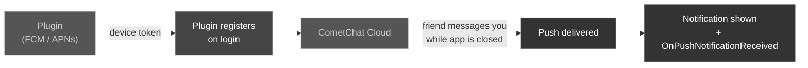

Push notifications bring players back to your game — a guild @mention, a friend's challenge, an incoming voice call. The plugin ships the **full push path**: it obtains the device token (FCM on Android, APNs on iOS), registers it with CometChat after login, and displays the incoming notification. You turn it on with a few config values; no Firebase or Objective-C wiring of your own. It also stores **per-user notification preferences** so each player controls exactly which events buzz their phone.

<Info>
**Push is opt-in and inert until you enable it.** Without `bEnablePushNotifications=True` in your `DefaultEngine.ini`, the plugin adds **nothing** to your build — no Firebase dependency, no manifest service, no notification permission, no startup code. Projects that don't use push are completely unaffected.
</Info>

### Push Registration Flow



Once configured, the plugin fetches the device token, waits until the user is authenticated, and registers automatically from **every** login path. It also re-registers when the platform rotates the token, and unregisters on logout so the next user on that device doesn't inherit the previous user's notifications. You don't call anything — but [Register Token Async](#register-a-push-token) remains available if you manage tokens yourself.

---

## Setup

<Steps>
<Step title="Configure a provider in the CometChat Dashboard">
In your app's dashboard, enable the **Notifications** add-on and add a push provider:
- **Android** — an **FCM** provider (upload your Firebase service-account JSON).
- **iOS** — an **APNs** provider (auth key `.p8` or certificate).

Each provider has a **Provider ID**. Note it for the next step.

<Warning>
If the Notifications add-on isn't enabled on your app, token registration fails with `401 ERR_UNAUTHORIZED` / *"Forbidden resource"* no matter how the client is configured. Do this step first.
</Warning>
</Step>

<Step title="Add your config to DefaultEngine.ini">
```ini
[CometChat]
; Master switch — without this the plugin adds no push wiring to your build at all.
bEnablePushNotifications=True

; Provider ID from the dashboard (step 1).
PushProviderId=my-fcm-provider

; Android only — from YOUR google-services.json.
; project_info → project_number / project_id / storage_bucket
; client → mobilesdk_app_id, api_key → current_key
FcmAppId=1:000000000000:android:0000000000000000000000
FcmApiKey=AIza...
FcmProjectId=my-firebase-project
FcmSenderId=000000000000
FcmBucket=my-firebase-project.appspot.com
```

These are injected into the Android build at package time — you do **not** add `google-services.json` to the plugin, and no credentials live in the plugin itself.

<Warning>
Your app's **Package Name** (Project Settings → Android) must match a client registered in that Firebase project, or Firebase issues a token your project can't deliver to.
</Warning>
</Step>

<Step title="iOS only — enable remote notifications">
Project Settings → **iOS** → **Enable Remote Notifications Support**.

Unreal adds the `aps-environment` entitlement; the plugin then registers for APNs and forwards the device token to CometChat. Your provisioning profile must have the **Push Notifications** capability.

<Info>
The plugin deliberately does not add this entitlement itself — injecting it into an app whose provisioning profile lacks Push would break code signing. With the setting off, the iOS push code is inert.
</Info>
</Step>

<Step title="Log in and verify">
Log a user in, then check the log:
```
CometChatFCM: FirebaseApp initialized (project=my-firebase-project)
CometChatFCM: FCM token ready (142 chars)
LogCometChat: Registering FCM push token (142 chars)
LogCometChat: FCM push token registered
```
Background the app and have another user message you.
</Step>
</Steps>

---

## Reacting to a push in-game

Bind these on the CometChat subsystem to react to notifications. Both are optional — push works without them.

| Event | Fires when |
| ----- | ---------- |
| `OnPushNotificationReceived` | A push arrives while your game is running |
| `OnPushNotificationTapped` | The player taps a CometChat notification — including a tap that cold-starts the app |

Both pass the push payload as a JSON `FString`. Read `conversationId`, `sender`, `receiver`, `receiverType`, `title`, `body` from it.

<Tabs>
<Tab title="Blueprint">
From **Get CometChat Subsystem**, bind **On Push Notification Tapped** and parse the payload with **Deserialize JSON** to route the player to the right conversation.
</Tab>
<Tab title="C++">
```cpp
void UMyHUD::NativeConstruct()
{
    Super::NativeConstruct();
    if (auto* Sub = GetGameInstance()->GetSubsystem<UCometChatSubsystem>())
    {
        Sub->OnPushNotificationTapped.AddDynamic(this, &UMyHUD::HandlePushTapped);
        Sub->OnPushNotificationReceived.AddDynamic(this, &UMyHUD::HandlePushReceived);
    }
}

void UMyHUD::HandlePushTapped(const FString& PayloadJson)
{
    // Route to the conversation the notification referred to.
    UE_LOG(LogTemp, Log, TEXT("Notification tapped: %s"), *PayloadJson);
}

void UMyHUD::HandlePushReceived(const FString& PayloadJson)
{
    // App is running — e.g. refresh an unread badge.
}
```
</Tab>
</Tabs>

<Tip>
A tap can launch the app from cold. The plugin queues the tap until the subsystem exists and your Blueprint has bound, so you won't miss it if you bind during startup.
</Tip>

---

## Register a Push Token

<Info>
**You normally don't need this.** With [Setup](#setup) done, the plugin registers automatically after login and re-registers on token rotation. Use this node only if you obtain tokens yourself — e.g. a custom Firebase layer, a third-party push plugin, or registering an extra **APNs VoIP** token for CallKit.
</Info>

Registers the given device push token so this user receives notifications on this device. The token is stored against the **logged-in user**, so call it after login.

<Tabs>
<Tab title="Blueprint">
Call the **Register Token Async** node.

| Parameter | Type | Description |
| --------- | ---- | ----------- |
| Token | `FString` | The device push token from FCM (Android) or APNs (iOS) |
| Platform | `ECometChatPushPlatform` | `FCM`, `APNS`, or `APNS_VOIP` |
| Provider Id | `FString` | The push provider profile ID configured in the CometChat Dashboard |

**On Success** returns a JSON `FString` result confirming registration.
</Tab>
<Tab title="C++">
```cpp
#include "AsyncActions/CometChatRegisterTokenAction.h"

void AMyActor::RegisterAndroidPushToken(const FString& FcmToken)
{
    auto* Action = UCometChatRegisterTokenAction::RegisterTokenAsync(
        this,
        FcmToken,                          // Device token from Firebase Cloud Messaging
        ECometChatPushPlatform::FCM,       // Platform
        TEXT("my-fcm-provider")            // Provider Id from the dashboard
    );
    Action->OnSuccess.AddDynamic(this, &AMyActor::OnTokenRegistered);
    Action->OnFailure.AddDynamic(this, &AMyActor::OnError);
    Action->Activate();
}

void AMyActor::OnTokenRegistered(const FString& Result)
{
    UE_LOG(LogTemp, Log, TEXT("Push token registered: %s"), *Result);
}

// Shared async failure handler used across this page.
void AMyActor::OnError(const FCometChatError& Error)
{
    UE_LOG(LogTemp, Error, TEXT("Push request failed: %s"), *Error.Message);
}
```
</Tab>
</Tabs>

### ECometChatPushPlatform

| Value | Description |
| ----- | ----------- |
| `FCM` | Firebase Cloud Messaging — Android device tokens |
| `APNS` | Apple Push Notification service — standard iOS device tokens |
| `APNS_VOIP` | Apple PushKit VoIP tokens — for high-priority incoming-call pushes on iOS (CallKit) |

<Info>
`Provider Id` is the **push provider profile** you set up under **Notifications** in the [CometChat Dashboard](https://app.cometchat.com) (where you upload your FCM server key or APNs auth key). It selects which credentials CometChat uses to deliver the push — it is not the device token.
</Info>

<Tip>
On iOS, register the standard APNs token with `APNS` for chat messages, and register the separate PushKit token with `APNS_VOIP` if your game uses [Calls](/sdk/unreal/reference) so incoming voice/video invites can wake the app instantly. They are two different tokens for two different notification paths.
</Tip>

---

## Unregister a Push Token

Stop notifications from being delivered to this device — call it at logout, or when the player signs out on a shared device so the next player doesn't receive their messages.

<Tabs>
<Tab title="Blueprint">
Call the **Unregister Token Async** node. It takes no parameters and unregisters the current device's token for the logged-in user.

**On Success** fires with **no output** — notifications to this device are now stopped.
</Tab>
<Tab title="C++">
```cpp
#include "AsyncActions/CometChatUnregisterTokenAction.h"

void AMyActor::UnregisterPushToken()
{
    auto* Action = UCometChatUnregisterTokenAction::UnregisterTokenAsync(this);
    Action->OnSuccess.AddDynamic(this, &AMyActor::OnTokenUnregistered);
    Action->OnFailure.AddDynamic(this, &AMyActor::OnError);
    Action->Activate();
}

void AMyActor::OnTokenUnregistered()
{
    // Parameterless — the device is no longer registered for push.
    UE_LOG(LogTemp, Log, TEXT("Push token unregistered"));
}
```
</Tab>
</Tabs>

<Warning>
Always unregister before logging a user out on a **shared or public device**. If you skip this, push notifications intended for the previous player keep arriving after the next player signs in.
</Warning>

---

## Notification Preferences

Every user has a set of notification preferences that decide which events generate a push. Expose these in an in-game **Settings → Notifications** screen so players can, for example, silence noisy guild join/leave spam while still being pinged for direct messages.

Preferences are represented by the `FCometChatNotificationPreferences` struct (detailed [below](#fcometchatnotificationpreferences)). Each event flag is an `int32` where **`1` = enabled** and **`0` = disabled**.

### Fetch Preferences

Load the user's current preferences — typically when the notifications settings screen opens — to populate the toggles.

<Tabs>
<Tab title="Blueprint">
Call the **Fetch Preferences Async** node. It takes no parameters.

**On Success** returns an `FCometChatNotificationPreferences` struct with the user's current settings.
</Tab>
<Tab title="C++">
```cpp
#include "AsyncActions/CometChatFetchPreferencesAction.h"

void AMyActor::LoadNotificationSettings()
{
    auto* Action = UCometChatFetchPreferencesAction::FetchPreferencesAsync(this);
    Action->OnSuccess.AddDynamic(this, &AMyActor::OnPreferencesFetched);
    Action->OnFailure.AddDynamic(this, &AMyActor::OnError);
    Action->Activate();
}

void AMyActor::OnPreferencesFetched(const FCometChatNotificationPreferences& Prefs)
{
    UE_LOG(LogTemp, Log, TEXT("1:1 messages: %d, Group messages: %d, DND: %d"),
        Prefs.OneOnOne.Messages, Prefs.Group.Messages, Prefs.Mute.DND);
    // Populate the settings toggles from Prefs...
}
```
</Tab>
</Tabs>

### Update Preferences

Save the player's chosen settings. Build an `FCometChatNotificationPreferences` from your toggle states and submit it. The example below keeps direct messages on but silences the group member-churn events (joined/left) that spam large guilds, and enables Do Not Disturb.

<Tabs>
<Tab title="Blueprint">
Call the **Update Preferences Async** node with a filled-in `FCometChatNotificationPreferences` struct.

| Parameter | Type | Description |
| --------- | ---- | ----------- |
| Preferences | `FCometChatNotificationPreferences` | The full preferences object to persist |

**On Success** returns the updated `FCometChatNotificationPreferences` as stored by the server.
</Tab>
<Tab title="C++">
```cpp
#include "AsyncActions/CometChatUpdatePreferencesAction.h"

void AMyActor::SaveNotificationSettings()
{
    FCometChatNotificationPreferences Prefs;

    // Keep 1:1 messages and replies buzzing.
    Prefs.OneOnOne.Messages  = 1;
    Prefs.OneOnOne.Replies   = 1;
    Prefs.OneOnOne.Reactions = 0;   // Player doesn't care about reaction pings.

    // Keep guild messages, but silence the noisy join/leave churn.
    Prefs.Group.Messages     = 1;
    Prefs.Group.MemberJoined = 0;
    Prefs.Group.MemberLeft   = 0;

    // Enable Do Not Disturb with a quiet-hours schedule (JSON string).
    Prefs.Mute.DND = 1;
    Prefs.Mute.ScheduleJson =
        TEXT("{\"monday\":{\"from\":\"22:00\",\"to\":\"08:00\"}}");

    auto* Action = UCometChatUpdatePreferencesAction::UpdatePreferencesAsync(this, Prefs);
    Action->OnSuccess.AddDynamic(this, &AMyActor::OnPreferencesUpdated);
    Action->OnFailure.AddDynamic(this, &AMyActor::OnError);
    Action->Activate();
}

void AMyActor::OnPreferencesUpdated(const FCometChatNotificationPreferences& Prefs)
{
    UE_LOG(LogTemp, Log, TEXT("Preferences saved. DND is now %d"), Prefs.Mute.DND);
}
```
</Tab>
</Tabs>

<Tip>
Fetch preferences first, mutate only the fields your UI exposes, then send the whole struct back on **Update**. That way you never accidentally reset a flag the player didn't touch to its default.
</Tip>

### Reset Preferences

Restore the user's preferences to CometChat's defaults — wire this to a "Restore defaults" button.

<Tabs>
<Tab title="Blueprint">
Call the **Reset Preferences Async** node. It takes no parameters.

**On Success** returns the default `FCometChatNotificationPreferences`.
</Tab>
<Tab title="C++">
```cpp
#include "AsyncActions/CometChatResetPreferencesAction.h"

void AMyActor::RestoreDefaultNotificationSettings()
{
    auto* Action = UCometChatResetPreferencesAction::ResetPreferencesAsync(this);
    Action->OnSuccess.AddDynamic(this, &AMyActor::OnPreferencesReset);
    Action->OnFailure.AddDynamic(this, &AMyActor::OnError);
    Action->Activate();
}

void AMyActor::OnPreferencesReset(const FCometChatNotificationPreferences& Prefs)
{
    UE_LOG(LogTemp, Log, TEXT("Preferences reset to defaults"));
    // Re-populate the settings toggles from the returned defaults.
}
```
</Tab>
</Tabs>

---

## Preference Structs

### FCometChatNotificationPreferences

The top-level preferences object returned by fetch/update/reset and passed into update.

| Property | Type | Default | Description |
| -------- | ---- | ------- | ----------- |
| `bUsePrivacyTemplate` | `bool` | `false` | When `true`, push payloads hide message content (show a generic "New message" instead of the text) |
| `OneOnOne` | `FCometChatOneOnOnePreferences` | — | Notification flags for 1:1 conversations |
| `Group` | `FCometChatGroupPreferences` | — | Notification flags for group conversations |
| `Mute` | `FCometChatMutePreferences` | — | Do Not Disturb and scheduled quiet hours |

### FCometChatOneOnOnePreferences

Flags for direct (1:1) conversations. Each is an `int32`: **`1` = enabled**, **`0` = disabled**.

| Property | Type | Default | Description |
| -------- | ---- | ------- | ----------- |
| `Messages` | `int32` | `1` | Push for new direct messages |
| `Replies` | `int32` | `1` | Push for replies in a thread |
| `Reactions` | `int32` | `1` | Push when someone reacts to your message |

### FCometChatGroupPreferences

Flags for group conversations. Each is an `int32`: **`1` = enabled**, **`0` = disabled**.

| Property | Type | Default | Description |
| -------- | ---- | ------- | ----------- |
| `Messages` | `int32` | `1` | Push for new group messages |
| `Replies` | `int32` | `1` | Push for replies in a group thread |
| `Reactions` | `int32` | `1` | Push when someone reacts in the group |
| `MemberLeft` | `int32` | `1` | Push when a member leaves the group |
| `MemberAdded` | `int32` | `1` | Push when a member is added to the group |
| `MemberJoined` | `int32` | `1` | Push when a member joins the group |
| `MemberKicked` | `int32` | `1` | Push when a member is kicked |
| `MemberBanned` | `int32` | `1` | Push when a member is banned |
| `MemberUnbanned` | `int32` | `1` | Push when a member is unbanned |
| `MemberScopeChanged` | `int32` | `1` | Push when a member's role/scope changes |

### FCometChatMutePreferences

Do Not Disturb and scheduled quiet hours.

| Property | Type | Default | Description |
| -------- | ---- | ------- | ----------- |
| `DND` | `int32` | `0` | Master Do Not Disturb switch: `1` silences all push, `0` respects the per-event flags above |
| `ScheduleJson` | `FString` | `""` | A JSON string describing scheduled quiet hours (e.g. per-day `from`/`to` windows) |

<Info>
`DND` is a global override. When `DND = 1`, no push is delivered regardless of the individual `OneOnOne` and `Group` flags. Use `ScheduleJson` to restrict the quiet period to specific hours or days rather than muting around the clock.
</Info>

<Warning>
`ScheduleJson` is stored and applied as an opaque JSON string — validate its shape against your CometChat Dashboard notification configuration before sending. Malformed schedule JSON may be ignored server-side, leaving the player still receiving push during their intended quiet hours.
</Warning>

---

## Troubleshooting

Read the device log (`adb logcat` on Android, Xcode console on iOS) — the plugin logs each stage under `CometChatFCM` and `LogCometChat`.

| Symptom | Cause | Fix |
| ------- | ----- | --- |
| `Push not registered: no provider id` | `PushProviderId` unset | Set it in `[CometChat]`, or pass it to `Register Token Async` |
| `Firebase not configured — push inactive` | `Fcm*` keys missing | Add them from your `google-services.json` (see [Setup](#setup)) |
| `register failed: 401 ... "Forbidden resource"` | Notifications add-on not enabled on the app | Enable it in the dashboard — no client change helps |
| `register failed: ... ERR_INVALID_PROVIDERID` | `PushProviderId` doesn't exist on this app | Use the ID shown in the dashboard for **this** App ID |
| Registers fine, no notification appears | Notification permission denied | Android 13+ requires `POST_NOTIFICATIONS`; the plugin prompts, but check it wasn't declined |
| No `FCM token ready` line at all | Push not enabled, or package mismatch | Check `bEnablePushNotifications=True`; confirm your Package Name matches a Firebase client |
| Works on Android, silent on iOS | Remote notifications not enabled | Project Settings → iOS → **Enable Remote Notifications Support**, and confirm the Push capability on your provisioning profile |

<Warning>
A successful register call is **not** proof that delivery works — it only means CometChat stored the token. Delivery also needs a correctly configured provider and a real device token. Always verify by backgrounding the app and having another user message you.
</Warning>

<Info>
**Why the token must be real:** FCM/APNs only deliver to a token issued to an actual device. A fake or hard-coded token registers successfully and then silently never receives anything.
</Info>

---

## Next Steps

<CardGroup cols={2}>
  <Card title="Authentication" icon="key" href="/sdk/unreal/authentication">
    Log a user in before registering their device push token.
  </Card>
  <Card title="Real-Time Events" icon="bolt" href="/sdk/unreal/real-time-events">
    Handle messages in-app while the player is online, push while they're away.
  </Card>
</CardGroup>
