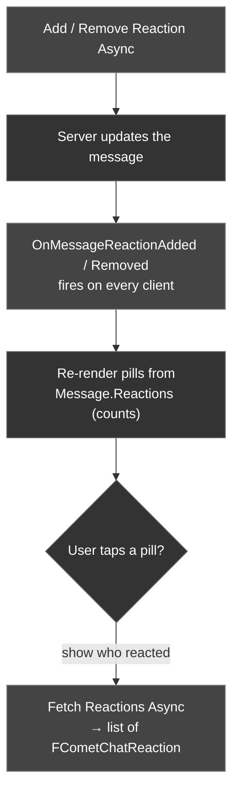

Reactions let users respond to a message with an emoji. The CometChat Unreal SDK provides async nodes to add and remove your own reactions, to fetch the full list of who reacted, and multicast delegates so every participant's UI updates the instant a reaction changes.

There are two distinct pieces of data, and using the right one keeps your chat UI fast:

- **Per-emoji totals** live directly on `FCometChatMessage.Reactions` — use these to draw the reaction *pills* (e.g. `👍 3`) with **no extra network call**.
- **Who reacted** is fetched on demand with **Fetch Reactions Async** — only needed when the user opens a "who reacted" list.

### Reaction Flow



---

## Add a Reaction

Add an emoji reaction to a message by its ID.

<Tabs>
<Tab title="Blueprint">
**Use case:** the user taps an emoji in the reaction picker on a message, and that message's pill row updates immediately.

Call the **Add Reaction Async** node.

| Parameter | Type | Description |
| --------- | ---- | ----------- |
| Message Id | `int64` | The ID of the message to react to |
| Reaction | `FString` | The emoji to add (e.g. `😀`, `👍`, `❤️`) |

**On Success** returns the updated `FCometChatMessage` — its `Reactions` array already reflects the new reaction, so you can re-render the pills straight from the result.

**Blueprint flow**

1. On the emoji picker's **On Clicked**, read the selected `Message Id` and the emoji string
2. Call **Add Reaction Async**
3. **On Success** (`FCometChatMessage`) → **For Each Loop** over `Reactions` → rebuild that message's pill row from the result
4. **On Failure** → a **Handle Reaction Error** custom event taking an `FCometChatError` → **Break** it, show `Message`, and roll back the optimistic pill if you drew one
</Tab>
<Tab title="C++">
```cpp
#include "AsyncActions/CometChatAddReactionAction.h"

void AMyActor::ReactToMessage(int64 MessageId)
{
    auto* Action = UCometChatAddReactionAction::AddReactionAsync(
        this,
        MessageId,      // ID of the message to react to
        TEXT("👍")      // Emoji to add
    );
    Action->OnSuccess.AddDynamic(this, &AMyActor::OnReactionAdded);
    Action->OnFailure.AddDynamic(this, &AMyActor::OnReactionError);
    Action->Activate();
}

void AMyActor::OnReactionAdded(const FCometChatMessage& Message)
{
    // Message.Reactions now includes the emoji you just added
    UE_LOG(LogTemp, Log, TEXT("Reaction added — message %s now has %d distinct reactions"),
        *Message.Id, Message.Reactions.Num());
}

void AMyActor::OnReactionError(const FCometChatError& Error)
{
    UE_LOG(LogTemp, Error, TEXT("Reaction failed: %s"), *Error.Message);
}
```
</Tab>
</Tabs>

### Reference: sample UI

The bundled sample panel reacts to a message with the **native C++ SDK** directly rather than the async node, updating its local pill row optimistically in the callback. In your own game code, prefer the **Add Reaction Async** node above — it marshals the result back to the Game Thread for you.

```cpp
// From UCometChatPanel::AddReactionToMessage() — CometChatPanel.cpp
// Native C++ SDK call (chatsdk::), shown for reference. Prefer the Add Reaction Async node in game code.
void UCometChatPanel::AddReactionToMessage(const FString& Emoji)
{
    auto* Sub = GetSubsystem();
    if (!Sub || !Sub->GetSdk() || SelectedMessageId.IsEmpty()) return;

    const int64 MsgId = FCString::Atoi64(*SelectedMessageId);
    Sub->GetSdk()->add_reaction(
        static_cast<int64_t>(MsgId),
        TCHAR_TO_UTF8(*Emoji),
        [this, Emoji](const std::string& err, const chatsdk::Message& result)
        {
            // Native callback runs off the game thread — hop back before touching UMG
            AsyncTask(ENamedThreads::GameThread, [this, err, Emoji]()
            {
                if (err.empty())
                    RebuildChatFromData();          // pill row updated locally, then redrawn
                else
                    ShowSnackbar(TEXT("Failed to react"));
            });
        });
}
```

---

## Remove a Reaction

Remove one of your own reactions from a message.

<Tabs>
<Tab title="Blueprint">
**Use case:** the user taps a pill they already reacted with to toggle their own reaction back off.

Call the **Remove Reaction Async** node with the same `Message Id` and `Reaction` you added.

| Parameter | Type | Description |
| --------- | ---- | ----------- |
| Message Id | `int64` | The ID of the message to remove the reaction from |
| Reaction | `FString` | The emoji to remove |

**On Success** returns the updated `FCometChatMessage` with the reaction taken out of its `Reactions` array.

**Blueprint flow**

1. On a pill's **On Clicked**, check `bReactedByMe` — if `true`, treat the tap as a toggle-off
2. Call **Remove Reaction Async** with the same `Message Id` and emoji
3. **On Success** (`FCometChatMessage`) → rebuild the pill row from the result (the pill disappears when its `Count` reaches `0`)
4. **On Failure** → a **Handle Reaction Error** custom event taking an `FCometChatError` → **Break** it and show `Message`
</Tab>
<Tab title="C++">
```cpp
#include "AsyncActions/CometChatRemoveReactionAction.h"

void AMyActor::UnreactToMessage(int64 MessageId)
{
    auto* Action = UCometChatRemoveReactionAction::RemoveReactionAsync(
        this,
        MessageId,
        TEXT("👍")
    );
    Action->OnSuccess.AddDynamic(this, &AMyActor::OnReactionRemoved);
    Action->OnFailure.AddDynamic(this, &AMyActor::OnReactionError);
    Action->Activate();
}

void AMyActor::OnReactionRemoved(const FCometChatMessage& Message)
{
    UE_LOG(LogTemp, Log, TEXT("Reaction removed from message %s"), *Message.Id);
}
```
</Tab>
</Tabs>

---

## Rendering Reaction Pills

Every `FCometChatMessage` carries a `Reactions` array of **per-emoji totals**. This is populated when you fetch message history and refreshed on every real-time reaction event, so you can draw the reaction pills without ever calling Fetch Reactions.

| Property | Type | Description |
| -------- | ---- | ----------- |
| `Reaction` | `FString` | The emoji |
| `Count` | `int32` | How many users reacted with this emoji |
| `bReactedByMe` | `bool` | `true` if the logged-in user is one of them (highlight the pill) |

```cpp
// Draw one pill per distinct emoji, straight from the message — no fetch needed
for (const FCometChatReactionCount& Pill : Message.Reactions)
{
    const bool bMine = Pill.bReactedByMe; // highlight pills the local user tapped
    AddReactionPillWidget(Pill.Reaction, Pill.Count, bMine);
}
```

<Info>
`FCometChatMessage.Reactions` gives you the emoji and its total count — everything needed to render the pill row. Only call **Fetch Reactions Async** (below) when the user wants to see the *list of people* behind a pill.
</Info>

<Tip>
**Rendering emoji in UMG.** Unreal's default font contains no emoji glyphs, so reaction text renders as blank boxes (`▯`) unless you assign an emoji-capable font — such as **Noto Color Emoji** — to the `UTextBlock`. Two gotchas that will otherwise cost you an afternoon:

- **Keep the emoji glyph's color pure white.** Slate multiplies a color-emoji glyph by the text tint, so any non-white tint darkens the whole glyph — a dark tint makes it effectively invisible.
- **Render the emoji and its count as separate text blocks.** Most emoji fonts have no digit glyphs, so a combined `"😀 3"` in a single block drops the digits entirely. Put the emoji in an emoji-font block and the count in your normal-font block, side by side.
</Tip>

---

## Fetch Reactions

Retrieve the full list of **who reacted** to a message, optionally filtered to a single emoji. Use this to populate a "reacted by" sheet when the user taps a pill.

<Tabs>
<Tab title="Blueprint">
Call the **Fetch Reactions Async** node with an `FCometChatReactionsRequest` struct. Set `MessageId` to the target message, and optionally set `Reaction` to list only the users who reacted with that specific emoji.

**On Success** returns a `TArray<FCometChatReaction>` — one entry per user, in reverse-chronological order.
</Tab>
<Tab title="C++">
```cpp
#include "AsyncActions/CometChatFetchReactionsAction.h"

void AMyActor::FetchWhoReacted(int64 MessageId)
{
    FCometChatReactionsRequest Request;
    Request.MessageId = MessageId;
    Request.Limit = 25;
    // Request.Reaction = TEXT("👍"); // optional: only users who used this emoji

    auto* Action = UCometChatFetchReactionsAction::FetchReactionsAsync(this, Request);
    Action->OnSuccess.AddDynamic(this, &AMyActor::OnReactionsFetched);
    Action->OnFailure.AddDynamic(this, &AMyActor::OnReactionError);
    Action->Activate();
}

void AMyActor::OnReactionsFetched(const TArray<FCometChatReaction>& Reactions)
{
    for (const FCometChatReaction& R : Reactions)
    {
        UE_LOG(LogTemp, Log, TEXT("%s reacted with %s"), *R.ReactedBy.Name, *R.Reaction);
    }
}
```
</Tab>
</Tabs>

### FCometChatReactionsRequest

| Property | Type | Default | Description |
| -------- | ---- | ------- | ----------- |
| `Limit` | `int32` | `10` | Max reactions to return per page |
| `MessageId` | `int64` | `-1` | ID of the message to fetch reactions for |
| `Reaction` | `FString` | — | Optional: only fetch users who used this specific emoji |

### FCometChatReaction

| Property | Type | Description |
| -------- | ---- | ----------- |
| `Reaction` | `FString` | The emoji that was used |
| `ReactedBy` | `FCometChatUser` | The full profile of the user who reacted |
| `ReactedAt` | `int64` | Unix timestamp when the reaction was added |

---

## Real-Time Reaction Events

Bind to the subsystem's reaction delegates to keep every open message in sync when anyone — including other users — adds or removes a reaction. Both fire on the **Game Thread**, so you can update UMG widgets directly.

| Delegate | Payload | Fires When |
| -------- | ------- | ---------- |
| `OnMessageReactionAdded` | `FCometChatReactionEvent` | A reaction is added to a message |
| `OnMessageReactionRemoved` | `FCometChatReactionEvent` | A reaction is removed from a message |

<Tabs>
<Tab title="Blueprint">
**Use case:** when anyone — including other players — reacts, update that message's pills live without re-fetching the thread.

1. Get a reference to the **CometChat Subsystem**
2. Drag off and search for **On Message Reaction Added** (and **On Message Reaction Removed**)
3. Use **Bind Event** to connect each to a custom event
4. The custom event receives an `FCometChatReactionEvent`. Its `Message` field is the full updated message — re-render that row's pills from `Message.Reactions`.
</Tab>
<Tab title="C++">
```cpp
void AMyActor::BeginPlay()
{
    Super::BeginPlay();

    UCometChatSubsystem* Chat = GetGameInstance()->GetSubsystem<UCometChatSubsystem>();
    Chat->OnMessageReactionAdded.AddDynamic(this, &AMyActor::HandleReactionAdded);
    Chat->OnMessageReactionRemoved.AddDynamic(this, &AMyActor::HandleReactionRemoved);
}

void AMyActor::HandleReactionAdded(const FCometChatReactionEvent& Event)
{
    // Event.Message carries the full updated message, including its Reactions array
    UE_LOG(LogTemp, Log, TEXT("%s reacted %s to message %s"),
        *Event.ReactedBy.Name, *Event.Reaction, *Event.MessageId);

    RefreshReactionPills(Event.Message); // redraw the pill row for this message
}

void AMyActor::HandleReactionRemoved(const FCometChatReactionEvent& Event)
{
    UE_LOG(LogTemp, Log, TEXT("%s removed %s from message %s"),
        *Event.ReactedBy.Name, *Event.Reaction, *Event.MessageId);

    RefreshReactionPills(Event.Message);
}
```
</Tab>
</Tabs>

### FCometChatReactionEvent

| Property | Type | Description |
| -------- | ---- | ----------- |
| `Reaction` | `FString` | The emoji that was added or removed |
| `MessageId` | `FString` | ID of the affected message |
| `ReceiverId` | `FString` | UID (1:1) or GUID (group) the message belongs to |
| `ReceiverType` | `FString` | `user` or `group` |
| `ConversationId` | `FString` | Conversation the message belongs to |
| `ParentMessageId` | `int64` | Parent message ID if this is a threaded reply, `0` otherwise |
| `ReactedBy` | `FCometChatUser` | The user who added or removed the reaction |
| `ReactedAt` | `int64` | Unix timestamp of the change |
| `Message` | `FCometChatMessage` | The full updated message, including its refreshed `Reactions` array |

<Warning>
**Bind before you log in.** Reaction events that arrive between login completing and your delegates being bound will be missed. Bind `OnMessageReactionAdded` / `OnMessageReactionRemoved` in `BeginPlay` (or before calling Login) so no updates are dropped.
</Warning>

---

## Best Practices

<Tip>
**Render pills from the message you already have.** `FCometChatMessage.Reactions` holds every emoji with its `Count` and `bReactedByMe`, and it's refreshed on every real-time reaction event — so draw the whole pill row straight from it with **no extra fetch**. Two rendering rules keep the glyphs readable: keep the **emoji glyph pure white** (Slate multiplies a color-emoji glyph by the text tint, so any non-white tint darkens it), and put the **count in a separate normal-font text block** beside the emoji (most emoji fonts ship no digit glyphs).
</Tip>

<Warning>
**Don't call Fetch Reactions just to show counts.** **Fetch Reactions Async** exists to list the *people* behind a pill — calling it for every message to derive counts adds a network round trip per message and can rate-limit you. The counts are already in `Message.Reactions`; only fetch when the user opens a "reacted by" sheet.
</Warning>

---

## Handling Failures

Both **Add Reaction Async** and **Remove Reaction Async** expose an **On Failure** pin (and a bindable `OnFailure` in C++) that delivers an `FCometChatError`. Wire it so a failed reaction rolls back the optimistic pill instead of leaving the UI out of sync with the server.

| Field | Type | Description |
| ----- | ---- | ----------- |
| `Code` | `FString` | Machine-readable error code — branch on this |
| `Message` | `FString` | Human-readable summary — safe to show in a toast |
| `Details` | `FString` | Raw server payload for logging and triage |

<Tabs>
<Tab title="Blueprint">
1. Drag off **Add Reaction Async** / **Remove Reaction Async**'s **On Failure** pin
2. Route it to a **Handle Reaction Error** custom event that takes an `FCometChatError`
3. **Break** the struct to read `Code`, `Message`, and `Details`
4. Roll back the optimistic pill you drew, show `Message` in a toast, and log `Details`
</Tab>
<Tab title="C++">
```cpp
void AMyActor::OnReactionError(const FCometChatError& Error)
{
    // Code is machine-readable, Message is user-facing, Details is the raw payload
    UE_LOG(LogTemp, Error, TEXT("Reaction failed [%s]: %s"),
        *Error.Code, *Error.Message);
    UE_LOG(LogTemp, Verbose, TEXT("Details: %s"), *Error.Details);

    // Undo the optimistic pill so the row matches the server, then tell the user
    RollbackOptimisticReaction();
    ShowReactionToast(Error.Message);
}
```
</Tab>
</Tabs>

---

## Next Steps

<CardGroup cols={2}>
  <Card title="Receive Messages" icon="inbox" href="/sdk/unreal/receive-messages">
    Fetch message history — each message arrives with its `Reactions` populated.
  </Card>
  <Card title="Real-Time Events" icon="bolt" href="/sdk/unreal/real-time-events">
    All the subsystem delegates, including reactions, in one place.
  </Card>
</CardGroup>
