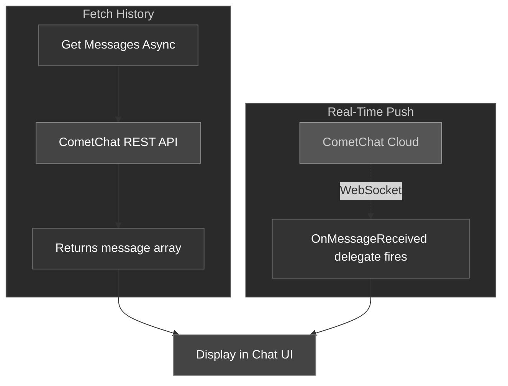
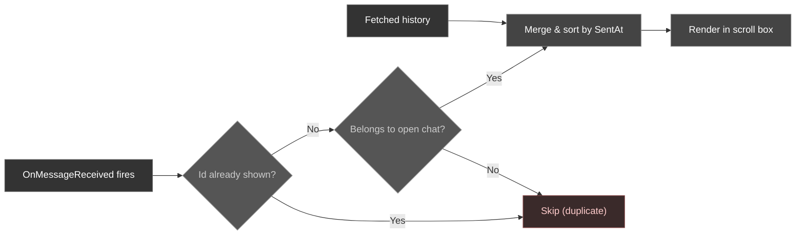

There are two ways to get messages in the CometChat Unreal SDK:

1. **Fetch history** — pull previous messages for a conversation using async nodes
2. **Real-time push** — listen for new messages as they arrive via the `OnMessageReceived` delegate

### How Messages Flow



---

## Fetch User Messages

Retrieve the message history for a 1:1 conversation.

<Tabs>
<Tab title="Blueprint">
<Frame>
  
</Frame>

Call the **Get Messages Async** node.

| Parameter | Type | Description |
| --------- | ---- | ----------- |
| Uid | `FString` | The UID of the other user in the conversation |
| Limit | `int32` | Maximum number of messages to return (default: 50) |

**On Success** returns a `TArray<FCometChatMessage>` — an array of messages sorted by timestamp.

**Blueprint flow — opening a 1:1 chat**

1. `On Chat Opened` → `Get CometChat Subsystem`
2. `Get Messages Async` (Uid, Limit = 30)
3. **On Success** → populate the message scroll box, then bind `On Message Received` for live updates
4. **On Failure** → `Break FCometChatError` → show a "couldn't load history" state with a **Retry** button that re-runs step 2

Wire the node's green **On Success** pin and red **On Failure** pin to separate handlers.
</Tab>
<Tab title="C++">
```cpp
#include "AsyncActions/CometChatGetMessagesAction.h"

void AMyActor::FetchMessages()
{
    auto* Action = UCometChatGetMessagesAction::GetMessagesAsync(
        this,
        TEXT("cometchat-uid-2"),  // Other user's UID
        30                        // Limit
    );
    Action->OnSuccess.AddDynamic(this, &AMyActor::OnMessagesFetched);
    Action->OnFailure.AddDynamic(this, &AMyActor::OnFetchFailed);
    Action->Activate();
}

void AMyActor::OnMessagesFetched(const TArray<FCometChatMessage>& Messages)
{
    for (const FCometChatMessage& Msg : Messages)
    {
        UE_LOG(LogTemp, Log, TEXT("[%s]: %s"), *Msg.SenderName, *Msg.Text);
    }
}

void AMyActor::OnFetchFailed(const FCometChatError& Error)
{
    UE_LOG(LogTemp, Error, TEXT("Fetch failed: %s"), *Error.Message);
}
```
</Tab>
</Tabs>

---

## Fetch Group Messages

Retrieve the message history for a group conversation, with pagination support.

<Tabs>
<Tab title="Blueprint">
<Frame>
  
</Frame>

Call the **Get Group Messages Async** node.

| Parameter | Type | Description |
| --------- | ---- | ----------- |
| Guid | `FString` | The group's unique identifier |
| Limit | `int32` | Maximum messages per page (default: 50) |
| Before Message Id | `int32` | Pass `0` for the first page. For subsequent pages, pass the `NextCursor` value from the previous response's `FCometChatPagination`. |

**On Success** returns two outputs:
- `TArray<FCometChatMessage>` — the messages for this page
- `FCometChatPagination` — pagination metadata including `HasMore` and `NextCursor`

**Blueprint flow — opening a group chat**

1. `On Chat Opened` → `Get CometChat Subsystem`
2. `Get Group Messages Async` (Guid, Limit = 30, Before Message Id = 0)
3. **On Success** → populate the scroll box in order and scroll to the bottom, then bind `On Message Received` for live updates (or keep one app-wide binding from before Login — see [Best Practices](#best-practices))
4. **On Failure** → `Break FCometChatError` → show a "couldn't load history" state with a **Retry** button that calls step 2 again

Connect the node's two execution pins to separate handlers — the green **On Success** pin to your populate-list logic, the red **On Failure** pin to a `Break FCometChatError` node feeding your error UI.
</Tab>
<Tab title="C++">
```cpp
#include "AsyncActions/CometChatGetGroupMessagesAction.h"

void AMyActor::FetchGroupMessages(int32 BeforeId)
{
    auto* Action = UCometChatGetGroupMessagesAction::GetGroupMessagesAsync(
        this,
        TEXT("group-abc-123"),  // Group GUID
        20,                     // Limit
        BeforeId                // 0 for first page
    );
    Action->OnSuccess.AddDynamic(this, &AMyActor::OnGroupMessagesFetched);
    Action->OnFailure.AddDynamic(this, &AMyActor::OnGroupFetchFailed);
    Action->Activate();
}

void AMyActor::OnGroupMessagesFetched(
    const TArray<FCometChatMessage>& Messages,
    const FCometChatPagination& Pagination)
{
    for (const FCometChatMessage& Msg : Messages)
    {
        UE_LOG(LogTemp, Log, TEXT("[%s]: %s"), *Msg.SenderName, *Msg.Text);
    }

    if (Pagination.HasMore)
    {
        // Load next page
        FetchGroupMessages(Pagination.NextCursor);
    }
}
```
</Tab>
</Tabs>

### Pagination

The `FCometChatPagination` struct tells you where you are in the message history:

| Property | Type | Description |
| -------- | ---- | ----------- |
| `Total` | `int32` | Total messages available in the conversation |
| `Count` | `int32` | Messages returned in this page |
| `PerPage` | `int32` | Page size that was requested |
| `HasMore` | `bool` | `true` if there are older messages to fetch |
| `NextCursor` | `int32` | Pass this as `BeforeMessageId` to get the next page |

<Tip>
**Infinite scroll pattern**: Start with `BeforeMessageId = 0`, then keep passing `NextCursor` from each response until `HasMore` is `false`.
</Tip>

### Infinite Scroll

Load older messages as the user scrolls up. Two equivalent approaches:

**Cursor-based (Get Group Messages Async + `NextCursor`)**

1. Keep the latest `FCometChatPagination`; start with `Before Message Id = 0`
2. `On Scrolled To Top` → check `HasMore`. If `false`, stop — you've reached the start
3. `Get Group Messages Async` (Guid, Limit = 30, Before Message Id = `NextCursor`)
4. **On Success** → prepend the older page above the current messages and store the new `NextCursor`
5. **On Failure** → `Break FCometChatError` → show an inline "tap to retry" row at the top

**Request-builder (`FCometChatMessagesRequest` + Fetch Previous)**

1. Build an `FCometChatMessagesRequest` (set `GUID` or `UID`, plus `Limit`) — see [Advanced Fetch](#advanced-fetch-request-builder)
2. `On Scrolled To Top` → set `MessageId` to the oldest message you've loaded so far, then `Fetch Previous Messages Async` (Request)
3. **On Success** → prepend the returned older messages; an empty array means there's no more history
4. **On Failure** → `Break FCometChatError` → retry the same request

<Tip>
Cursor paging is the simplest for a single conversation. Reach for the request builder when you also need filters — threads, search, attachments-only — while scrolling.
</Tip>

---

## Advanced Fetch (Request Builder)

When you need full control over what you pull — threaded replies, keyword search, unread-only, attachments-only, category/type filters — use the request-builder nodes. Both share a single `FCometChatMessagesRequest`: set `UID` for a 1:1 conversation or `GUID` for a group, tune the filters, then page in either direction.

### Fetch Previous Messages

Pulls **older** messages (history) relative to the request's anchor.

<Tabs>
<Tab title="Blueprint">
Call the **Fetch Previous Messages Async** node.

| Parameter | Type | Description |
| --------- | ---- | ----------- |
| Request | `FCometChatMessagesRequest` | The configured request builder (see fields below) |

**On Success** returns a `TArray<FCometChatMessage>` of older messages.
</Tab>
<Tab title="C++">
```cpp
#include "AsyncActions/CometChatFetchMessagesAction.h"

void AMyActor::LoadHistory()
{
    FCometChatMessagesRequest Request;
    Request.UID   = TEXT("cometchat-uid-2");  // 1:1 thread (use GUID for a group)
    Request.Limit = 30;

    auto* Action = UCometChatFetchPreviousMessagesAction::FetchPreviousMessagesAsync(this, Request);
    Action->OnSuccess.AddDynamic(this, &AMyActor::OnHistoryLoaded);
    Action->OnFailure.AddDynamic(this, &AMyActor::OnError);
    Action->Activate();
}

void AMyActor::OnHistoryLoaded(const TArray<FCometChatMessage>& Messages)
{
    for (const FCometChatMessage& Msg : Messages)
    {
        UE_LOG(LogTemp, Log, TEXT("[%s]: %s"), *Msg.SenderName, *Msg.Text);
    }
}

void AMyActor::OnError(const FCometChatError& Error)
{
    UE_LOG(LogTemp, Error, TEXT("Fetch failed: %s"), *Error.Message);
}
```
</Tab>
</Tabs>

### Fetch Next Messages

Pulls **newer** messages relative to the request's anchor — handy for catching up after a gap, or loading forward through a thread.

<Tabs>
<Tab title="Blueprint">
Call the **Fetch Next Messages Async** node.

| Parameter | Type | Description |
| --------- | ---- | ----------- |
| Request | `FCometChatMessagesRequest` | The configured request builder (see fields below) |

**On Success** returns a `TArray<FCometChatMessage>` of newer messages.
</Tab>
<Tab title="C++">
```cpp
#include "AsyncActions/CometChatFetchMessagesAction.h"

void AMyActor::LoadThreadReplies(int64 ParentId)
{
    FCometChatMessagesRequest Request;
    Request.GUID            = TEXT("group-abc-123");  // group thread (use UID for 1:1)
    Request.ParentMessageId = ParentId;               // fetch replies in a thread
    Request.Limit           = 50;

    auto* Action = UCometChatFetchNextMessagesAction::FetchNextMessagesAsync(this, Request);
    Action->OnSuccess.AddDynamic(this, &AMyActor::OnNewerMessages);
    Action->OnFailure.AddDynamic(this, &AMyActor::OnError);
    Action->Activate();
}

void AMyActor::OnNewerMessages(const TArray<FCometChatMessage>& Messages)
{
    // Messages newer than the request's MessageId / Timestamp anchor
    UE_LOG(LogTemp, Log, TEXT("Fetched %d newer message(s)"), Messages.Num());
}
```
</Tab>
</Tabs>

### FCometChatMessagesRequest

The most useful fields for building a request:

| Property | Type | Description |
| -------- | ---- | ----------- |
| `Limit` | `int32` | Max messages per page (default `30`) |
| `UID` | `FString` | The other user's UID — set for a 1:1 conversation or thread |
| `GUID` | `FString` | The group's GUID — set for a group conversation or thread |
| `MessageId` | `int64` | Anchor message ID to page around (default `-1`) |
| `Timestamp` | `int64` | Anchor Unix timestamp to page around (default `-1`) |
| `bUnread` | `bool` | Only return unread messages |
| `bHideMessagesFromBlockedUsers` | `bool` | Exclude messages from blocked users |
| `SearchKeyword` | `FString` | Full-text search within message bodies |
| `Categories` | `TArray<FString>` | Filter by category, e.g. `message`, `custom` |
| `Types` | `TArray<FString>` | Filter by type, e.g. `text`, `image` |
| `ParentMessageId` | `int64` | Parent message ID for fetching thread replies (default `-1`) |
| `bHideReplies` | `bool` | Exclude threaded replies |
| `bHideDeleted` | `bool` | Exclude deleted (tombstoned) messages |
| `bHasAttachments` | `bool` | Only messages that carry an attachment |
| `bHasMentions` | `bool` | Only messages containing a mention |
| `bHasReactions` | `bool` | Only messages that have reactions |
| `MentionedUIDs` | `TArray<FString>` | Only messages mentioning these UIDs |
| `Tags` | `TArray<FString>` | Filter by message tags |

<Info>
Set **`UID`** for a 1:1 thread **or** **`GUID`** for a group thread — provide the one that matches the conversation you're paging through. Combine with `ParentMessageId` to page through a specific thread's replies.
</Info>

---

## Get a Single Message

Fetch one message by its ID — useful for resolving a reply's parent, a quoted message, or a deep link.

<Tabs>
<Tab title="Blueprint">
Call the **Get Message Details Async** node.

| Parameter | Type | Description |
| --------- | ---- | ----------- |
| Message Id | `int64` | The ID of the message to fetch |

**On Success** returns the full `FCometChatMessage`.

**Blueprint flow — resolving a reply's parent**

1. `On Reply Tapped` → `Get Message Details Async` (Message Id of the parent)
2. **On Success** → show the quoted parent above the composer
3. **On Failure** → `Break FCometChatError` → fall back to an "original message unavailable" placeholder
</Tab>
<Tab title="C++">
```cpp
#include "AsyncActions/CometChatGetMessageDetailsAction.h"

void AMyActor::LoadMessage(int64 MessageId)
{
    auto* Action = UCometChatGetMessageDetailsAction::GetMessageDetailsAsync(this, MessageId);
    Action->OnSuccess.AddDynamic(this, &AMyActor::OnMessageLoaded);
    Action->OnFailure.AddDynamic(this, &AMyActor::OnError);
    Action->Activate();
}

void AMyActor::OnMessageLoaded(const FCometChatMessage& Message)
{
    UE_LOG(LogTemp, Log, TEXT("[%s]: %s"), *Message.SenderName, *Message.Text);
}
```
</Tab>
</Tabs>

---

## Message Receipts

Fetch the delivery/read receipts for a specific message, and explicitly mark messages as read, delivered, or unread.

### Get Receipts

<Tabs>
<Tab title="Blueprint">
Call the **Get Receipts Async** node to list who has received or read a message.

| Parameter | Type | Description |
| --------- | ---- | ----------- |
| Message Id | `int64` | The ID of the message to fetch receipts for |

**On Success** returns a `TArray<FCometChatMessageReceipt>` — one entry per recipient/status.

**Blueprint flow — a "Seen by" sheet**

1. `On Bubble Long-Pressed` → `Get Receipts Async` (Message Id)
2. **On Success** → filter the array to `ReceiptType == read` and list each `Sender`
3. **On Failure** → `Break FCometChatError` → toast the `Message`
</Tab>
<Tab title="C++">
```cpp
#include "AsyncActions/CometChatGetReceiptsAction.h"

void AMyActor::LoadReceipts(int64 MessageId)
{
    auto* Action = UCometChatGetReceiptsAction::GetReceiptsAsync(this, MessageId);
    Action->OnSuccess.AddDynamic(this, &AMyActor::OnReceipts);
    Action->OnFailure.AddDynamic(this, &AMyActor::OnError);
    Action->Activate();
}

void AMyActor::OnReceipts(const TArray<FCometChatMessageReceipt>& Receipts)
{
    for (const FCometChatMessageReceipt& R : Receipts)
    {
        UE_LOG(LogTemp, Log, TEXT("%s — %s (read at %lld)"),
            *R.Sender.Name, *R.ReceiptType, R.ReadAt);
    }
}
```
</Tab>
</Tabs>

#### FCometChatMessageReceipt

| Property | Type | Description |
| -------- | ---- | ----------- |
| `MessageId` | `FString` | The ID of the message the receipt is for |
| `Sender` | `FCometChatUser` | The user the receipt is about |
| `ReceiverType` | `FString` | `user` or `group` |
| `ReceiverId` | `FString` | The UID or GUID the message was sent to |
| `Timestamp` | `int64` | When the receipt was generated |
| `ReceiptType` | `FString` | `delivered` or `read` |
| `DeliveredAt` | `int64` | Unix-ms when delivered (`0` if not yet) |
| `ReadAt` | `int64` | Unix-ms when read (`0` if not yet) |
| `MessageSender` | `FString` | UID of the original message's sender |

### Mark As Read

<Tabs>
<Tab title="Blueprint">
Call the **Mark As Read Async** node, passing a message you received. This sends a read receipt to its sender.

| Parameter | Type | Description |
| --------- | ---- | ----------- |
| Message | `FCometChatMessage` | The message to mark as read |

**On Success** fires with **no payload**.

Wire **On Failure** → `Break FCometChatError` here too: if marking read fails (say the socket dropped), keep the message flagged unread locally and retry on reconnect rather than showing it as read.
</Tab>
<Tab title="C++">
```cpp
#include "AsyncActions/CometChatMarkAsReadAction.h"

void AMyActor::MarkRead(const FCometChatMessage& Message)
{
    auto* Action = UCometChatMarkAsReadAction::MarkAsReadAsync(this, Message);
    Action->OnSuccess.AddDynamic(this, &AMyActor::OnMarkedRead);
    Action->OnFailure.AddDynamic(this, &AMyActor::OnError);
    Action->Activate();
}

void AMyActor::OnMarkedRead()
{
    // No payload — the read receipt has been sent to the message's sender
}
```
</Tab>
</Tabs>

### Mark As Delivered

<Tabs>
<Tab title="Blueprint">
Call the **Mark As Delivered Async** node, passing a message you received, to send a delivery receipt.

| Parameter | Type | Description |
| --------- | ---- | ----------- |
| Message | `FCometChatMessage` | The message to mark as delivered |

**On Success** fires with **no payload**.
</Tab>
<Tab title="C++">
```cpp
#include "AsyncActions/CometChatMarkAsDeliveredAction.h"

void AMyActor::MarkDelivered(const FCometChatMessage& Message)
{
    auto* Action = UCometChatMarkAsDeliveredAction::MarkAsDeliveredAsync(this, Message);
    Action->OnSuccess.AddDynamic(this, &AMyActor::OnMarkedDelivered);
    Action->OnFailure.AddDynamic(this, &AMyActor::OnError);
    Action->Activate();
}

void AMyActor::OnMarkedDelivered()
{
    // No payload — the delivery receipt has been sent
}
```
</Tab>
</Tabs>

### Mark As Unread

<Tabs>
<Tab title="Blueprint">
Call the **Mark As Unread Async** node, passing a message, to flag its conversation as unread again.

| Parameter | Type | Description |
| --------- | ---- | ----------- |
| Message | `FCometChatMessage` | The message from which to mark the conversation unread |

**On Success** returns the affected `FCometChatConversation` with its refreshed `UnreadMessageCount`.
</Tab>
<Tab title="C++">
```cpp
#include "AsyncActions/CometChatMarkAsUnreadAction.h"

void AMyActor::MarkUnread(const FCometChatMessage& Message)
{
    auto* Action = UCometChatMarkAsUnreadAction::MarkAsUnreadAsync(this, Message);
    Action->OnSuccess.AddDynamic(this, &AMyActor::OnMarkedUnread);
    Action->OnFailure.AddDynamic(this, &AMyActor::OnError);
    Action->Activate();
}

void AMyActor::OnMarkedUnread(const FCometChatConversation& Conversation)
{
    UE_LOG(LogTemp, Log, TEXT("Unread again: %d"), Conversation.UnreadMessageCount);
}
```
</Tab>
</Tabs>

<Info>
These nodes **send** receipts and set status on demand. For the **real-time** receipt delegates (`OnMessagesDelivered`, `OnMessagesRead`) that fire automatically as the other user's client acknowledges your messages, see [Delivery & Read Receipts](/sdk/unreal/delivery-read-receipts).
</Info>

---

## Real-Time: Incoming Messages

To receive messages as they arrive (without polling), bind to the `OnMessageReceived` delegate on the Subsystem.

<Tabs>
<Tab title="Blueprint">
**Use case**: keep an open chat live without polling.

1. Get a reference to the **CometChat Subsystem**
2. Drag off and search for **On Message Received**
3. Use **Bind Event** to connect it to a custom event — do this **before** calling Login so you don't miss anything
4. The custom event receives an `FCometChatMessage`. In the handler:
   - **Skip your own echo** — ignore the message if `Sender Uid` is the logged-in user
   - **De-duplicate** — ignore it if you've already shown that message `Id` (a live message can overlap fetched history)
   - **Route** — only append if it belongs to the open chat (`Receiver Type` + `Conversation Id`)
   - **Append** the row and scroll to the bottom

`On Message Received` has no failure pin — it's a push delegate. Handle connection drops with the connection-status delegates instead.
</Tab>
<Tab title="C++">
```cpp
void AMyActor::BeginPlay()
{
    Super::BeginPlay();

    UCometChatSubsystem* Chat = GetGameInstance()->GetSubsystem<UCometChatSubsystem>();
    Chat->OnMessageReceived.AddDynamic(this, &AMyActor::HandleNewMessage);
}

void AMyActor::HandleNewMessage(const FCometChatMessage& Message)
{
    // This fires on the Game Thread — safe to update UI
    UE_LOG(LogTemp, Log, TEXT("New message from %s: %s"),
        *Message.SenderName, *Message.Text);

    // Check if it's a group or user message
    if (Message.ReceiverType == TEXT("group"))
    {
        // Group message — Message.ReceiverUid is the group GUID
    }
    else
    {
        // 1:1 message — Message.SenderUid is the other user
    }
}
```
</Tab>
</Tabs>

<Info>
The `OnMessageReceived` delegate fires for **all** conversations — both 1:1 and group. Use `ReceiverType` to distinguish between them, and `ConversationId` to route messages to the right chat window.
</Info>

### Merging History with Live Messages



### Reference: sample UI

The plugin ships a ready-made `UCometChatGroupChatBox` widget. These two trimmed excerpts show the same paths this page covers — history load and live append.

<Warning>
Both excerpts call the **native C++ SDK** (`Sub->GetSdk()->...`) directly, which delivers results on a **background thread**. In your own code, prefer the async nodes above plus the `OnMessageReceived` / `OnTextMessageReceived` delegates — they're Blueprint-friendly and already marshal to the game thread for you.
</Warning>

```cpp
// (a) History load — CometChatGroupChatBox.cpp, UCometChatGroupChatBox::DoLoadHistory()
// Native API: the callback runs off the game thread, so hop back before touching UI.
Sub->GetSdk()->get_group_messages(TCHAR_TO_UTF8(*GroupGuid), MessageLimit, /*before_id*/ 0,
    [this](const std::string& err, const chatsdk::PaginatedMessages& result)
    {
        AsyncTask(ENamedThreads::GameThread, [this, err, result]()
        {
            if (err.empty())
            {
                for (const auto& m : result.messages)
                    AddMessageToList(CometChatConversions::ToUnreal(m)); // append in order
                ScrollToBottom();
            }
            // else: SetState(EChatState::Error, ...) to show a retry state
        });
    });
```

```cpp
// (b) Real-time append — CometChatGroupChatBox.cpp, UCometChatGroupChatBox::HandleTextMessageReceived()
// Bound to UCometChatSubsystem::OnTextMessageReceived, which fires on the game thread.
void UCometChatGroupChatBox::HandleTextMessageReceived(const FCometChatMessage& Message)
{
    if (Message.SenderUid == CurrentUserUid) return;   // skip your own echo
    if (MessageIds.Contains(Message.Id)) return;       // de-dup vs. fetched history

    // Route: only append if this message belongs to the open group
    if (Message.ReceiverType == TEXT("group") && Message.ConversationId.Contains(GroupGuid))
    {
        AddMessageToList(Message); // records Message.Id in MessageIds, then adds the row
        ScrollToBottom();
    }
}
```

<Info>
`AddMessageToList()` is what records each `Message.Id`, so the `MessageIds.Contains(...)` guard above is what keeps a live message from being drawn twice when it overlaps the tail of your fetched history.
</Info>

---

## Handling Failures

Every async node exposes an **On Failure** pin (Blueprint) / `OnFailure` delegate (C++) that hands you an `FCometChatError`:

| Field | Type | Description |
| ----- | ---- | ----------- |
| `Code` | `FString` | Machine-readable code, e.g. `ERR_SDK`, `ERR_UNKNOWN`, or a server code |
| `Message` | `FString` | Human-readable description — safe to log |
| `Details` | `FString` | Extra context when the SDK provides it |

For a one-off failure, log `Message` and show a retry affordance. For history loads it's worth retrying **transient** network errors automatically, with backoff:

```cpp
// AMyActor.h:  int32 PendingHistoryAttempt = 0;  FString GroupGuid;
#include "AsyncActions/CometChatGetGroupMessagesAction.h"
#include "TimerManager.h"

void AMyActor::LoadGroupHistory(int32 Attempt)
{
    PendingHistoryAttempt = Attempt; // remembered so the failure handler can back off

    auto* Action = UCometChatGetGroupMessagesAction::GetGroupMessagesAsync(this, GroupGuid, 30, 0);
    Action->OnSuccess.AddDynamic(this, &AMyActor::OnGroupMessagesFetched);
    Action->OnFailure.AddDynamic(this, &AMyActor::OnHistoryFetchFailed);
    Action->Activate();
}

void AMyActor::OnHistoryFetchFailed(const FCometChatError& Error)
{
    // Code is an FString surfaced from the SDK/server (e.g. "ERR_INTERNET_UNAVAILABLE").
    UE_LOG(LogTemp, Warning, TEXT("History fetch failed [%s]: %s"), *Error.Code, *Error.Message);

    const bool bTransient =
        Error.Code == TEXT("ERR_INTERNET_UNAVAILABLE") || Error.Code.Contains(TEXT("NETWORK"));

    if (!bTransient || PendingHistoryAttempt >= 4)
    {
        ShowHistoryErrorState(); // show a "couldn't load history" panel with a Retry button
        return;
    }

    // Exponential backoff: 0.5s, 1s, 2s, 4s
    const float Delay = 0.5f * FMath::Pow(2.0f, static_cast<float>(PendingHistoryAttempt));
    FTimerHandle RetryHandle;
    GetWorldTimerManager().SetTimer(RetryHandle,
        [this]() { LoadGroupHistory(PendingHistoryAttempt + 1); }, Delay, false);
}
```

<Warning>
Always cap retries (here, four attempts) and only retry **transient** errors. Retrying a permanent failure — bad GUID, not a member, revoked auth — just loops. When you give up, surface a manual **Retry** button instead.
</Warning>

---

## Best Practices

<Tip>
**Do**
- **Bind `On Message Received` before you call Login** so you never miss a message that arrives during startup.
- **De-duplicate by message `Id`.** A real-time message can overlap the tail of your fetched history — skip it if that `Id` is already on screen.
- **Route by `ConversationId` / `ReceiverType`.** The delegate fires for every conversation; only append when the message belongs to the chat that's open.
- **Page history with `NextCursor` + `HasMore`** instead of pulling everything at once.
</Tip>

<Warning>
**Avoid**
- **Don't poll.** Re-fetching with `Get ... Messages Async` on a timer wastes requests and adds latency — use the real-time delegate for new messages and fetch only for history and backfill.
- **Don't sort by arrival.** Merge fetched history and live messages, then order by `SentAt` before rendering, so a delayed fetch can't shuffle the timeline.
- **Don't hand-marshal what's already safe.** The CometChat delegates fire on the game thread, so handlers bound to them can touch widgets directly. If *you* spin off async work (image decode, disk cache), that's when you must return to the game thread before updating UI.
</Warning>

---

## Next Steps

<CardGroup cols={2}>
  <Card title="Users" icon="user" href="/sdk/unreal/users">
    Fetch user profiles and track presence.
  </Card>
  <Card title="Groups" icon="users" href="/sdk/unreal/groups">
    Create, join, and leave groups.
  </Card>
  <Card title="Real-Time Events" icon="bolt" href="/sdk/unreal/real-time-events">
    All five real-time delegates explained in detail.
  </Card>
</CardGroup>
