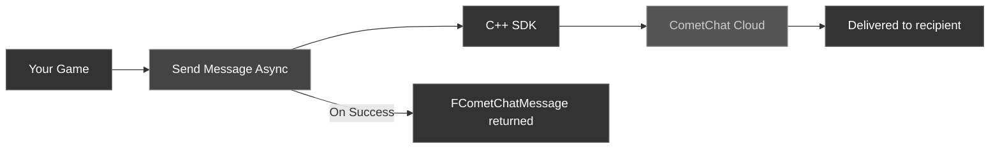

Once a user is [logged in](/sdk/unreal/authentication), you can send text messages to other users (1:1) or to groups.

### Message Flow



---

## Send a User Message

Send a text message to a specific user by their UID.

**Use case:** A player opens a direct chat with a teammate and fires off a quick "gg" right after a match ends.

<Tabs>
<Tab title="Blueprint">
<Frame>
  
</Frame>

1. Get a reference to the **CometChat Subsystem**
2. Call the **Send Message Async** node
3. Wire the **On Success** and **On Failure** pins

| Parameter | Type | Description |
| --------- | ---- | ----------- |
| Receiver Uid | `FString` | The UID of the user to send the message to |
| Text | `FString` | The message body |

**On Success** returns an `FCometChatMessage` with the sent message details (including the server-assigned `Id` and `SentAt` timestamp).

**Node flow:**

1. `On Text Committed (chat input)` → `Get CometChat Subsystem`
2. `Send Message Async` (Receiver Uid, Text)
3. **On Success** → append the returned `FCometChatMessage` to the chat list, clear the input
4. **On Failure** → `Break FCometChatError` → show a "couldn't send" toast, keep the draft text

Wire **On Failure** to a custom event that receives an `FCometChatError` (`Code`, `Message`, `Details`) so you can surface the reason and leave the composer editable.
</Tab>
<Tab title="C++">
```cpp
#include "AsyncActions/CometChatSendMessageAction.h"

void AMyActor::SendDirectMessage()
{
    auto* Action = UCometChatSendMessageAction::SendMessageAsync(
        this,
        TEXT("cometchat-uid-2"),   // Receiver UID
        TEXT("Hey, want to play?") // Message text
    );
    Action->OnSuccess.AddDynamic(this, &AMyActor::OnMessageSent);
    Action->OnFailure.AddDynamic(this, &AMyActor::OnMessageFailed);
    Action->Activate();
}

void AMyActor::OnMessageSent(const FCometChatMessage& Message)
{
    UE_LOG(LogTemp, Log, TEXT("Message sent! ID: %s"), *Message.Id);
}

void AMyActor::OnMessageFailed(const FCometChatError& Error)
{
    UE_LOG(LogTemp, Error, TEXT("Send failed: %s"), *Error.Message);
}
```
</Tab>
</Tabs>

<Tip>
Optimistically render the message in a "sending…" state the instant the player commits it, then reconcile on **On Success** by swapping in the server-assigned `Id` and `SentAt`. The chat feels instant even on a slow connection.
</Tip>

<Warning>
Never call **Send Message Async** from **Event Tick**, and don't block the game thread waiting for **On Success** — the node is asynchronous. Drive it from an input or commit event and let the callback update your UI.
</Warning>

### Handle a failed send (keep and resend)

Hold onto the unsent text on **On Failure** so the player can retry without retyping. Clear it only once the send actually succeeds.

```cpp
FString PendingText; // member: the message awaiting confirmation

void AMyActor::TrySend(const FString& Text)
{
    PendingText = Text;
    auto* Action = UCometChatSendMessageAction::SendMessageAsync(this, TEXT("cometchat-uid-2"), Text);
    Action->OnSuccess.AddDynamic(this, &AMyActor::OnSendOk);
    Action->OnFailure.AddDynamic(this, &AMyActor::OnSendFailed);
    Action->Activate();
}

void AMyActor::OnSendOk(const FCometChatMessage& Message)
{
    PendingText.Empty();                 // delivered — safe to clear the composer
    // append Message to your chat list here
}

void AMyActor::OnSendFailed(const FCometChatError& Error)
{
    UE_LOG(LogTemp, Warning, TEXT("Send failed [%s]: %s"), *Error.Code, *Error.Message);
    // Leave PendingText in the composer and offer a Retry control that calls TrySend(PendingText) again.
    ShowResendButton(PendingText);       // your own UI helper
}
```

---

## Send a Group Message

Send a text message to a group by its GUID.

**Use case:** In a guild lobby, a member types into the shared chat input and presses Enter to rally the team before a raid.

<Tabs>
<Tab title="Blueprint">
<Frame>
  
</Frame>

Call the **Send Group Message Async** node.

| Parameter | Type | Description |
| --------- | ---- | ----------- |
| Guid | `FString` | The unique identifier of the target group |
| Text | `FString` | The message body |

**On Success** returns an `FCometChatMessage`.

**Node flow:**

1. `On Text Committed (chat input)` → `Get CometChat Subsystem`
2. `Send Group Message Async` (Guid, Text)
3. **On Success** → append the returned `FCometChatMessage` to the chat list, clear the input
4. **On Failure** → `Break FCometChatError` → show a "couldn't send" toast, keep the draft text

Wire **On Failure** to a custom event that receives an `FCometChatError` (`Code`, `Message`, `Details`) so you can tell the player why it didn't send and keep their draft.
</Tab>
<Tab title="C++">
```cpp
#include "AsyncActions/CometChatSendGroupMessageAction.h"

void AMyActor::SendToGroup()
{
    auto* Action = UCometChatSendGroupMessageAction::SendGroupMessageAsync(
        this,
        TEXT("group-abc-123"),       // Group GUID
        TEXT("Team, ready up!")      // Message text
    );
    Action->OnSuccess.AddDynamic(this, &AMyActor::OnGroupMessageSent);
    Action->OnFailure.AddDynamic(this, &AMyActor::OnGroupMessageFailed);
    Action->Activate();
}

void AMyActor::OnGroupMessageSent(const FCometChatMessage& Message)
{
    UE_LOG(LogTemp, Log, TEXT("Group message sent! ID: %s"), *Message.Id);
}

void AMyActor::OnGroupMessageFailed(const FCometChatError& Error)
{
    UE_LOG(LogTemp, Error, TEXT("Group send failed: %s"), *Error.Message);
}
```
</Tab>
</Tabs>

### Reference: sample UI

The `UCometChatGroupChatBox` widget that ships with the plugin sends group messages straight through the native C++ SDK. Here's the trimmed call from its send handler:

```cpp
// UCometChatGroupChatBox::OnSendClicked()
// UnrealPlugin/CometChat/Source/CometChat/UI/CometChatGroupChatBox.cpp
Sub->GetSdk()->send_group_message(TCHAR_TO_UTF8(*GroupGuid), TCHAR_TO_UTF8(*Text),
    [this](const std::string& err, const chatsdk::Message& msg)
    {
        // Callback runs off the game thread — hop back before touching UI.
        AsyncTask(ENamedThreads::GameThread, [this, err, msg]()
        {
            if (err.empty())
            {
                AddMessageToList(CometChatConversions::ToUnreal(msg));
                ScrollToBottom();
            }
        });
    });
```

<Info>
This is the native C++ SDK API (`Sub->GetSdk()->send_group_message(...)`), handy when you're writing a custom widget in C++. In game code, prefer the **Send Group Message Async** node / `UCometChatSendGroupMessageAction`: it marshals the callback back to the game thread for you and exposes typed **On Success** / **On Failure** pins.
</Info>

<Tip>
Append the returned `FCometChatMessage` and clear the composer inside **On Success** — not before you send — so a failed send leaves the player's draft untouched.
</Tip>

<Warning>
Don't send on every keystroke or from **Event Tick**. Send once per committed message; spamming the node floods the group and can trip rate limits.
</Warning>

---

## Send a Media Message

Send an image, video, audio clip, or file. You build an `FCometChatMessage`, set its `Type` and `Attachment`, and point the attachment at an already-uploaded, publicly reachable `Url`.

**Use case:** After a match, a player shares a screenshot of the final scoreboard into the squad chat.

<Tabs>
<Tab title="Blueprint">
Call the **Send Media Message Async** node with an `FCometChatMessage` you've populated.

| Field to set | Type | Description |
| ------------ | ---- | ----------- |
| Receiver Uid | `FString` | The recipient's UID (1:1) or group GUID |
| Receiver Type | `FString` | `user` or `group` |
| Type | `FString` | `image`, `video`, `audio`, or `file` |
| Attachment | `FCometChatAttachment` | The media metadata (see table below) |
| Caption | `FString` | *(Optional)* Text shown alongside the media |

**On Success** returns the sent `FCometChatMessage` (with its server-assigned `Id` and `SentAt`).

**Node flow:**

1. `On File Chosen (upload complete)` → `Get CometChat Subsystem`
2. `Make FCometChatMessage` (set `Receiver Uid`, `Receiver Type`, `Type`, `Attachment.Url`)
3. `Send Media Message Async` (Message)
4. **On Success** → append the returned `FCometChatMessage`, show the delivered media
5. **On Failure** → `Break FCometChatError` → show an "upload failed" toast, keep the local preview so the player can retry

Wire **On Failure** to a custom event that receives an `FCometChatError` (`Code`, `Message`, `Details`) so a broken URL or oversized file surfaces a clear message.
</Tab>
<Tab title="C++">
```cpp
#include "AsyncActions/CometChatSendMediaMessageAction.h"

void AMyActor::SendImage()
{
    FCometChatMessage Message;
    Message.ReceiverUid  = TEXT("cometchat-uid-2");  // or a group GUID
    Message.ReceiverType = TEXT("user");             // "user" or "group"
    Message.Type         = TEXT("image");            // image / video / audio / file
    Message.Caption      = TEXT("Check out my high score!");

    Message.Attachment.Name      = TEXT("score.png");
    Message.Attachment.Extension = TEXT("png");
    Message.Attachment.MimeType  = TEXT("image/png");
    Message.Attachment.Size      = 20480;            // bytes
    Message.Attachment.Url       = TEXT("https://cdn.mygame.com/uploads/score.png");

    auto* Action = UCometChatSendMediaMessageAction::SendMediaMessageAsync(this, Message);
    Action->OnSuccess.AddDynamic(this, &AMyActor::OnMediaSent);
    Action->OnFailure.AddDynamic(this, &AMyActor::OnError);
    Action->Activate();
}

void AMyActor::OnMediaSent(const FCometChatMessage& Message)
{
    UE_LOG(LogTemp, Log, TEXT("Media sent! ID: %s (%s)"),
        *Message.Id, *Message.Attachment.Url);
}

void AMyActor::OnError(const FCometChatError& Error)
{
    UE_LOG(LogTemp, Error, TEXT("Send failed: %s"), *Error.Message);
}
```
</Tab>
</Tabs>

<Tip>
Upload the file to your storage bucket or CDN first, then pass the resulting public `Url`. Show a local thumbnail immediately and swap to the delivered message on **On Success** so the share feels instant.
</Tip>

<Warning>
Media messages need an already-uploaded, publicly reachable `Url`. A local file path (`C:\Users\…` or `/Game/…`) won't resolve for recipients and the send will fail — upload first, then send the returned URL.
</Warning>

### FCometChatAttachment

| Property | Type | Description |
| -------- | ---- | ----------- |
| `Extension` | `FString` | File extension, e.g. `png` |
| `MimeType` | `FString` | MIME type, e.g. `image/png` |
| `Name` | `FString` | Display file name |
| `Size` | `int64` | File size in bytes |
| `Url` | `FString` | Publicly reachable URL of the uploaded file |

---

## Send a Custom Message

Custom messages carry an arbitrary `Type` and a `CustomData` JSON payload — perfect for game-specific events like gifts, challenges, or location pings that you render with your own bubble.

**Use case:** A player sends a teammate a "golden sword" gift that pops a custom animated bubble in the recipient's chat.

<Tabs>
<Tab title="Blueprint">
Call the **Send Custom Message Async** node with a populated `FCometChatMessage`.

| Field to set | Type | Description |
| ------------ | ---- | ----------- |
| Receiver Uid | `FString` | The recipient's UID (1:1) or group GUID |
| Receiver Type | `FString` | `user` or `group` |
| Type | `FString` | Your custom message type, e.g. `game_gift` |
| Custom Data | `FString` | A JSON string carrying your payload |
| Sub Type | `FString` | *(Optional)* A finer classification within your `Type` |

**On Success** returns the sent `FCometChatMessage`.

**Node flow:**

1. `On Gift Selected` → `Get CometChat Subsystem`
2. `Make FCometChatMessage` (set `Receiver Uid`, `Receiver Type`, `Type` = `game_gift`, `Custom Data` = your JSON)
3. `Send Custom Message Async` (Message)
4. **On Success** → append the returned `FCometChatMessage`, spawn the gift effect locally
5. **On Failure** → `Break FCometChatError` → show a "gift not sent" toast, re-enable the gift button

Wire **On Failure** to a custom event that receives an `FCometChatError` (`Code`, `Message`, `Details`) so a rejected payload doesn't silently swallow the player's action.
</Tab>
<Tab title="C++">
```cpp
#include "AsyncActions/CometChatSendCustomMessageAction.h"

void AMyActor::SendGift()
{
    FCometChatMessage Message;
    Message.ReceiverUid  = TEXT("cometchat-uid-2");  // or a group GUID
    Message.ReceiverType = TEXT("user");             // "user" or "group"
    Message.Type         = TEXT("game_gift");        // your custom type
    Message.SubType      = TEXT("golden_sword");     // optional finer classification
    Message.CustomData   = TEXT("{\"item\":\"golden_sword\",\"qty\":1,\"rarity\":\"legendary\"}");

    auto* Action = UCometChatSendCustomMessageAction::SendCustomMessageAsync(this, Message);
    Action->OnSuccess.AddDynamic(this, &AMyActor::OnCustomSent);
    Action->OnFailure.AddDynamic(this, &AMyActor::OnError);
    Action->Activate();
}

void AMyActor::OnCustomSent(const FCometChatMessage& Message)
{
    UE_LOG(LogTemp, Log, TEXT("Custom '%s' sent! ID: %s"), *Message.Type, *Message.Id);
}
```
</Tab>
</Tabs>

<Tip>
Receiving clients get custom messages through the same `OnMessageReceived` delegate — branch on `Message.Type` and parse `Message.CustomData` to spawn the right in-game effect.
</Tip>

<Tip>
Keep `CustomData` a small JSON of ids and enums (item id, quantity, rarity) that the receiver looks up locally — it stays fast to parse and cheap to sync across clients.
</Tip>

<Warning>
Don't stuff large payloads — full inventory dumps, base64-encoded images — into `CustomData`. Oversized custom messages bloat conversation history and slow every client that loads it. Send big assets as **media messages** instead.
</Warning>

---

## The FCometChatMessage Struct

Both send operations return an `FCometChatMessage` on success. Here's a quick reference of the key fields:

| Property | Type | Description |
| -------- | ---- | ----------- |
| `Id` | `FString` | Server-assigned unique message ID |
| `SenderUid` | `FString` | UID of the sender (the logged-in user) |
| `ReceiverUid` | `FString` | UID of the receiver (user UID or group GUID) |
| `Text` | `FString` | The message body |
| `SentAt` | `int64` | Unix timestamp when the message was sent |
| `Type` | `FString` | `text` for text messages |
| `ReceiverType` | `FString` | `user` for 1:1, `group` for group messages |
| `ConversationId` | `FString` | Unique conversation identifier |

For the full struct definition, see [Key Concepts → FCometChatMessage](/sdk/unreal/key-concepts#fchatmessage).

---

## Edit a Message

Update the text of a message you've already sent. Populate an `FCometChatMessage` with the existing message's `Id` and the new `Text`.

**Use case:** A player fixes a typo in a message they just posted to the group, and everyone sees the correction in place.

<Tabs>
<Tab title="Blueprint">
Call the **Edit Message Async** node with an `FCometChatMessage`.

| Field to set | Type | Description |
| ------------ | ---- | ----------- |
| Id | `FString` | The server-assigned ID of the message to edit |
| Text | `FString` | The new message body |

**On Success** returns the updated `FCometChatMessage` with its `EditedAt` timestamp set.

**Node flow:**

1. `On Edit Confirmed` → `Get CometChat Subsystem`
2. `Make FCometChatMessage` (set `Id` = existing message id, `Text` = new body)
3. `Edit Message Async` (Message)
4. **On Success** → update the existing bubble in place, add an "edited" marker
5. **On Failure** → `Break FCometChatError` → show an "edit failed" toast, restore the previous text

Wire **On Failure** to a custom event that receives an `FCometChatError` (`Code`, `Message`, `Details`) so a rejected edit rolls the bubble back instead of showing a change that never saved.
</Tab>
<Tab title="C++">
```cpp
#include "AsyncActions/CometChatEditMessageAction.h"

void AMyActor::EditMyMessage(const FString& MessageId)
{
    FCometChatMessage Message;
    Message.Id   = MessageId;                  // the existing message's server ID
    Message.Text = TEXT("Edited: good game!"); // the new body

    auto* Action = UCometChatEditMessageAction::EditMessageAsync(this, Message);
    Action->OnSuccess.AddDynamic(this, &AMyActor::OnMessageEdited);
    Action->OnFailure.AddDynamic(this, &AMyActor::OnError);
    Action->Activate();
}

void AMyActor::OnMessageEdited(const FCometChatMessage& Message)
{
    UE_LOG(LogTemp, Log, TEXT("Edited at %lld: %s"), Message.EditedAt, *Message.Text);
}
```
</Tab>
</Tabs>

<Tip>
Update the bubble in place on **On Success** using the returned `EditedAt`, and show a small "edited" label — there's no need to re-fetch the conversation.
</Tip>

<Warning>
Only the original sender can edit a message, and the edit still round-trips the network. Handle **On Failure** rather than assuming it stuck — roll the bubble back to the previous text if it fails.
</Warning>

---

## Delete a Message

Soft-delete a message. The server returns a **tombstoned** copy with `DeletedAt` set, which you can use to render a "This message was deleted" placeholder.

**Use case:** A player removes a message they posted by mistake, and it collapses to a "This message was deleted" note for everyone.

<Tabs>
<Tab title="Blueprint">
Call the **Delete Message Async** node.

| Parameter | Type | Description |
| --------- | ---- | ----------- |
| Message Id | `int64` | The ID of the message to delete |

**On Success** returns the tombstoned `FCometChatMessage` with its `DeletedAt` (and `DeletedBy`) fields populated.

**Node flow:**

1. `On Delete Confirmed` → `Get CometChat Subsystem`
2. `Delete Message Async` (Message Id)
3. **On Success** → swap the bubble for a "This message was deleted" placeholder (read `DeletedAt` / `DeletedBy`)
4. **On Failure** → `Break FCometChatError` → show a "couldn't delete" toast, leave the bubble as-is

Wire **On Failure** to a custom event that receives an `FCometChatError` (`Code`, `Message`, `Details`) so a failed delete doesn't leave the UI out of sync with the server.
</Tab>
<Tab title="C++">
```cpp
#include "AsyncActions/CometChatDeleteMessageAction.h"

void AMyActor::DeleteMyMessage(int64 MessageId)
{
    auto* Action = UCometChatDeleteMessageAction::DeleteMessageAsync(this, MessageId);
    Action->OnSuccess.AddDynamic(this, &AMyActor::OnMessageDeleted);
    Action->OnFailure.AddDynamic(this, &AMyActor::OnError);
    Action->Activate();
}

void AMyActor::OnMessageDeleted(const FCometChatMessage& Message)
{
    // Message.DeletedAt is now set — swap the bubble for a deleted-placeholder
    UE_LOG(LogTemp, Log, TEXT("Deleted at %lld by %s"),
        Message.DeletedAt, *Message.DeletedBy);
}
```
</Tab>
</Tabs>

<Tip>
Delete is a soft-delete: render the tombstoned copy (its `DeletedAt` / `DeletedBy` are set) as a "This message was deleted" placeholder rather than removing the row, so message indices stay stable.
</Tip>

<Warning>
Don't hard-remove the row and assume you're finished — other clients receive the deletion through `OnMessageDeleted` and expect the same placeholder. Re-adding a locally deleted row won't un-delete it on the server.
</Warning>

<Tip>
When you edit or delete a message, every other connected client with that conversation open receives the change in real time through the `OnMessageEdited` / `OnMessageDeleted` subsystem delegates — bind them to update the message bubble in place without re-fetching. See [Real-Time Events](/sdk/unreal/real-time-events).
</Tip>

---

## Reactions

Users can react to any message (1:1 or group) with an emoji. Reactions have their own async nodes, per-emoji count summaries, and real-time delegates — see the dedicated [Reactions](/sdk/unreal/reactions) page for the full guide, including the color-emoji font setup for rendering reaction pills.

---

## Next Steps

<CardGroup cols={2}>
  <Card title="Receive Messages" icon="inbox" href="/sdk/unreal/receive-messages">
    Fetch message history and listen for incoming messages in real time.
  </Card>
  <Card title="Groups" icon="users" href="/sdk/unreal/groups">
    Create and manage groups before sending group messages.
  </Card>
</CardGroup>
