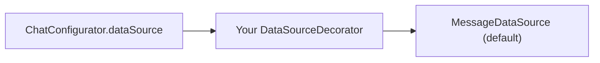

<Accordion title="AI Integration Quick Reference">

| Field | Value |
| --- | --- |
| Package | `@cometchat/chat-uikit-react-native` |
| Import | `import { ChatConfigurator, DataSourceDecorator, ExtensionsDataSource } from "@cometchat/chat-uikit-react-native";` |
| Key classes | `DataSourceDecorator` · `ChatConfigurator` · `ExtensionsDataSource` · `MessageDataSource` |
| Required overrides | **Five** — `getAllMessageTemplates` · `getMessageTemplate` · `getAllMessageTypes` · `getAllMessageCategories` · `getId` |
| Register with | `ChatConfigurator.enable(source => new MyDataSource(source))` |
| Prerequisites | `CometChatUIKit.init()` completed **and** `CometChatUIKit.login()` resolved — [details](#when-to-register) |
| Constraints | `getId` must not call `super` and must be unique · registration before `login()` is discarded · an `ExtensionsDataSource` must override `enable()` |
| Primary output | The custom type renders in `CometChatMessageList` **and** survives a reload |
| Related | [Message List](/ui-kit/react-native/message-list) · [Message Composer](/ui-kit/react-native/message-composer) · [Methods](/ui-kit/react-native/methods) |

</Accordion>

The UI Kit has no plugin API. It customises through a **decorator chain**: you wrap the active data source in your own `DataSourceDecorator`, override the methods you need, and register the result with `ChatConfigurator`.



`MessageDataSource` is the default implementation `ChatConfigurator` starts from. Every decorator you register wraps whatever is currently active, so calling `enable()` more than once layers decorators rather than replacing them.

---

## The five required overrides

A custom message type has to be declared twice — once so the list knows how to **render** it, and once so the list knows to **fetch** it — plus an identity so `ChatConfigurator` can tell your decorator apart from the others.

| Half | Methods | Why |
| --- | --- | --- |
| Render | `getAllMessageTemplates` · `getMessageTemplate` | Maps the type to a bubble |
| **Fetch** | **`getAllMessageTypes`** · **`getAllMessageCategories`** | `CometChatMessageList` builds `setTypes`/`setCategories` from these |
| **Identity** | **`getId`** | `ChatConfigurator.enable()` dedupes on it |

Miss the fetch half and the bubble renders optimistically when the message is sent, then disappears on reload — the type is filtered out **server-side**, with no error in the console, on the listener, or in the network response. See [Filtering Messages](/ui-kit/react-native/message-list#filtering-messages).

The four template and type methods must call `super` and extend the result. Returning your own list wholesale drops every built-in type.

<Warning>
**`getId` is the exception — it must not call `super`.**

The base implementation on `DataSourceDecorator` throws, it does not delegate:

```ts
getId(): string {
  throw new Error("Method not implemented.");
}
```

Both ways of getting it wrong fail quietly or confusingly:

| Mistake | What happens |
| --- | --- |
| No `getId` override | Crashes at `ChatConfigurator.enable()` with `Method not implemented.` — a message naming neither `getId` nor your decorator. The class is **not** `abstract`, so TypeScript does not catch it. |
| `return super.getId()` or the wrapped source's id | `enable()` finds the id already in its `names` list, decides the decorator is registered, and **skips it silently**. Nothing renders and nothing errors. |

Return a string unique to your decorator.
</Warning>

---

## When to register

<Warning>
**Register after `CometChatUIKit.login()` resolves — not after `init()`.**

`login()` calls `enableExtensions()`, whose first statement re-initialises the data source:

```ts
private static enableExtensions() {
  ChatConfigurator.init(); // re-initialize data source
```

`ChatConfigurator.init()` replaces `dataSource` and resets the `names` dedup list:

```ts
static init(initialSource?: DataSource) {
  this.dataSource = initialSource ?? new MessageDataSource();
  this.names = ["message_utils"];
  this.names.push(this.dataSource.getId());
}
```

`enableExtensions()` runs from every entry point that establishes or changes the session — `init()`, `login()` and `getLoggedInUser()` among them. Anything registered at module scope, or straight after `init()`, is gone by the time the user is logged in.
</Warning>

```tsx lines
import { CometChatUIKit, ChatConfigurator } from "@cometchat/chat-uikit-react-native";

await CometChatUIKit.init(uiKitSettings);
await CometChatUIKit.login({ uid: "cometchat-uid-1" });

// Only now does the registration survive.
ChatConfigurator.enable((source) => new PollDataSource(source));
```

---

## Example: a poll message type

```tsx lines
import { CometChat } from "@cometchat/chat-sdk-react-native";
import {
  ChatConfigurator,
  CometChatMessageTemplate,
  CometChatTheme,
  DataSource,
  DataSourceDecorator,
} from "@cometchat/chat-uikit-react-native";
import { Text } from "react-native";

const POLL_TYPE = "poll";

class PollDataSource extends DataSourceDecorator {
  // Required. Must be unique and must not delegate to the wrapped source.
  getId(): string {
    return "poll_data_source";
  }

  // Fetch half — without these the bubble vanishes on reload.
  getAllMessageTypes(): string[] {
    return [...super.getAllMessageTypes(), POLL_TYPE];
  }

  getAllMessageCategories(): string[] {
    return [...super.getAllMessageCategories(), CometChat.CATEGORY_CUSTOM];
  }

  // Render half.
  getAllMessageTemplates(
    theme: CometChatTheme,
    additionalParams?: any
  ): CometChatMessageTemplate[] {
    return [
      ...super.getAllMessageTemplates(theme, additionalParams),
      this.getPollTemplate(),
    ];
  }

  getMessageTemplate(
    messageType: string,
    messageCategory: string,
    theme: CometChatTheme,
    additionalParams?: any,
    message?: CometChat.BaseMessage
  ): CometChatMessageTemplate | null {
    if (
      messageType === POLL_TYPE &&
      messageCategory === CometChat.CATEGORY_CUSTOM
    ) {
      return this.getPollTemplate();
    }
    return super.getMessageTemplate(
      messageType,
      messageCategory,
      theme,
      additionalParams,
      message
    );
  }

  private getPollTemplate(): CometChatMessageTemplate {
    return new CometChatMessageTemplate({
      type: POLL_TYPE,
      category: CometChat.CATEGORY_CUSTOM,
      ContentView: (message: CometChat.BaseMessage) => {
        const data = (message as CometChat.CustomMessage).getCustomData() as {
          question?: string;
        };
        return <Text>{data?.question ?? "Poll"}</Text>;
      },
    });
  }
}

export function registerPollType(source: DataSource) {
  return new PollDataSource(source);
}
```

Register it after login:

```tsx lines
ChatConfigurator.enable(registerPollType);
```

---

## Registering through `uiKitSettings.extensions`

`enableExtensions()` re-applies `uiKitSettings.extensions` *after* the reset, so an `ExtensionsDataSource` passed in settings is the one registration route that survives `login()`. It has its own trap.

`ExtensionsDataSource` is abstract. It requires `addExtension()` and `getExtensionId()`, and ships a concrete `enable()`:

```ts
abstract class ExtensionsDataSource {
  abstract addExtension(): void;
  abstract getExtensionId(): string;

  enable(): void {
    CometChat.isExtensionEnabled(this.getExtensionId()).then((enabled) => {
      if (enabled) this.addExtension();
    });
  }
}
```

<Warning>
**A custom message type is not a dashboard extension.**

`isExtensionEnabled("poll")` resolves `false` for any type you invented, so the inherited `enable()` never calls `addExtension()` and your decorator is never registered — silently. Override `enable()` as well, and the dashboard check is bypassed.

Both steps or neither: passing the settings without overriding `enable()` fails exactly as quietly as registering before `login()`.
</Warning>

```tsx lines
import {
  ChatConfigurator,
  ExtensionsDataSource,
} from "@cometchat/chat-uikit-react-native";

class PollExtension extends ExtensionsDataSource {
  getExtensionId(): string {
    return "poll";
  }

  addExtension(): void {
    ChatConfigurator.enable((source) => new PollDataSource(source));
  }

  // Required: the inherited enable() gates on a dashboard check that is
  // false for a custom type, so addExtension() would never run.
  override enable(): void {
    this.addExtension();
  }
}

CometChatUIKit.init({
  appId: "APP_ID",
  region: "REGION",
  authKey: "AUTH_KEY",
  extensions: [new PollExtension()],
});
```

Passed this way, the type is re-registered automatically on every `login()`, so you do not have to sequence the call yourself.

---

## Choosing a route

| Route | Survives `login()` | Extra requirement |
| --- | --- | --- |
| `ChatConfigurator.enable()` after `login()` resolves | Yes, until the next `login()` / `getLoggedInUser()` | Sequence the call yourself |
| `ExtensionsDataSource` in `uiKitSettings.extensions` | Yes, re-applied on every session change | Must override `enable()` |

Use the settings route for a type your app always needs. Use the direct call for a type you register conditionally after the user is known.

---

## Related

- [Message List → Filtering Messages](/ui-kit/react-native/message-list#filtering-messages) — why the fetch half matters.
- [Message Composer](/ui-kit/react-native/message-composer) — sending a custom message.
- [Methods](/ui-kit/react-native/methods) — `CometChatUIKit.init` and `login`.
