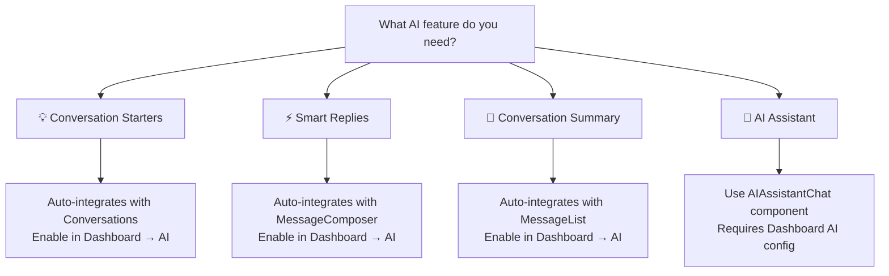

<Info>
📍 **Step 3 of 8: Feature Discovery** — [← Extensions](/ui-kit/react/extensions) | [Components →](/ui-kit/react/components-overview)
</Info>

<Accordion title="AI Agent Component Spec">
- **Package:** `@cometchat/chat-uikit-react`
- **Required setup:** `CometChatUIKit.init(UIKitSettings)` then `CometChatUIKit.login("UID")` + AI features enabled in [CometChat Dashboard](/fundamentals/ai-user-copilot/overview)
- **AI features:** Conversation Starter, Smart Replies, Conversation Summary
- **Key components:** `CometChatMessageList` → [Message List](/ui-kit/react/message-list) (Conversation Starter), `CometChatMessageComposer` → [Message Composer](/ui-kit/react/message-composer) (Smart Replies, Summary), `CometChatAIAssistantChat` → [AI Assistant Chat](/ui-kit/react/ai-assistant-chat)
- **Activation:** Enable each AI feature from the CometChat Dashboard — UI Kit auto-integrates them, no additional code required
</Accordion>

## Overview

CometChat's AI capabilities greatly enhance user interaction and engagement in your application. Let's understand how the React UI Kit achieves these features.

<Tip>
**Found what you need?** Head to [Components](/ui-kit/react/components-overview) to integrate the components that power these features.
</Tip>

<Tip>
**Quick Component Finder:**

**If you want AI conversation starters** → enable in Dashboard → AI → Conversation Starters, auto-integrates with [Conversations](/ui-kit/react/conversations)

**If you want AI smart replies** → enable in Dashboard → AI → Smart Replies, auto-integrates with [MessageComposer](/ui-kit/react/message-composer)

**If you want AI conversation summary** → enable in Dashboard → AI → Conversation Summary, auto-integrates with [MessageList](/ui-kit/react/message-list)

**If you want an AI assistant chatbot** → use [AIAssistantChat](/ui-kit/react/ai-assistant-chat) — requires Dashboard AI configuration
</Tip>

## Feature-to-Component Mapping

| Feature | Primary Component(s) | Dashboard Config Required |
|---------|---------------------|--------------------------|
| Conversation Starters | [Conversations](/ui-kit/react/conversations) | Yes (Dashboard → AI → Conversation Starters) |
| Smart Replies | [MessageComposer](/ui-kit/react/message-composer) | Yes (Dashboard → AI → Smart Replies) |
| Conversation Summary | [MessageList](/ui-kit/react/message-list) | Yes (Dashboard → AI → Conversation Summary) |
| AI Assistant Chat | [AIAssistantChat](/ui-kit/react/ai-assistant-chat) | Yes (Dashboard → AI) |

## Component Decision Tree

## Smart Chat Features

<Warning>
**Dashboard Setup Required:** All AI features require configuration in your CometChat Dashboard at Dashboard → AI. Enable each feature individually (Conversation Starters, Smart Replies, Conversation Summary) before they appear in the UI Kit.
</Warning>

### Conversation Starter

When a user initiates a new chat, the UI kit displays a list of suggested opening lines that users can select, making it easier for them to start a conversation. These suggestions are powered by CometChat's AI, which predicts contextually relevant conversation starters.

For a comprehensive understanding and guide on implementing and using the Conversation Starter, refer to our specific guide on the [Conversation Starter](/fundamentals/ai-user-copilot/conversation-starter).

Once you have successfully activated the [Conversation Starter](/fundamentals/ai-user-copilot/conversation-starter) from your CometChat Dashboard, the feature will automatically be incorporated into the [MessageList](/ui-kit/react/message-list) Component of UI Kits.

<Frame>
  
</Frame>

### Smart Replies

Smart Replies are AI-generated responses to messages. They can predict what a user might want to say next by analyzing the context of the conversation. This allows for quicker and more convenient responses, especially on mobile devices.

For a comprehensive understanding and guide on implementing and using the Smart Replies, refer to our specific guide on the [Smart Replies](/fundamentals/ai-user-copilot/smart-replies).

Once you have successfully activated the [Smart Replies](/fundamentals/ai-user-copilot/smart-replies) from your CometChat Dashboard, the feature will automatically be incorporated into the Action sheet of [MessageComposer](/ui-kit/react/message-composer) Component of UI Kits.

<Frame>
  
</Frame>

### Conversation Summary

The Conversation Summary feature provides concise summaries of long conversations, allowing users to catch up quickly on missed chats. This feature uses natural language processing to determine the main points in a conversation.

For a comprehensive understanding and guide on implementing and using the Conversation Summary, refer to our specific guide on the [Conversation Summary](/fundamentals/ai-user-copilot/conversation-summary).

Once you have successfully activated the [Conversation Summary](/fundamentals/ai-user-copilot/conversation-summary) from your CometChat Dashboard, the feature will automatically be incorporated into the Action sheet of [MessageComposer](/ui-kit/react/message-composer) Component of UI Kits.

<Frame>
  
</Frame>

<AccordionGroup>
<Accordion title="Common Failure Modes">

| Symptom | Cause | Fix |
| --- | --- | --- |
| AI features not appearing | Feature not activated in CometChat Dashboard | Enable the specific AI feature from your [Dashboard](/fundamentals/ai-user-copilot/overview) |
| Component doesn't render | `CometChatUIKit.init()` not called or not awaited | Ensure init completes before rendering. See [Methods](/ui-kit/react/methods) |
| Component renders but no AI suggestions | User not logged in | Call `CometChatUIKit.login("UID")` after init |
| Conversation Starter not showing | Feature not enabled or no conversation context | Ensure [Conversation Starter](/fundamentals/ai-user-copilot/conversation-starter) is activated in Dashboard |
| Smart Replies not appearing in composer | Feature not enabled in Dashboard | Ensure [Smart Replies](/fundamentals/ai-user-copilot/smart-replies) is activated in Dashboard |
| SSR hydration error | Component uses browser APIs on server | Wrap in `useEffect` or dynamic import with `ssr: false`. See [Next.js Integration](/ui-kit/react/next-js-integration) |

</Accordion>
</AccordionGroup>

---

## Next Steps

<CardGroup cols={3}>
  <Card title="AI Assistant Chat" icon="robot" href="/ui-kit/react/ai-assistant-chat">
    Add an AI chatbot to your app
  </Card>
  <Card title="Browse Components" icon="cubes" href="/ui-kit/react/components-overview">
    See all components and their APIs
  </Card>
  <Card title="Customize Theme" icon="palette" href="/ui-kit/react/theme">
    Apply your brand colors and styling
  </Card>
</CardGroup>
