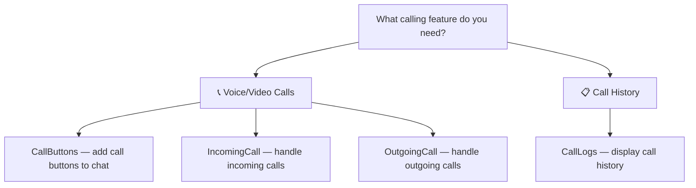

<Info>
📍 **Step 3 of 8: Feature Discovery** — [← AI Features](/ui-kit/react/ai-features) | [Components →](/ui-kit/react/components-overview)
</Info>

<Accordion title="AI Agent Component Spec">
- **Packages:** `@cometchat/chat-uikit-react` + `@cometchat/calls-sdk-javascript` (`npm install @cometchat/calls-sdk-javascript`)
- **Required setup:** `CometChatUIKit.init(UIKitSettings)` then `CometChatUIKit.login("UID")` — Calls SDK must also be installed
- **Call features:** Incoming Call, Outgoing Call, Call Logs, Call Buttons
- **Key components:** `CometChatCallButtons` → [Call Buttons](/ui-kit/react/call-buttons), `CometChatIncomingCall` → [Incoming Call](/ui-kit/react/incoming-call), `CometChatOutgoingCall` → [Outgoing Call](/ui-kit/react/outgoing-call), `CometChatCallLogs` → [Call Logs](/ui-kit/react/call-logs)
- **Auto-detection:** UI Kit automatically detects the Calls SDK and enables call UI components
- **CSS class prefix:** `.cometchat-`
</Accordion>

## Overview

CometChat's Calls feature is an advanced functionality that allows you to seamlessly integrate one-on-one as well as group audio and video calling capabilities into your application. This document provides a technical overview of these features, as implemented in the React UI Kit.


<Note>
**Before using call components:** Ensure `CometChatUIKit.init(UIKitSettings)` has completed and the user is logged in via `CometChatUIKit.login("UID")`. See [React.js Integration](/ui-kit/react/react-js-integration).
</Note>

<Tip>
**Found what you need?** Head to [Components](/ui-kit/react/components-overview) to integrate the components that power these features.
</Tip>

<Tip>
**Quick Component Finder:**

**If you want voice/video call buttons** → use [CallButtons](/ui-kit/react/call-buttons)

**If you want incoming call screen** → use [IncomingCall](/ui-kit/react/incoming-call)

**If you want outgoing call screen** → use [OutgoingCall](/ui-kit/react/outgoing-call)

**If you want call history** → use [CallLogs](/ui-kit/react/call-logs)
</Tip>

## Feature-to-Component Mapping

| Feature | Primary Component(s) | Additional SDK Required |
|---------|---------------------|------------------------|
| Voice Calling | [CallButtons](/ui-kit/react/call-buttons), [IncomingCall](/ui-kit/react/incoming-call), [OutgoingCall](/ui-kit/react/outgoing-call) | Yes (CometChat Calls SDK) |
| Video Calling | [CallButtons](/ui-kit/react/call-buttons), [IncomingCall](/ui-kit/react/incoming-call), [OutgoingCall](/ui-kit/react/outgoing-call) | Yes (CometChat Calls SDK) |
| Call Logs | [CallLogs](/ui-kit/react/call-logs) | No |
| Call Recording | [CallButtons](/ui-kit/react/call-buttons) | Yes (CometChat Calls SDK) |

## Component Decision Tree



## Integration

<Warning>
**Additional SDK Required:** Voice and video calling requires the CometChat Calls SDK. Install it alongside the UI Kit — see the integration steps below.
</Warning>

First, make sure that you've correctly integrated the UI Kit library into your project. If you haven't done this yet or are facing difficulties, refer to our [Getting Started](/ui-kit/react/integration) guide. This guide will walk you through a step-by-step process of integrating our UI Kit into your React project.

Once you've successfully integrated the UI Kit, the next step is to add the CometChat Calls SDK to your project. This is necessary to enable the calling features in the UI Kit. Here's how you do it:

Add the SDK files to your project's dependencies or libraries:

```bash
npm install @cometchat/calls-sdk-javascript
```

After adding this dependency, the React UI Kit will automatically detect it and activate the calling features. Now, your application supports both audio and video calling. You will see [CallButtons](/ui-kit/react/call-buttons) component rendered in [MessageHeader](/ui-kit/react/message-header) Component.

<Frame>
  
</Frame>

## Features

### Incoming Call

The [Incoming Call](/ui-kit/react/incoming-call) component of the CometChat UI Kit provides the functionality that lets users receive real-time audio and video calls in the app.

When a call is made to a user, the Incoming Call component triggers and displays a call screen. This call screen typically displays the caller information and provides the user with options to either accept or reject the incoming call.

<Frame>
  
</Frame>

### Outgoing Call

The [Outgoing Call](/ui-kit/react/outgoing-call) component of the CometChat UI Kit is designed to manage the outgoing call process within your application. When a user initiates an audio or video call to another user or group, this component displays an outgoing call screen, showcasing information about the recipient and the call status.

Importantly, the Outgoing Call component is smartly designed to transition automatically into the ongoing call screen once the receiver accepts the call. This ensures a smooth flow from initiating the call to engaging in a conversation, without any additional steps required from the user.

<Frame>
  
</Frame>

### Call Logs

[Call Logs](/ui-kit/react/call-logs) component provides you with the records call events such as who called who, the time of the call, and the duration of the call. This information can be fetched from the CometChat server and displayed in a structured format for users to view their past call activities.

<Frame>
  
</Frame>

<AccordionGroup>
<Accordion title="Common Failure Modes">

| Symptom | Cause | Fix |
| --- | --- | --- |
| Call buttons not appearing in Message Header | `@cometchat/calls-sdk-javascript` not installed | Run `npm install @cometchat/calls-sdk-javascript` — UI Kit auto-detects it |
| Component doesn't render | `CometChatUIKit.init()` not called or not awaited | Ensure init completes before rendering. See [Methods](/ui-kit/react/methods) |
| Component renders but shows no data | User not logged in | Call `CometChatUIKit.login("UID")` after init |
| Incoming call screen not showing | `CometChatIncomingCall` not mounted in the component tree | Ensure the component is rendered at the app root level so it can listen for incoming calls |
| SSR hydration error | Component uses browser APIs on server | Wrap in `useEffect` or dynamic import with `ssr: false`. See [Next.js Integration](/ui-kit/react/next-js-integration) |

</Accordion>
</AccordionGroup>

---

## Next Steps

<CardGroup cols={3}>
  <Card title="Call Buttons" icon="phone" href="/ui-kit/react/call-buttons">
    Add voice and video call buttons
  </Card>
  <Card title="Incoming Call" icon="phone-arrow-down-left" href="/ui-kit/react/incoming-call">
    Handle incoming call screens
  </Card>
  <Card title="Call Logs" icon="clock-rotate-left" href="/ui-kit/react/call-logs">
    Display call history
  </Card>
</CardGroup>
