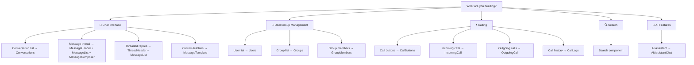

<Info>
📍 **Step 4 of 8: Component Integration** — [← Features](/ui-kit/react/core-features) | [Customization →](/ui-kit/react/theme)
</Info>

<Accordion title="AI Agent Component Spec">

| Field | Value |
| --- | --- |
| Package | `@cometchat/chat-uikit-react` |
| Required setup | `CometChatUIKit.init()` + `CometChatUIKit.login()` before rendering any component |
| Callback actions | `on<Event>={(param) => {}}` |
| Data filtering | `<entity>RequestBuilder={new CometChat.<Entity>RequestBuilder()}` |
| Toggle features | `hide<Feature>={true}` or `show<Feature>={true}` |
| Custom rendering | `<slot>View={(<params>) => JSX}` |
| CSS overrides | Target `.cometchat-<component>` class in global CSS |
| Calling | Requires separate `@cometchat/calls-sdk-javascript` package |

</Accordion>

## What Are You Building?



## Component Catalog

All components are imported from `@cometchat/chat-uikit-react`.

| Component | Purpose | Key Props | Page |
|-----------|---------|-----------|------|
| [Conversations](/ui-kit/react/conversations) | Display and manage chat conversation list | `conversationsRequestBuilder`, `onItemClick`, `activeConversation` | [→](/ui-kit/react/conversations) |
| [Users](/ui-kit/react/users) | Browse and select users | `usersRequestBuilder`, `onItemClick`, `hideSearch` | [→](/ui-kit/react/users) |
| [Groups](/ui-kit/react/groups) | Browse and manage groups | `groupsRequestBuilder`, `onItemClick`, `hideSearch` | [→](/ui-kit/react/groups) |
| [GroupMembers](/ui-kit/react/group-members) | View and manage group members | `groupMembersRequestBuilder`, `group`, `onItemClick` | [→](/ui-kit/react/group-members) |
| [MessageHeader](/ui-kit/react/message-header) | Display conversation header with user/group info | `user`, `group`, `hideBackButton` | [→](/ui-kit/react/message-header) |
| [MessageList](/ui-kit/react/message-list) | Display sent and received messages | `messagesRequestBuilder`, `user`, `group`, `hideReceipt` | [→](/ui-kit/react/message-list) |
| [MessageComposer](/ui-kit/react/message-composer) | Compose and send messages | `user`, `group`, `hideLiveReaction`, `hideVoiceRecording` | [→](/ui-kit/react/message-composer) |
| [MessageTemplate](/ui-kit/react/message-template) | Customize message bubble rendering | `type`, `contentView`, `bubbleView` | [→](/ui-kit/react/message-template) |
| [ThreadHeader](/ui-kit/react/thread-header) | Display thread parent message header | `parentMessage`, `onClose` | [→](/ui-kit/react/thread-header) |
| [IncomingCall](/ui-kit/react/incoming-call) | Handle incoming call UI | `call`, `onAccept`, `onDecline` | [→](/ui-kit/react/incoming-call) |
| [OutgoingCall](/ui-kit/react/outgoing-call) | Handle outgoing call UI | `call`, `onCancelClick` | [→](/ui-kit/react/outgoing-call) |
| [CallButtons](/ui-kit/react/call-buttons) | Add voice/video call buttons | `user`, `group`, `hideVoiceCall`, `hideVideoCall` | [→](/ui-kit/react/call-buttons) |
| [CallLogs](/ui-kit/react/call-logs) | Display call history | `callLogsRequestBuilder`, `onItemClick` | [→](/ui-kit/react/call-logs) |
| [Search](/ui-kit/react/search) | Search messages, users, groups | `searchRequestBuilder`, `onItemClick` | [→](/ui-kit/react/search) |
| [AIAssistantChat](/ui-kit/react/ai-assistant-chat) | AI-powered assistant chatbot | `title`, `onClose` | [→](/ui-kit/react/ai-assistant-chat) |

### Conversations and Lists

| Component | Purpose | Key Props | Page |
| --- | --- | --- | --- |
| CometChatConversations | Scrollable list of recent conversations | `conversationsRequestBuilder`, `onItemClick`, `onError` | [Conversations](/ui-kit/react/conversations) |
| CometChatUsers | Scrollable list of users | `usersRequestBuilder`, `onItemClick`, `onError` | [Users](/ui-kit/react/users) |
| CometChatGroups | Scrollable list of groups | `groupsRequestBuilder`, `onItemClick`, `onError` | [Groups](/ui-kit/react/groups) |
| CometChatGroupMembers | Scrollable list of group members | `group`, `groupMemberRequestBuilder`, `onItemClick` | [Group Members](/ui-kit/react/group-members) |

### Messages

| Component | Purpose | Key Props | Page |
| --- | --- | --- | --- |
| CometChatMessageHeader | Toolbar with avatar, name, status, typing indicator | `user`, `group`, `enableAutoSummaryGeneration` | [Message Header](/ui-kit/react/message-header) |
| CometChatMessageList | Scrollable message list with reactions, receipts, threads | `user`, `group`, `messagesRequestBuilder`, `goToMessageId` (string) | [Message List](/ui-kit/react/message-list) |
| CometChatMessageComposer | Rich text input with attachments, mentions, voice notes | `user`, `group`, `onSendButtonClick`, `placeholderText` | [Message Composer](/ui-kit/react/message-composer) |
| CometChatMessageTemplate | Pre-defined structure for custom message bubbles | `type`, `category`, `contentView`, `headerView`, `footerView` | [Message Template](/ui-kit/react/message-template) |
| CometChatThreadHeader | Parent message bubble and reply count for threaded view | `parentMessage`, `onClose`, `hideReceipts`, `textFormatters` | [Thread Header](/ui-kit/react/thread-header) |

### Calling

| Component | Purpose | Key Props | Page |
| --- | --- | --- | --- |
| CometChatCallButtons | Voice and video call initiation buttons | `user`, `group`, `onVoiceCallClick`, `onVideoCallClick` | [Call Buttons](/ui-kit/react/call-buttons) |
| CometChatIncomingCall | Incoming call notification with accept/decline | `call`, `onAccept(call)`, `onDecline(call)` | [Incoming Call](/ui-kit/react/incoming-call) |
| CometChatOutgoingCall | Outgoing call screen with cancel control | `call`, `onCloseClicked` | [Outgoing Call](/ui-kit/react/outgoing-call) |
| CometChatCallLogs | Scrollable list of call history | `callLogsRequestBuilder`, `onItemClick` | [Call Logs](/ui-kit/react/call-logs) |

### Search and AI

| Component | Purpose | Key Props | Page |
| --- | --- | --- | --- |
| CometChatSearch | Real-time search across conversations and messages | `onConversationClicked(conversation, searchKeyword?)`, `onMessageClicked(message, searchKeyword?)`, `uid`, `guid`, `textFormatters` | [Search](/ui-kit/react/search) |
| CometChatAIAssistantChat | AI agent chat with streaming, suggestions, history | `user`, `onSendButtonClick(message, previewMessageMode?)`, `aiAssistantTools` | [AI Assistant Chat](/ui-kit/react/ai-assistant-chat) |

<Tip>
**Once this component is working**, customize its look in [Customization](/ui-kit/react/theme) or explore related [Guides](/ui-kit/react/guide-overview) for advanced patterns.
</Tip>

## Iterative Development Workflow

You don't need to build everything at once. The recommended approach is incremental:

1. **Identify a gap** — What's missing from your current chat experience?
2. **Find the component** — Use the [Feature-to-Component tables](/ui-kit/react/core-features) or the catalog above to find the right component
3. **Add the component** — Import it and add the base implementation (copy-paste from the component page)
4. **Configure behavior** — Adjust props to control visibility and features
5. **Attach events** — Wire up callbacks (`onItemClick`, `onSearch`, etc.) for your business logic
6. **Inject custom UI** — Use View Slots to replace default sections with your own components
7. **Repeat** — Go back to step 1 for the next feature

Each component page follows this same layered structure: Base → Behavior → Actions → Filters → Events → Custom Views. Start simple, add complexity as needed.

## Component API Pattern

All components share a consistent API surface.

### Actions

Actions control component behavior. They split into two categories:

**Predefined Actions** are built into the component and execute automatically on user interaction (e.g., clicking send dispatches the message). No configuration needed.

**User-Defined Actions** are callback props that fire on specific events. Override them to customize behavior:

```tsx
<CometChatMessageList
  user={chatUser}
  onThreadRepliesClick={(message) => openThreadPanel(message)}
  onError={(error) => logError(error)}
/>
```

### Events

Events enable decoupled communication between components. A component emits events that other parts of the application can subscribe to without direct references.

```tsx
import { CometChatMessageEvents } from "@cometchat/chat-uikit-react";

const sub = CometChatMessageEvents.ccMessageSent.subscribe((message) => {
  // react to sent message
});

// cleanup
sub?.unsubscribe();
```

Each component page documents its emitted events in the Events section.

### Filters

List-based components accept `RequestBuilder` props to control which data loads:

```tsx
<CometChatMessageList
  user={chatUser}
  messagesRequestBuilder={
    new CometChat.MessagesRequestBuilder().setLimit(20)
  }
/>
```

### Custom View Slots

Components expose named view slots to replace sections of the default UI:

```tsx
<CometChatMessageHeader
  user={chatUser}
  titleView={<CustomTitle />}
  subtitleView={<CustomSubtitle />}
  leadingView={<CustomAvatar />}
/>
```

### CSS Overrides

Every component has a root CSS class (`.cometchat-<component>`) for style customization:

```css
.cometchat-message-list .cometchat-text-bubble__body-text {
  font-family: "SF Pro";
}
```


## Next Steps
<CardGroup cols={3}>
  <Card title="Customize Theme" icon="palette" href="/ui-kit/react/theme">Apply your brand colors and styling</Card>
  <Card title="Guides" icon="book" href="/ui-kit/react/guide-overview">Step-by-step recipes for common patterns</Card>
  <Card title="API Reference" icon="code" href="/ui-kit/react/methods">Methods and events reference</Card>
</CardGroup>
