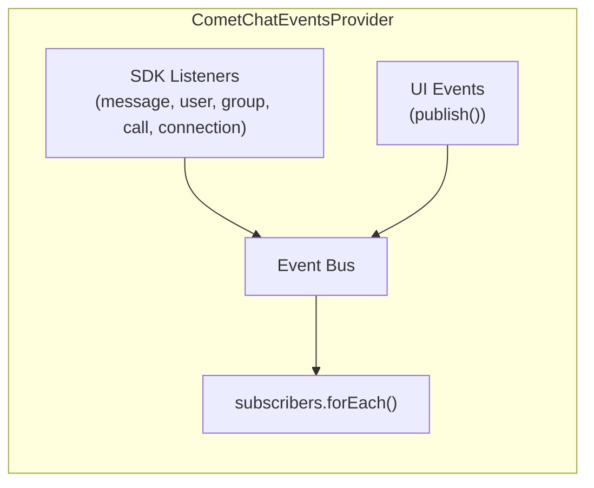

<Accordion title="AI Integration Quick Reference">

| Field | Value |
| --- | --- |
| Subscribe hook | `useCometChatEvents((event) => { ... })` |
| Publish hook | `const publish = usePublishEvent()` |
| Provider | `CometChatEventsProvider` (mounted automatically by `CometChatProvider` after login) |
| Event prefix | SDK events: `message/`, `receipt/`, `user/`, `group/`, `call/`, `connection/` |
| UI event prefix | `ui:message/`, `ui:compose/`, `ui:group/`, `ui:call/`, `ui:thread/`, `ui:conversation/`, `ui:card/` |

</Accordion>

## Overview

The v7 event system merges CometChat SDK listener events (from the network) with local UI events (from component actions) into a single pub/sub bus. Components subscribe to events they care about and publish events when they perform actions that other components need to know about.

This replaces v6's RxJS-based `CometChatMessageEvents`, `CometChatGroupEvents`, etc. with a single unified system.

---

## How It Works



1. **SDK listeners** are attached when `CometChatEventsProvider` mounts (after login)
2. When the SDK fires a listener callback, it's converted to a typed event and emitted to all subscribers
3. Components can also **publish** UI events for local cross-component communication
4. All subscribers receive all events — filter by `event.type` in your handler

---

## Subscribing to Events

Use the `useCometChatEvents` hook to subscribe:

```tsx
import { useCometChatEvents } from "@cometchat/chat-uikit-react";

function MyComponent() {
  useCometChatEvents((event) => {
    switch (event.type) {
      case "message/text-received":
        console.log("New message:", event.message.getText());
        break;
      case "user/online":
        console.log("User online:", event.user.getName());
        break;
      case "ui:message/sent":
        console.log("Message sent:", event.message.getId());
        break;
    }
  });

  return <div>...</div>;
}
```

The hook automatically subscribes on mount and unsubscribes on unmount. No cleanup needed.

---

## Publishing UI Events

Use the `usePublishEvent` hook to publish events that other components can react to:

```tsx
import { usePublishEvent } from "@cometchat/chat-uikit-react";

function MyComponent() {
  const publish = usePublishEvent();

  const handleSend = (message: CometChat.BaseMessage) => {
    publish({
      type: "ui:message/sent",
      message,
      status: CometChatMessageStatus.success,
    });
  };

  return <button onClick={() => handleSend(msg)}>Send</button>;
}
```

Only `ui:` prefixed events can be published by components. SDK events are emitted internally by the provider.

---

## SDK Events

These events originate from the CometChat SDK (network). They fire when other users perform actions.

### Message Events

| Event Type | Payload | When |
| --- | --- | --- |
| `message/text-received` | `{ message: TextMessage }` | Text message received |
| `message/media-received` | `{ message: MediaMessage }` | Media message received |
| `message/custom-received` | `{ message: CustomMessage }` | Custom message received |
| `message/interactive-received` | `{ message: InteractiveMessage }` | Interactive message received |
| `message/card-received` | `{ message: BaseMessage }` | Card message (`category: "card"`) received |
| `message/edited` | `{ message: BaseMessage }` | Message was edited |
| `message/deleted` | `{ message: BaseMessage }` | Message was deleted |
| `message/moderated` | `{ message: BaseMessage }` | Message was moderated |

### Pin and Save

| Event Type | Payload | When |
| --- | --- | --- |
| `message/pinned` | `{ message: BaseMessage }` | A message was pinned in the conversation |
| `message/unpinned` | `{ message: BaseMessage }` | A message was unpinned |
| `message/saved` | `{ message: BaseMessage }` | The current user saved a message |
| `message/unsaved` | `{ message: BaseMessage }` | The current user unsaved a message |

`CometChatPinnedMessages` and `CometChatSavedMessages` subscribe to these to keep their lists in sync in real time. See the [Pin & Save Messages guide](/ui-kit/react/guide-pin-and-save-messages).

### Receipt Events

| Event Type | Payload | When |
| --- | --- | --- |
| `receipt/delivered` | `{ receipt: MessageReceipt }` | Message delivered to recipient |
| `receipt/read` | `{ receipt: MessageReceipt }` | Message read by recipient |
| `receipt/delivered-to-all` | `{ receipt: MessageReceipt }` | Message delivered to all (group) |
| `receipt/read-by-all` | `{ receipt: MessageReceipt }` | Message read by all (group) |

### Reaction Events

| Event Type | Payload | When |
| --- | --- | --- |
| `reaction/added` | `{ event: ReactionEvent }` | Reaction added to a message |
| `reaction/removed` | `{ event: ReactionEvent }` | Reaction removed from a message |

### Typing Events

| Event Type | Payload | When |
| --- | --- | --- |
| `typing/started` | `{ indicator: TypingIndicator }` | User started typing |
| `typing/ended` | `{ indicator: TypingIndicator }` | User stopped typing |

### User Events

| Event Type | Payload | When |
| --- | --- | --- |
| `user/online` | `{ user: User }` | User came online |
| `user/offline` | `{ user: User }` | User went offline |

### Group Events

| Event Type | Payload | When |
| --- | --- | --- |
| `group/member-joined` | `{ action, joinedUser, joinedGroup }` | Member joined a group |
| `group/member-left` | `{ action, leftUser, leftGroup }` | Member left a group |
| `group/member-kicked` | `{ action, kickedUser, kickedBy, kickedFrom }` | Member was kicked |
| `group/member-banned` | `{ action, bannedUser, bannedBy, bannedFrom }` | Member was banned |
| `group/member-unbanned` | `{ action, unbannedUser, unbannedBy, unbannedFrom }` | Member was unbanned |
| `group/member-added` | `{ action, addedBy, addedUser, addedTo }` | Member was added |
| `group/member-scope-changed` | `{ action, changedUser, newScope, oldScope, changedGroup }` | Member scope changed |

### Call Events

| Event Type | Payload | When |
| --- | --- | --- |
| `call/incoming` | `{ call: Call }` | Incoming call received |
| `call/accepted` | `{ call: Call }` | Outgoing call was accepted |
| `call/rejected` | `{ call: Call }` | Outgoing call was rejected |
| `call/cancelled` | `{ call: Call }` | Incoming call was cancelled |
| `call/ended` | `{ call: Call }` | Call ended |

### Connection Events

| Event Type | Payload | When |
| --- | --- | --- |
| `connection/connected` | — | WebSocket connected |
| `connection/disconnected` | — | WebSocket disconnected |

---

## UI Events

These events are published by UI Kit components for local cross-component communication within the same tab.

### Message Lifecycle

| Event Type | Payload | Published by |
| --- | --- | --- |
| `ui:message/sent` | `{ message, status }` | MessageComposer |
| `ui:message/deleted` | `{ message }` | MessageList (after delete) |
| `ui:message/read` | `{ message }` | MessageList (mark as read) |

### Pin and Save (optimistic)

Published by the message options the moment a pin/save succeeds locally, before the network echo. Pinned/Saved panels and the message list listen to these so every surface flips together.

| Event Type | Payload | Published by |
| --- | --- | --- |
| `ui:message/pin-changed` | `{ message, pinned }` | Message options (pin / unpin action) |
| `ui:message/save-changed` | `{ message, saved }` | Message options (save / unsave action) |

### Composer Commands

| Event Type | Payload | Published by |
| --- | --- | --- |
| `ui:compose/edit` | `{ message, status, parentMessageId? }` | MessageList (edit option) |
| `ui:compose/reply` | `{ message, status, parentMessageId? }` | MessageList (reply option) |
| `ui:compose/text` | `{ text }` | Smart replies, conversation starters |
| `ui:compose/recording-started` | `{ composerInstanceId }` | MessageComposer (voice recording) |

### Conversation State

| Event Type | Payload | Published by |
| --- | --- | --- |
| `ui:conversation/read` | `{ conversationId }` | MessageList |
| `ui:conversation/updated` | `{ conversation }` | MessageList |
| `ui:conversation/deleted` | `{ conversation }` | Conversations (delete action) |
| `ui:conversation/pin-changed` | `{ conversation, pinned }` | Conversations (pin / unpin action; optimistic re-order) |
| `ui:active-chat/changed` | `{ user?, group?, message?, unreadMessageCount? }` | MessageList (on load) |

### User & Group Actions

| Event Type | Payload | Published by |
| --- | --- | --- |
| `ui:user/blocked` | `{ user }` | MessageHeader |
| `ui:user/unblocked` | `{ user }` | MessageHeader |
| `ui:group/created` | `{ group }` | Groups |
| `ui:group/left` | `{ group }` | GroupMembers |
| `ui:group/deleted` | `{ group }` | Groups |
| `ui:group/member-kicked` | `{ message, user, group }` | GroupMembers |
| `ui:group/member-banned` | `{ message, user, group }` | GroupMembers |
| `ui:group/member-unbanned` | `{ message?, user, group }` | GroupMembers |
| `ui:group/member-scope-changed` | `{ message, user, group, newScope }` | GroupMembers |
| `ui:group/ownership-changed` | `{ group, newOwner, previousOwnerUid }` | GroupMembers |

### Thread

| Event Type | Payload | Published by |
| --- | --- | --- |
| `ui:thread/opened` | `{ parentMessage }` | MessageList (thread option) |
| `ui:thread/closed` | — | ThreadHeader |
| `ui:thread/subscription-changed` | `{ parentMessageId, subscribed }` | ThreadHeader / MessageList (optimistic subscribe-unsubscribe flip) |

### Call Actions

| Event Type | Payload | Published by |
| --- | --- | --- |
| `ui:call/outgoing` | `{ call }` | MessageHeader (call buttons) |
| `ui:call/rejected` | `{ call }` | IncomingCall |
| `ui:call/ended` | `{ call? }` | OngoingCall |
| `ui:call/accepted` | `{ call }` | IncomingCall |
| `ui:call/join` | `{ sessionId, message }` | CallLogs |

### Navigation

| Event Type | Payload | Published by |
| --- | --- | --- |
| `ui:open-chat` | `{ user?, group? }` | MessageList (message privately option) |

### Card Actions

| Event Type | Payload | Published by |
| --- | --- | --- |
| `ui:card/action` | `{ message, action }` | [Card Bubble](/ui-kit/react/components/card-bubble) (user clicks a card action) |

Published when a user clicks an action (button, link, etc.) inside a card message bubble. The kit performs no behavior — it forwards the raw `action` and its `message` to your app, so you own all action handling. This is the only channel that can reach a kit-instantiated card (e.g. a nested agent card) where no prop is reachable.

### Panels

| Event Type | Payload | Published by |
| --- | --- | --- |
| `ui:panel/show` | `{ position, panel }` | AI features |
| `ui:panel/hide` | `{ position }` | AI features |

---

## Differences from v6

| v6 | v7 |
| --- | --- |
| Multiple RxJS Subject classes (`CometChatMessageEvents`, `CometChatGroupEvents`, etc.) | Single unified event bus |
| `CometChatMessageEvents.ccMessageSent.next(...)` | `publish({ type: 'ui:message/sent', ... })` |
| `CometChatMessageEvents.ccMessageSent.subscribe(...)` | `useCometChatEvents((e) => { if (e.type === 'ui:message/sent') ... })` |
| Manual listener management | Automatic — provider handles all SDK listeners |
| RxJS dependency | No external dependencies |
