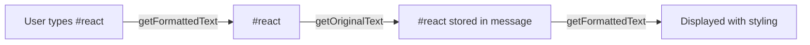

<Accordion title="AI Agent Component Spec">

| Field | Value |
| --- | --- |
| Package | `@cometchat/chat-uikit-react` |
| Base Class | `CometChatTextFormatter` — abstract class to extend |
| Key Methods | `getFormattedText()`, `getOriginalText()`, `onKeyUp()`, `onKeyDown()` |
| Usage | Pass to `textFormatters` prop on `CometChatMessageList` and `CometChatMessageComposer` |
| Built-in Formatters | Mentions, URLs, Shortcuts |

</Accordion>

## Overview

This guide shows you how to create custom text formatters for the CometChat React UI Kit. You'll learn to build formatters that detect patterns (like hashtags) and apply custom styling and behavior.

**Time estimate:** 20 minutes
**Difficulty:** Advanced

## Prerequisites

- [React.js Integration](/ui-kit/react/guides/getting-started/react-js) completed
- [Messaging Guide](/ui-kit/react/guides/chat-features/messaging) completed
- Familiarity with regular expressions (regex)

## Use Cases

Custom formatters are useful for:

- **Hashtags** — Style and link #hashtags in messages
- **Keywords** — Highlight specific terms or product names
- **Custom mentions** — Create @mentions beyond users/groups
- **Code snippets** — Detect and style inline code
- **Custom links** — Transform patterns into clickable links

## How Formatters Work

Text formatters process message text in two directions:

1. **Input → Display**: `getFormattedText()` converts plain text to styled HTML
2. **Display → Storage**: `getOriginalText()` strips formatting back to plain text



## Steps

### Step 1: Create the Formatter Class

Extend `CometChatTextFormatter` and configure the tracking character and regex patterns:

```tsx title="HashTagFormatter.ts"
import { CometChatTextFormatter } from "@cometchat/chat-uikit-react";

class HashTagFormatter extends CometChatTextFormatter {
  constructor() {
    super();
    
    // Character that triggers formatting
    this.setTrackingCharacter("#");
    
    // Regex to match hashtags
    this.setRegexPatterns([/\B#(\w+)\b/g]);
    
    // Regex to strip formatting (for storage)
    this.setRegexToReplaceFormatting([
      /<span class="custom-hashtag"[^>]*>#(\w+)<\/span>/g,
    ]);
    
    // Set up key event callbacks
    this.setKeyUpCallBack(this.onKeyUp.bind(this));
    this.setKeyDownCallBack(this.onKeyDown.bind(this));
  }

  // Convert plain text to formatted HTML
  getFormattedText(inputText: string): string | void {
    if (!inputText) return;
    return inputText.replace(
      /\B#(\w+)\b/g,
      '<span class="custom-hashtag" style="color: #6852d6; font-weight: 500;">#$1</span>'
    );
  }

  // Strip formatting back to plain text
  getOriginalText(inputText: string): string {
    if (!inputText) return "";
    return inputText.replace(
      /<span class="custom-hashtag"[^>]*>#(\w+)<\/span>/g,
      "#$1"
    );
  }

  onKeyUp(event: KeyboardEvent): void {
    // Handle key up events if needed
  }

  onKeyDown(event: KeyboardEvent): void {
    // Handle key down events if needed
  }
}

export default HashTagFormatter;
```

### Step 2: Apply the Formatter to Components

Pass your formatter to the `textFormatters` prop:

```tsx title="ChatWithHashtags.tsx"
import { useState, useEffect } from "react";
import {
  CometChatMessageList,
  CometChatMessageComposer,
} from "@cometchat/chat-uikit-react";
import { CometChat } from "@cometchat/chat-sdk-javascript";
import HashTagFormatter from "./HashTagFormatter";
import "@cometchat/chat-uikit-react/css-variables.css";

function ChatWithHashtags() {
  const [user, setUser] = useState<CometChat.User>();
  const hashTagFormatter = new HashTagFormatter();

  useEffect(() => {
    CometChat.getUser("user_uid").then(setUser);
  }, []);

  if (!user) return null;

  return (
    <div style={{ display: "flex", flexDirection: "column", height: "100vh" }}>
      <CometChatMessageList
        user={user}
        textFormatters={[hashTagFormatter]}
      />
      <CometChatMessageComposer
        user={user}
        textFormatters={[hashTagFormatter]}
      />
    </div>
  );
}

export default ChatWithHashtags;
```

<Frame>
  
</Frame>

### Step 3: Add Click Handlers (Optional)

Make formatted text interactive by implementing `registerEventListeners`:

```tsx title="ClickableHashTagFormatter.ts"
import { CometChatTextFormatter } from "@cometchat/chat-uikit-react";

class ClickableHashTagFormatter extends CometChatTextFormatter {
  private onHashtagClick: (hashtag: string) => void;

  constructor(onHashtagClick: (hashtag: string) => void) {
    super();
    this.onHashtagClick = onHashtagClick;
    
    this.setTrackingCharacter("#");
    this.setRegexPatterns([/\B#(\w+)\b/g]);
    this.setRegexToReplaceFormatting([
      /<span class="custom-hashtag"[^>]*>#(\w+)<\/span>/g,
    ]);
  }

  getFormattedText(inputText: string): string | void {
    if (!inputText) return;
    return inputText.replace(
      /\B#(\w+)\b/g,
      '<span class="custom-hashtag" style="color: #6852d6; cursor: pointer;" data-hashtag="$1">#$1</span>'
    );
  }

  getOriginalText(inputText: string): string {
    if (!inputText) return "";
    return inputText.replace(
      /<span class="custom-hashtag"[^>]*>#(\w+)<\/span>/g,
      "#$1"
    );
  }

  // Called for each formatted element in the message
  registerEventListeners(element: HTMLElement, classList: DOMTokenList): HTMLElement {
    if (classList.contains("custom-hashtag")) {
      element.addEventListener("click", (event) => {
        const hashtag = element.getAttribute("data-hashtag");
        if (hashtag) {
          this.onHashtagClick(hashtag);
        }
      });
    }
    return element;
  }
}

export default ClickableHashTagFormatter;
```

Usage:

```tsx
const hashTagFormatter = new ClickableHashTagFormatter((hashtag) => {
  console.log("Clicked hashtag:", hashtag);
  // Navigate to hashtag search, open modal, etc.
});
```

### Step 4: Create a Keyword Highlighter

Here's another example that highlights specific keywords:

```tsx title="KeywordHighlighter.ts"
import { CometChatTextFormatter } from "@cometchat/chat-uikit-react";

class KeywordHighlighter extends CometChatTextFormatter {
  private keywords: string[];

  constructor(keywords: string[]) {
    super();
    this.keywords = keywords;
    
    // Create regex pattern from keywords
    const pattern = new RegExp(`\\b(${keywords.join("|")})\\b`, "gi");
    this.setRegexPatterns([pattern]);
    
    // Regex to strip formatting
    const stripPattern = new RegExp(
      `<span class="keyword-highlight"[^>]*>(${keywords.join("|")})<\\/span>`,
      "gi"
    );
    this.setRegexToReplaceFormatting([stripPattern]);
  }

  getFormattedText(inputText: string): string | void {
    if (!inputText) return;
    
    const pattern = new RegExp(`\\b(${this.keywords.join("|")})\\b`, "gi");
    return inputText.replace(
      pattern,
      '<span class="keyword-highlight" style="background: #fff3cd; padding: 2px 4px; border-radius: 4px;">$1</span>'
    );
  }

  getOriginalText(inputText: string): string {
    if (!inputText) return "";
    
    const pattern = new RegExp(
      `<span class="keyword-highlight"[^>]*>(.*?)<\\/span>`,
      "gi"
    );
    return inputText.replace(pattern, "$1");
  }
}

export default KeywordHighlighter;
```

Usage:

```tsx
const keywordHighlighter = new KeywordHighlighter([
  "urgent",
  "important",
  "deadline",
  "ASAP",
]);

<CometChatMessageList
  user={user}
  textFormatters={[keywordHighlighter]}
/>
```

## Complete Example

Here's a full implementation with multiple formatters:

```tsx title="ChatWithFormatters.tsx"
import { useState, useEffect } from "react";
import {
  CometChatConversations,
  CometChatMessageHeader,
  CometChatMessageList,
  CometChatMessageComposer,
  CometChatTextFormatter,
} from "@cometchat/chat-uikit-react";
import { CometChat } from "@cometchat/chat-sdk-javascript";
import "@cometchat/chat-uikit-react/css-variables.css";

// Hashtag Formatter
class HashTagFormatter extends CometChatTextFormatter {
  constructor() {
    super();
    this.setTrackingCharacter("#");
    this.setRegexPatterns([/\B#(\w+)\b/g]);
    this.setRegexToReplaceFormatting([/<span class="hashtag"[^>]*>#(\w+)<\/span>/g]);
  }

  getFormattedText(inputText: string): string | void {
    if (!inputText) return;
    return inputText.replace(
      /\B#(\w+)\b/g,
      '<span class="hashtag" style="color: #6852d6; font-weight: 500;">#$1</span>'
    );
  }

  getOriginalText(inputText: string): string {
    if (!inputText) return "";
    return inputText.replace(/<span class="hashtag"[^>]*>#(\w+)<\/span>/g, "#$1");
  }
}

// Keyword Highlighter
class KeywordHighlighter extends CometChatTextFormatter {
  private keywords = ["urgent", "important", "deadline"];

  constructor() {
    super();
    const pattern = new RegExp(`\\b(${this.keywords.join("|")})\\b`, "gi");
    this.setRegexPatterns([pattern]);
  }

  getFormattedText(inputText: string): string | void {
    if (!inputText) return;
    const pattern = new RegExp(`\\b(${this.keywords.join("|")})\\b`, "gi");
    return inputText.replace(
      pattern,
      '<span class="keyword" style="background: #fff3cd; padding: 2px 4px; border-radius: 4px;">$1</span>'
    );
  }

  getOriginalText(inputText: string): string {
    if (!inputText) return "";
    return inputText.replace(/<span class="keyword"[^>]*>(.*?)<\/span>/gi, "$1");
  }
}

function ChatWithFormatters() {
  const [selectedConversation, setSelectedConversation] = useState<CometChat.Conversation>();
  
  // Create formatter instances
  const formatters = [new HashTagFormatter(), new KeywordHighlighter()];

  const getConversationWith = () => {
    if (!selectedConversation) return null;
    const type = selectedConversation.getConversationType();
    if (type === "user") {
      return { user: selectedConversation.getConversationWith() as CometChat.User };
    }
    return { group: selectedConversation.getConversationWith() as CometChat.Group };
  };

  const conversationWith = getConversationWith();

  return (
    <div style={{ display: "flex", height: "100vh", width: "100vw" }}>
      <div style={{ width: 400, borderRight: "1px solid #eee" }}>
        <CometChatConversations
          onItemClick={(conversation) => setSelectedConversation(conversation)}
        />
      </div>

      {conversationWith ? (
        <div style={{ flex: 1, display: "flex", flexDirection: "column" }}>
          <CometChatMessageHeader {...conversationWith} />
          <CometChatMessageList
            {...conversationWith}
            textFormatters={formatters}
          />
          <CometChatMessageComposer
            {...conversationWith}
            textFormatters={formatters}
          />
        </div>
      ) : (
        <div style={{ flex: 1, display: "grid", placeItems: "center", color: "#727272" }}>
          Select a conversation
        </div>
      )}
    </div>
  );
}

export default ChatWithFormatters;
```

<Accordion title="Formatter API Reference">

### Properties (Set via Setters)

| Property | Setter | Description |
| --- | --- | --- |
| `trackCharacter` | `setTrackingCharacter(char)` | Character that triggers formatting |
| `regexPatterns` | `setRegexPatterns(patterns)` | Regex patterns to match text |
| `regexToReplaceFormatting` | `setRegexToReplaceFormatting(patterns)` | Regex to strip formatting |
| `keyUpCallBack` | `setKeyUpCallBack(fn)` | Callback for key up events |
| `keyDownCallBack` | `setKeyDownCallBack(fn)` | Callback for key down events |
| `inputElementReference` | `setInputElementReference(el)` | DOM reference to composer input |
| `reRender` | `setReRender(fn)` | Trigger composer re-render |

### Methods to Override

| Method | Description |
| --- | --- |
| `getFormattedText(text)` | Convert plain text to formatted HTML |
| `getOriginalText(text)` | Strip formatting back to plain text |
| `onKeyUp(event)` | Handle key up events |
| `onKeyDown(event)` | Handle key down events |
| `registerEventListeners(el, classList)` | Add click/hover handlers to formatted elements |

</Accordion>

<Accordion title="Built-in Formatters">

The UI Kit includes these built-in formatters:

| Formatter | Description |
| --- | --- |
| Mentions | @user and @group mentions |
| URLs | Auto-link URLs |
| Shortcuts | Text shortcuts/abbreviations |

You can combine your custom formatters with built-in ones:

```tsx
import { CometChatMentionsFormatter } from "@cometchat/chat-uikit-react";

const formatters = [
  new CometChatMentionsFormatter(),
  new HashTagFormatter(),
];
```

</Accordion>

## Common Issues

<Warning>
Always wrap formatted output in a `<span>` with a unique CSS class. This tells the UI Kit to render it as-is instead of sanitizing it.
</Warning>

| Issue | Solution |
|-------|----------|
| Formatting not applied | Ensure regex pattern matches your text correctly |
| HTML being escaped | Wrap output in `<span>` with a unique class name |
| Formatter not working in composer | Pass same formatter instance to both MessageList and MessageComposer |
| Click handlers not firing | Implement `registerEventListeners` and check for your CSS class |
| Formatting persists in storage | Implement `getOriginalText` to strip HTML before saving |

For more help, see the [Troubleshooting Guide](/ui-kit/react/troubleshooting) or contact [CometChat Support](https://help.cometchat.com/).

## Next Steps

<CardGroup cols={2}>
  <Card title="Mentions Formatter" href="/ui-kit/react/mentions-formatter-guide" icon="at">
    Built-in @mentions formatter
  </Card>
  <Card title="URL Formatter" href="/ui-kit/react/url-formatter-guide" icon="link">
    Built-in URL auto-linking
  </Card>
  <Card title="Theming Guide" href="/ui-kit/react/guides/advanced/theming" icon="paintbrush">
    Customize UI appearance
  </Card>
  <Card title="Messaging Guide" href="/ui-kit/react/guides/chat-features/messaging" icon="message">
    Build the messaging experience
  </Card>
</CardGroup>

## Related Guides

<CardGroup>
  <Card title="Custom Text Formatter Reference" href="/ui-kit/react/custom-text-formatter-guide" />
  <Card title="Shortcut Formatter" href="/ui-kit/react/shortcut-formatter-guide" />
  <Card title="Message List Reference" href="/ui-kit/react/message-list" />
  <Card title="Message Composer Reference" href="/ui-kit/react/message-composer" />
</CardGroup>
