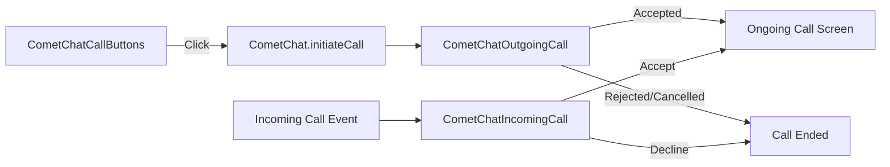

<Accordion title="AI Agent Component Spec">

| Field | Value |
| --- | --- |
| Packages | `@cometchat/chat-uikit-react` + `@cometchat/calls-sdk-javascript` |
| Call Buttons | `CometChatCallButtons` — voice and video call initiation |
| Incoming Call | `CometChatIncomingCall` — incoming call notification overlay |
| Outgoing Call | `CometChatOutgoingCall` — outgoing call screen overlay |
| CSS Import | `@import url("@cometchat/chat-uikit-react/css-variables.css");` |
| Auto-detection | UI Kit automatically detects Calls SDK and enables call components |

</Accordion>

## Overview

This guide shows you how to add voice and video calling to your React app. You'll learn to install the Calls SDK, add call buttons, handle incoming and outgoing calls, and customize the call experience.

**Time estimate:** 20 minutes
**Difficulty:** Intermediate

## Prerequisites

- [React.js Integration](/ui-kit/react/guides/getting-started/react-js) completed (CometChat initialized and user logged in)
- Basic familiarity with React hooks (`useState`, `useEffect`)

## Use Cases

Voice and video calling is ideal for:

- **1:1 communication** — Direct voice or video calls between users
- **Group calls** — Multi-participant audio/video conferences
- **Customer support** — Real-time voice/video support channels
- **Telehealth** — Video consultations and appointments

## Required Components

| Component | Purpose |
| --- | --- |
| `CometChatCallButtons` | Voice and video call initiation buttons |
| `CometChatIncomingCall` | Incoming call notification with accept/decline |
| `CometChatOutgoingCall` | Outgoing call screen with cancel option |



## Steps

### Step 1: Install the Calls SDK

The Calls SDK is required for voice and video calling. Install it alongside the UI Kit:

```bash
npm install @cometchat/calls-sdk-javascript
```

<Note>
The React UI Kit automatically detects the Calls SDK and enables call components. No additional configuration is needed.
</Note>

### Step 2: Add Call Buttons

Add call buttons to enable users to initiate voice and video calls:

```tsx title="CallButtonsDemo.tsx"
import { useState, useEffect } from "react";
import { CometChat } from "@cometchat/chat-sdk-javascript";
import { CometChatCallButtons } from "@cometchat/chat-uikit-react";
import "@cometchat/chat-uikit-react/css-variables.css";

function CallButtonsDemo() {
  const [user, setUser] = useState<CometChat.User>();

  useEffect(() => {
    CometChat.getUser("user_uid").then(setUser);
  }, []);

  if (!user) return null;

  return <CometChatCallButtons user={user} />;
}

export default CallButtonsDemo;
```

<Frame>
  
</Frame>

For group calls, pass a `group` prop instead:

```tsx
<CometChatCallButtons group={group} />
```

### Step 3: Handle Incoming Calls

Add the `CometChatIncomingCall` component at your app's root level to handle incoming calls:

```tsx title="App.tsx"
import { CometChatIncomingCall } from "@cometchat/chat-uikit-react";
import "@cometchat/chat-uikit-react/css-variables.css";

function App() {
  return (
    <div style={{ position: "relative", height: "100vh" }}>
      {/* This component auto-detects incoming calls */}
      <CometChatIncomingCall />
      
      {/* Rest of your app */}
      <YourChatApp />
    </div>
  );
}

export default App;
```

<Frame>
  
</Frame>

The component automatically:
- Listens for incoming call events
- Displays caller information
- Plays a ringtone
- Provides accept/decline buttons
- Transitions to the ongoing call screen on accept

### Step 4: Integrate with Message Header

Call buttons are typically displayed in the message header. The `CometChatMessageHeader` component includes call buttons automatically when the Calls SDK is installed:

```tsx title="ChatWithCalling.tsx"
import { useState } from "react";
import {
  CometChatConversations,
  CometChatMessageHeader,
  CometChatMessageList,
  CometChatMessageComposer,
  CometChatIncomingCall,
} from "@cometchat/chat-uikit-react";
import { CometChat } from "@cometchat/chat-sdk-javascript";
import "@cometchat/chat-uikit-react/css-variables.css";

function ChatWithCalling() {
  const [selectedConversation, setSelectedConversation] = useState<CometChat.Conversation>();

  const getConversationWith = () => {
    if (!selectedConversation) return null;
    const type = selectedConversation.getConversationType();
    if (type === "user") {
      return { user: selectedConversation.getConversationWith() as CometChat.User };
    }
    return { group: selectedConversation.getConversationWith() as CometChat.Group };
  };

  const conversationWith = getConversationWith();

  return (
    <div style={{ display: "flex", height: "100vh", width: "100vw" }}>
      {/* Incoming call handler - place at root level */}
      <CometChatIncomingCall />

      {/* Conversations Panel */}
      <div style={{ width: 400, height: "100%", borderRight: "1px solid #eee" }}>
        <CometChatConversations
          onItemClick={(conversation) => setSelectedConversation(conversation)}
        />
      </div>

      {/* Message Panel with Call Buttons in Header */}
      {conversationWith ? (
        <div style={{ flex: 1, display: "flex", flexDirection: "column" }}>
          <CometChatMessageHeader {...conversationWith} />
          <CometChatMessageList {...conversationWith} />
          <CometChatMessageComposer {...conversationWith} />
        </div>
      ) : (
        <div style={{ flex: 1, display: "grid", placeItems: "center", background: "#f5f5f5", color: "#727272" }}>
          Select a conversation to start messaging
        </div>
      )}
    </div>
  );
}

export default ChatWithCalling;
```

### Step 5: Initiate Calls Programmatically

For custom call initiation, use the CometChat SDK directly:

```tsx title="InitiateCall.tsx"
import { CometChat } from "@cometchat/chat-sdk-javascript";
import {
  CometChatOutgoingCall,
  CometChatUIKitConstants,
  CometChatCallEvents,
} from "@cometchat/chat-uikit-react";
import { useState } from "react";

function InitiateCall({ userId }: { userId: string }) {
  const [call, setCall] = useState<CometChat.Call>();

  const startVoiceCall = async () => {
    const callObject = new CometChat.Call(
      userId,
      CometChatUIKitConstants.MessageTypes.audio,
      CometChatUIKitConstants.MessageReceiverType.user
    );

    try {
      const initiatedCall = await CometChat.initiateCall(callObject);
      CometChatCallEvents.ccOutgoingCall.next(initiatedCall);
      setCall(initiatedCall);
    } catch (error) {
      console.error("Call initiation failed:", error);
    }
  };

  const startVideoCall = async () => {
    const callObject = new CometChat.Call(
      userId,
      CometChatUIKitConstants.MessageTypes.video,
      CometChatUIKitConstants.MessageReceiverType.user
    );

    try {
      const initiatedCall = await CometChat.initiateCall(callObject);
      CometChatCallEvents.ccOutgoingCall.next(initiatedCall);
      setCall(initiatedCall);
    } catch (error) {
      console.error("Call initiation failed:", error);
    }
  };

  const cancelCall = async () => {
    if (call) {
      await CometChat.endCall(call.getSessionId());
      setCall(undefined);
    }
  };

  return (
    <div>
      <button onClick={startVoiceCall}>Voice Call</button>
      <button onClick={startVideoCall}>Video Call</button>

      {call && (
        <CometChatOutgoingCall
          call={call}
          onCallCanceled={cancelCall}
        />
      )}
    </div>
  );
}

export default InitiateCall;
```

### Step 6: Listen to Call Events

Subscribe to call events for custom handling:

```tsx title="useCallEvents.ts"
import { useEffect } from "react";
import { CometChatCallEvents } from "@cometchat/chat-uikit-react";
import { CometChat } from "@cometchat/chat-sdk-javascript";

function useCallEvents() {
  useEffect(() => {
    const outgoingSub = CometChatCallEvents.ccOutgoingCall.subscribe(
      (call: CometChat.Call) => {
        console.log("Outgoing call initiated:", call.getSessionId());
      }
    );

    const acceptedSub = CometChatCallEvents.ccCallAccepted.subscribe(
      (call: CometChat.Call) => {
        console.log("Call accepted:", call.getSessionId());
      }
    );

    const rejectedSub = CometChatCallEvents.ccCallRejected.subscribe(
      (call: CometChat.Call) => {
        console.log("Call rejected:", call.getSessionId());
      }
    );

    const endedSub = CometChatCallEvents.ccCallEnded.subscribe(
      (call: CometChat.Call) => {
        console.log("Call ended:", call.getSessionId());
      }
    );

    return () => {
      outgoingSub?.unsubscribe();
      acceptedSub?.unsubscribe();
      rejectedSub?.unsubscribe();
      endedSub?.unsubscribe();
    };
  }, []);
}

export default useCallEvents;
```

| Event | Fires When |
| --- | --- |
| `ccOutgoingCall` | A call is initiated |
| `ccCallAccepted` | The recipient accepts the call |
| `ccCallRejected` | The recipient rejects the call |
| `ccCallEnded` | The call session ends |

## Complete Example

Here's a full implementation with chat and calling:

```tsx title="ChatAppWithCalling.tsx"
import { useState, useEffect } from "react";
import {
  CometChatConversations,
  CometChatMessageHeader,
  CometChatMessageList,
  CometChatMessageComposer,
  CometChatIncomingCall,
  CometChatCallEvents,
} from "@cometchat/chat-uikit-react";
import { CometChat } from "@cometchat/chat-sdk-javascript";
import "@cometchat/chat-uikit-react/css-variables.css";

function ChatAppWithCalling() {
  const [selectedConversation, setSelectedConversation] = useState<CometChat.Conversation>();

  // Listen to call events
  useEffect(() => {
    const acceptedSub = CometChatCallEvents.ccCallAccepted.subscribe(
      (call: CometChat.Call) => {
        console.log("Call accepted:", call.getSessionId());
      }
    );

    const endedSub = CometChatCallEvents.ccCallEnded.subscribe(
      (call: CometChat.Call) => {
        console.log("Call ended:", call.getSessionId());
      }
    );

    return () => {
      acceptedSub?.unsubscribe();
      endedSub?.unsubscribe();
    };
  }, []);

  const getConversationWith = () => {
    if (!selectedConversation) return null;
    const type = selectedConversation.getConversationType();
    if (type === "user") {
      return { user: selectedConversation.getConversationWith() as CometChat.User };
    }
    return { group: selectedConversation.getConversationWith() as CometChat.Group };
  };

  const conversationWith = getConversationWith();

  return (
    <div style={{ display: "flex", height: "100vh", width: "100vw" }}>
      {/* Global incoming call handler */}
      <CometChatIncomingCall
        onAccept={(call) => console.log("Accepted call from:", call.getCallInitiator()?.getName())}
        onDecline={(call) => console.log("Declined call from:", call.getCallInitiator()?.getName())}
      />

      {/* Conversations Panel */}
      <div style={{ width: 400, height: "100%", borderRight: "1px solid #eee" }}>
        <CometChatConversations
          onItemClick={(conversation) => setSelectedConversation(conversation)}
          activeConversation={selectedConversation}
        />
      </div>

      {/* Message Panel */}
      {conversationWith ? (
        <div style={{ flex: 1, display: "flex", flexDirection: "column" }}>
          {/* Header includes call buttons automatically */}
          <CometChatMessageHeader {...conversationWith} />
          <CometChatMessageList {...conversationWith} />
          <CometChatMessageComposer {...conversationWith} />
        </div>
      ) : (
        <div style={{ flex: 1, display: "grid", placeItems: "center", background: "#f5f5f5", color: "#727272" }}>
          Select a conversation to start messaging
        </div>
      )}
    </div>
  );
}

export default ChatAppWithCalling;
```

<Accordion title="Customization Options">

### Voice-Only Call Buttons

Hide the video call button:

```tsx
<CometChatCallButtons user={user} hideVideoCallButton={true} />
```

### Custom Ringtones

Set custom ringtones for incoming and outgoing calls:

```tsx
// Custom incoming call ringtone
<CometChatIncomingCall customSoundForCalls="/sounds/incoming.mp3" />

// Custom outgoing call ringtone
<CometChatOutgoingCall call={call} customSoundForCalls="/sounds/outgoing.mp3" />
```

### Silent Calls (No Ringtone)

Disable ringtones:

```tsx
<CometChatIncomingCall disableSoundForCalls={true} />
<CometChatOutgoingCall call={call} disableSoundForCalls={true} />
```

### Custom Call Settings

Customize the call experience using `callSettingsBuilder`:

```tsx
import { CometChatCallButtons, CometChatUIKitCalls } from "@cometchat/chat-uikit-react";

<CometChatCallButtons
  user={user}
  callSettingsBuilder={(isAudioOnlyCall, user, group) =>
    new CometChatUIKitCalls.CallSettingsBuilder()
      .enableDefaultLayout(true)
      .setIsAudioOnlyCall(isAudioOnlyCall)
  }
/>
```

### Custom Outgoing Call Configuration

Customize the outgoing call screen:

```tsx
import { CometChatCallButtons, OutgoingCallConfiguration } from "@cometchat/chat-uikit-react";

<CometChatCallButtons
  user={user}
  outgoingCallConfiguration={
    new OutgoingCallConfiguration({
      disableSoundForCalls: false,
      titleView: (call) => <div>{call.getCallReceiver().getName()}</div>,
      subtitleView: (call) => <div>Calling...</div>,
    })
  }
/>
```

</Accordion>

<Accordion title="CSS Customization">

### Key CSS Selectors

| Target | Selector |
| --- | --- |
| Call buttons root | `.cometchat-call-button` |
| Voice button | `.cometchat-call-button__voice` |
| Video button | `.cometchat-call-button__video` |
| Incoming call root | `.cometchat-incoming-call` |
| Accept button | `.cometchat-incoming-call__button-accept` |
| Decline button | `.cometchat-incoming-call__button-decline` |
| Outgoing call root | `.cometchat-outgoing-call` |
| Cancel button | `.cometchat-outgoing-call__button` |

### Example: Brand-Themed Call Buttons

```css
.cometchat-call-button .cometchat-button {
  border-radius: 8px;
  border: 1px solid #e8e8e8;
  background: #edeafa;
}

.cometchat-call-button .cometchat-button__icon {
  background-color: #6852d6;
}

.cometchat-incoming-call__button-accept .cometchat-button {
  background-color: #6852d6;
}

.cometchat-outgoing-call__button .cometchat-button {
  background-color: #f44649;
}
```

</Accordion>

## Common Issues

<Warning>
The Calls SDK must be installed for call components to work. Install it with `npm install @cometchat/calls-sdk-javascript`.
</Warning>

| Issue | Solution |
|-------|----------|
| Call buttons not showing | Ensure `@cometchat/calls-sdk-javascript` is installed |
| Incoming calls not detected | Place `CometChatIncomingCall` at the app root level |
| No ringtone playing | Check browser autoplay policies; user interaction may be required first |
| Call fails to connect | Verify both users are online and logged in |
| Outgoing call screen not showing | Ensure `CometChatCallEvents.ccOutgoingCall.next()` is called after `initiateCall()` |
| Styles missing | Add `@import url("@cometchat/chat-uikit-react/css-variables.css");` to global CSS |

For more help, see the [Troubleshooting Guide](/ui-kit/react/troubleshooting) or contact [CometChat Support](https://help.cometchat.com/).

## Next Steps

<CardGroup cols={2}>
  <Card title="Call Logs Guide" href="/ui-kit/react/guides/calling-features/call-logs" icon="clock-rotate-left">
    Display call history
  </Card>
  <Card title="Conversations Guide" href="/ui-kit/react/guides/chat-features/conversations" icon="comments">
    Build a conversation list
  </Card>
  <Card title="Groups Guide" href="/ui-kit/react/guides/chat-features/groups" icon="users">
    Add group calling
  </Card>
  <Card title="Theming Guide" href="/ui-kit/react/guides/advanced/theming" icon="paintbrush">
    Customize call UI appearance
  </Card>
</CardGroup>

## Related Guides

<CardGroup>
  <Card title="Call Buttons Reference" href="/ui-kit/react/call-buttons" />
  <Card title="Incoming Call Reference" href="/ui-kit/react/incoming-call" />
  <Card title="Outgoing Call Reference" href="/ui-kit/react/outgoing-call" />
  <Card title="Call Features Overview" href="/ui-kit/react/call-features" />
</CardGroup>
