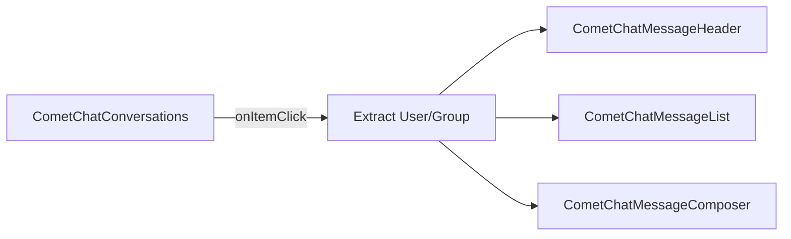

<Accordion title="AI Agent Component Spec">

| Field | Value |
| --- | --- |
| Package | `@cometchat/chat-uikit-react` |
| Primary Component | `CometChatConversations` — scrollable list of recent conversations |
| Combined Component | `CometChatConversationsWithMessages` — two-panel layout with conversations + messages |
| Message Components | `CometChatMessageHeader`, `CometChatMessageList`, `CometChatMessageComposer` |
| Primary Output | `onItemClick: (conversation: CometChat.Conversation) => void` |
| CSS Import | `@import url("@cometchat/chat-uikit-react/css-variables.css");` |
| CSS Root Class | `.cometchat-conversations` |
| Filtering | `conversationsRequestBuilder` prop accepts `CometChat.ConversationsRequestBuilder` |

</Accordion>

## Overview

This guide shows you how to build conversation list features in your React app. You'll learn to display recent conversations, handle conversation selection, and compose a two-panel chat layout with messages.

**Time estimate:** 20 minutes
**Difficulty:** Beginner

## Prerequisites

- [React.js Integration](/ui-kit/react/guides/getting-started/react-js) completed (CometChat initialized and user logged in)
- Basic familiarity with React hooks (`useState`, `useEffect`)

## Use Cases

The Conversations feature is ideal for:

- **Chat inbox** — Display all recent one-on-one and group conversations
- **Two-panel chat layout** — Conversation list on the left, messages on the right
- **Support dashboards** — Filter and display specific conversation types
- **Messaging apps** — Full-featured conversation management with search and filtering

## Required Components

| Component | Purpose |
| --- | --- |
| `CometChatConversations` | Scrollable list of recent conversations |
| `CometChatConversationsWithMessages` | Pre-built two-panel layout (conversations + messages) |
| `CometChatMessageHeader` | Header showing user/group info in message view |
| `CometChatMessageList` | Scrollable message history |
| `CometChatMessageComposer` | Text input for sending messages |



## Steps

### Step 1: Basic Conversation List

Start with a simple conversation list that displays all recent conversations:

```tsx title="ConversationList.tsx"
import { CometChatConversations } from "@cometchat/chat-uikit-react";
import "@cometchat/chat-uikit-react/css-variables.css";

function ConversationList() {
  return (
    <div style={{ width: "100%", height: "100vh" }}>
      <CometChatConversations />
    </div>
  );
}

export default ConversationList;
```

<Frame>
  
</Frame>

This renders a scrollable list with:
- User/group avatars
- Conversation names
- Last message preview
- Timestamps and unread badges
- Online/offline status indicators

### Step 2: Two-Panel Layout (Quick Start)

For a complete chat experience with minimal code, use `CometChatConversationsWithMessages`:

```tsx title="ChatApp.tsx"
import { CometChatConversationsWithMessages } from "@cometchat/chat-uikit-react";
import "@cometchat/chat-uikit-react/css-variables.css";

function ChatApp() {
  return (
    <div style={{ width: "100vw", height: "100vh" }}>
      <CometChatConversationsWithMessages />
    </div>
  );
}

export default ChatApp;
```

<Frame>
  
</Frame>

[](https://link.cometchat.com/react-conversation-list-message)

This component handles:
- Conversation list rendering
- Conversation selection
- Message view switching
- Real-time updates

### Step 3: Custom Two-Panel Layout

For more control, build your own two-panel layout using individual components:

```tsx title="CustomChatLayout.tsx"
import { useState } from "react";
import {
  CometChatConversations,
  CometChatMessageHeader,
  CometChatMessageList,
  CometChatMessageComposer,
} from "@cometchat/chat-uikit-react";
import { CometChat } from "@cometchat/chat-sdk-javascript";
import "@cometchat/chat-uikit-react/css-variables.css";

function CustomChatLayout() {
  const [selectedUser, setSelectedUser] = useState<CometChat.User>();
  const [selectedGroup, setSelectedGroup] = useState<CometChat.Group>();

  const handleItemClick = (conversation: CometChat.Conversation) => {
    const entity = conversation.getConversationWith();
    if (entity instanceof CometChat.User) {
      setSelectedUser(entity);
      setSelectedGroup(undefined);
    } else if (entity instanceof CometChat.Group) {
      setSelectedGroup(entity);
      setSelectedUser(undefined);
    }
  };

  return (
    <div style={{ display: "flex", height: "100vh", width: "100vw" }}>
      {/* Conversation List Panel */}
      <div style={{ width: 400, height: "100%", borderRight: "1px solid #eee" }}>
        <CometChatConversations onItemClick={handleItemClick} />
      </div>

      {/* Message Panel */}
      {selectedUser || selectedGroup ? (
        <div style={{ flex: 1, display: "flex", flexDirection: "column" }}>
          <CometChatMessageHeader user={selectedUser} group={selectedGroup} />
          <CometChatMessageList user={selectedUser} group={selectedGroup} />
          <CometChatMessageComposer user={selectedUser} group={selectedGroup} />
        </div>
      ) : (
        <div style={{ flex: 1, display: "grid", placeItems: "center", background: "#f5f5f5", color: "#727272" }}>
          Select a conversation to start messaging
        </div>
      )}
    </div>
  );
}

export default CustomChatLayout;
```

Key points:
- `onItemClick` receives the selected `CometChat.Conversation`
- Extract the `User` or `Group` using `getConversationWith()`
- Pass the user/group to message components

### Step 4: Filtering Conversations

Use `ConversationsRequestBuilder` to filter which conversations appear:

```tsx title="FilteredConversations.tsx"
import { CometChatConversations } from "@cometchat/chat-uikit-react";
import { CometChat } from "@cometchat/chat-sdk-javascript";

function FilteredConversations() {
  return (
    <CometChatConversations
      conversationsRequestBuilder={
        new CometChat.ConversationsRequestBuilder()
          .setConversationType("user")  // Only show user conversations
          .setLimit(20)                  // Limit to 20 per page
      }
    />
  );
}
```

<Note>
Pass the builder instance directly — not the result of `.build()`. The component calls `.build()` internally.
</Note>

#### Common Filter Recipes

| Filter | Code |
| --- | --- |
| Only user conversations | `new CometChat.ConversationsRequestBuilder().setConversationType("user")` |
| Only group conversations | `new CometChat.ConversationsRequestBuilder().setConversationType("group")` |
| Limit results per page | `new CometChat.ConversationsRequestBuilder().setLimit(10)` |
| Filter by tags | `new CometChat.ConversationsRequestBuilder().setTags(["vip"])` |
| Filter by user tags | `new CometChat.ConversationsRequestBuilder().withUserAndGroupTags(true).setUserTags(["premium"])` |
| Filter by group tags | `new CometChat.ConversationsRequestBuilder().withUserAndGroupTags(true).setGroupTags(["support"])` |

See [ConversationsRequestBuilder](/sdk/javascript/retrieve-conversations) for the full API.

### Step 5: Handling Events

Listen to conversation events for real-time updates:

```tsx title="ConversationEvents.tsx"
import { useEffect } from "react";
import { CometChatConversationEvents } from "@cometchat/chat-uikit-react";
import { CometChat } from "@cometchat/chat-sdk-javascript";

function useConversationEvents() {
  useEffect(() => {
    const deletedSub = CometChatConversationEvents.ccConversationDeleted.subscribe(
      (conversation: CometChat.Conversation) => {
        console.log("Conversation deleted:", conversation.getConversationId());
      }
    );

    const updatedSub = CometChatConversationEvents.ccUpdateConversation.subscribe(
      (conversation: CometChat.Conversation) => {
        console.log("Conversation updated:", conversation.getConversationId());
      }
    );

    const readSub = CometChatConversationEvents.ccMarkConversationAsRead.subscribe(
      (conversation: CometChat.Conversation) => {
        console.log("Marked as read:", conversation.getConversationId());
      }
    );

    return () => {
      deletedSub?.unsubscribe();
      updatedSub?.unsubscribe();
      readSub?.unsubscribe();
    };
  }, []);
}
```

| Event | Fires When |
| --- | --- |
| `ccConversationDeleted` | A conversation is deleted from the list |
| `ccUpdateConversation` | A conversation is updated (new message, metadata change) |
| `ccMarkConversationAsRead` | A conversation is marked as read |

## Complete Example

Here's a full implementation with conversation filtering and custom layout:

```tsx title="ChatApp.tsx"
import { useState } from "react";
import {
  CometChatConversations,
  CometChatMessageHeader,
  CometChatMessageList,
  CometChatMessageComposer,
} from "@cometchat/chat-uikit-react";
import { CometChat } from "@cometchat/chat-sdk-javascript";
import "@cometchat/chat-uikit-react/css-variables.css";

function ChatApp() {
  const [selectedUser, setSelectedUser] = useState<CometChat.User>();
  const [selectedGroup, setSelectedGroup] = useState<CometChat.Group>();
  const [activeConversation, setActiveConversation] = useState<CometChat.Conversation>();

  const handleItemClick = (conversation: CometChat.Conversation) => {
    setActiveConversation(conversation);
    const entity = conversation.getConversationWith();
    if (entity instanceof CometChat.User) {
      setSelectedUser(entity);
      setSelectedGroup(undefined);
    } else if (entity instanceof CometChat.Group) {
      setSelectedGroup(entity);
      setSelectedUser(undefined);
    }
  };

  return (
    <div style={{ display: "flex", height: "100vh", width: "100vw" }}>
      <div style={{ width: 400, height: "100%", borderRight: "1px solid #eee" }}>
        <CometChatConversations
          onItemClick={handleItemClick}
          activeConversation={activeConversation}
          showSearchBar={true}
          showScrollbar={true}
        />
      </div>

      {selectedUser || selectedGroup ? (
        <div style={{ flex: 1, display: "flex", flexDirection: "column" }}>
          <CometChatMessageHeader user={selectedUser} group={selectedGroup} />
          <CometChatMessageList user={selectedUser} group={selectedGroup} />
          <CometChatMessageComposer user={selectedUser} group={selectedGroup} />
        </div>
      ) : (
        <div style={{ flex: 1, display: "grid", placeItems: "center", background: "#f5f5f5", color: "#727272" }}>
          Select a conversation to start messaging
        </div>
      )}
    </div>
  );
}

export default ChatApp;
```

<Accordion title="Customization Options">

### Custom Item View

Replace the entire conversation list item:

```tsx
import { CometChatConversations, CometChatListItem, CometChatDate } from "@cometchat/chat-uikit-react";
import { CometChat } from "@cometchat/chat-sdk-javascript";

function CustomItemConversations() {
  const getItemView = (conversation: CometChat.Conversation) => {
    const title = conversation.getConversationWith().getName();
    const timestamp = conversation.getLastMessage()?.getSentAt();

    return (
      <CometChatListItem
        title={title}
        avatarName={title}
        id={conversation.getConversationId()}
        trailingView={<CometChatDate timestamp={timestamp} />}
      />
    );
  };

  return <CometChatConversations itemView={getItemView} />;
}
```

### Custom Header

Replace the header bar:

```tsx
import { CometChatConversations, CometChatButton, getLocalizedString } from "@cometchat/chat-uikit-react";

function CustomHeaderConversations() {
  return (
    <CometChatConversations
      headerView={
        <div style={{ display: "flex", padding: "8px 16px", justifyContent: "space-between", alignItems: "center" }}>
          <h2>{getLocalizedString("CHATS")}</h2>
          <CometChatButton onClick={() => console.log("New chat")} />
        </div>
      }
    />
  );
}
```

### Custom Empty State

Show a custom message when no conversations exist:

```tsx
import { CometChatConversations } from "@cometchat/chat-uikit-react";

function EmptyStateConversations() {
  return (
    <CometChatConversations
      emptyView={
        <div style={{ textAlign: "center", padding: 40 }}>
          <p>No conversations yet</p>
          <button onClick={() => console.log("Start chat")}>
            Start a conversation
          </button>
        </div>
      }
    />
  );
}
```

### Visibility Options

Control which UI elements are visible:

```tsx
import { CometChatConversations } from "@cometchat/chat-uikit-react";

function MinimalConversations() {
  return (
    <CometChatConversations
      hideReceipts={true}           // Hide read/delivery receipts
      hideUserStatus={true}         // Hide online/offline indicators
      hideGroupType={true}          // Hide group type icons
      hideDeleteConversation={true} // Hide delete option in context menu
      showSearchBar={true}          // Show search bar
      showScrollbar={true}          // Show scrollbar
    />
  );
}
```

### Custom Context Menu Options

Replace the hover/context menu actions:

```tsx
import { CometChatConversations, CometChatOption } from "@cometchat/chat-uikit-react";
import { CometChat } from "@cometchat/chat-sdk-javascript";

function CustomOptionsConversations() {
  const getOptions = (conversation: CometChat.Conversation) => [
    new CometChatOption({
      title: "Delete",
      id: "delete",
      onClick: () => console.log("Delete", conversation.getConversationId()),
    }),
    new CometChatOption({
      title: "Mute",
      id: "mute",
      onClick: () => console.log("Mute", conversation.getConversationId()),
    }),
    new CometChatOption({
      title: "Mark as Unread",
      id: "unread",
      onClick: () => console.log("Mark unread", conversation.getConversationId()),
    }),
  ];

  return <CometChatConversations options={getOptions} />;
}
```

</Accordion>

<Accordion title="CSS Customization">

### Key CSS Selectors

| Target | Selector |
| --- | --- |
| Root | `.cometchat-conversations` |
| Header title | `.cometchat-conversations .cometchat-list__header-title` |
| List item | `.cometchat-conversations .cometchat-list-item` |
| Avatar | `.cometchat-conversations .cometchat-avatar` |
| Unread badge | `.cometchat-conversations .cometchat-badge` |
| Active item | `.cometchat-conversations__list-item-active .cometchat-list-item` |
| Typing indicator | `.cometchat-conversations__subtitle-typing` |

### Example: Brand-Themed Conversations

```css
.cometchat-conversations .cometchat-list__header-title {
  background: #fef8f8;
  border-bottom: 2px solid #f4b6b8;
}

.cometchat-conversations .cometchat-avatar {
  background: #f0999b;
}

.cometchat-conversations .cometchat-badge {
  background: #e5484d;
}

.cometchat-conversations .cometchat-receipts-read {
  background: #e96b6f;
}
```

<Frame>
  
</Frame>

</Accordion>

## Common Issues

<Warning>
Components must not render until CometChat is initialized and the user is logged in. Gate rendering with state checks.
</Warning>

| Issue | Solution |
|-------|----------|
| Blank conversation list | Ensure `CometChatUIKit.init()` and `login()` complete before rendering |
| `onItemClick` not firing | Verify the callback is passed correctly; check for JavaScript errors in console |
| Conversations not updating | Real-time updates require WebSocket connection; check network tab for WS |
| Filter not working | Pass the builder instance, not `.build()` result |
| Styles missing | Add `@import url("@cometchat/chat-uikit-react/css-variables.css");` to global CSS |

For more help, see the [Troubleshooting Guide](/ui-kit/react/troubleshooting) or contact [CometChat Support](https://help.cometchat.com/).

## Next Steps

<CardGroup cols={2}>
  <Card title="Messaging Guide" href="/ui-kit/react/guides/chat-features/messaging" icon="message">
    Customize message sending and display
  </Card>
  <Card title="Groups Guide" href="/ui-kit/react/guides/chat-features/groups" icon="users">
    Build group chat features
  </Card>
  <Card title="Theming Guide" href="/ui-kit/react/guides/advanced/theming" icon="paintbrush">
    Customize colors, fonts, and styles
  </Card>
  <Card title="Voice/Video Calling" href="/ui-kit/react/guides/calling-features/voice-video" icon="video">
    Add calling to your chat app
  </Card>
</CardGroup>

## Related Guides

<CardGroup>
  <Card title="React.js Integration" href="/ui-kit/react/guides/getting-started/react-js" />
  <Card title="Conversations Component Reference" href="/ui-kit/react/conversations" />
  <Card title="Search Feature" href="/ui-kit/react/guides/chat-features/search" />
  <Card title="Users Guide" href="/ui-kit/react/guides/chat-features/users" />
</CardGroup>
