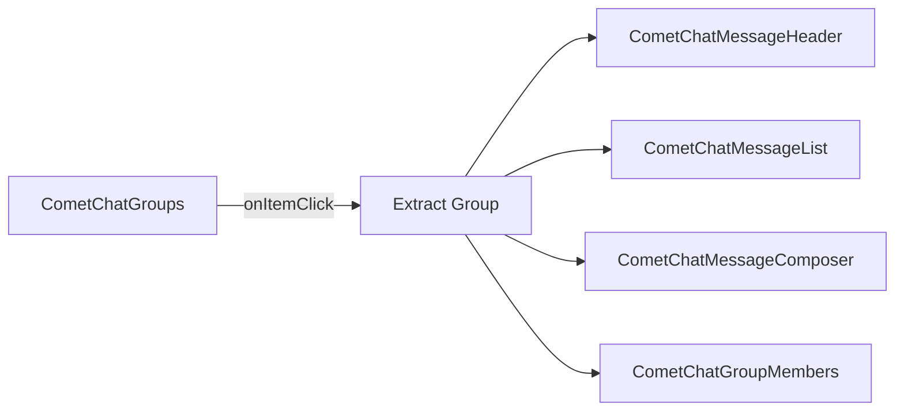

<Accordion title="AI Agent Component Spec">

| Field | Value |
| --- | --- |
| Package | `@cometchat/chat-uikit-react` |
| Primary Component | `CometChatGroups` — scrollable list of available groups |
| Combined Component | `CometChatGroupsWithMessages` — two-panel layout with groups + messages |
| Member Component | `CometChatGroupMembers` — member list with management actions |
| Create Component | `CometChatCreateGroup` — group creation form |
| Join Component | `CometChatJoinGroup` — handles joining password-protected groups |
| Primary Output | `onItemClick: (group: CometChat.Group) => void` |
| CSS Import | `@import url("@cometchat/chat-uikit-react/css-variables.css");` |
| CSS Root Class | `.cometchat-groups` |
| Filtering | `groupsRequestBuilder` prop accepts `CometChat.GroupsRequestBuilder` |

</Accordion>

## Overview

This guide shows you how to build group chat features in your React app. You'll learn to display group lists, create and join groups, manage members, and handle group roles.

**Time estimate:** 20 minutes
**Difficulty:** Intermediate

## Prerequisites

- [React.js Integration](/ui-kit/react/guides/getting-started/react-js) completed (CometChat initialized and user logged in)
- Basic familiarity with React hooks (`useState`, `useEffect`)

## Use Cases

The Groups feature is ideal for:

- **Team collaboration** — Create workspaces for teams with role-based access
- **Community chat** — Public groups anyone can join and participate in
- **Private channels** — Password-protected or invite-only group conversations
- **Support rooms** — Moderated group chats with admin controls

## Required Components

| Component | Purpose |
| --- | --- |
| `CometChatGroups` | Scrollable list of available groups |
| `CometChatGroupsWithMessages` | Pre-built two-panel layout (groups + messages) |
| `CometChatGroupMembers` | Member list with kick, ban, and scope change actions |
| `CometChatCreateGroup` | Form for creating new groups |
| `CometChatJoinGroup` | Handles joining password-protected groups |



## Steps

### Step 1: Basic Group List

Start with a simple group list that displays all available groups:

```tsx title="GroupList.tsx"
import { CometChatGroups } from "@cometchat/chat-uikit-react";
import "@cometchat/chat-uikit-react/css-variables.css";

function GroupList() {
  return (
    <div style={{ width: "100%", height: "100vh" }}>
      <CometChatGroups />
    </div>
  );
}

export default GroupList;
```

<Frame>
  
</Frame>

This renders a scrollable list with:
- Group avatars and names
- Member count
- Group type indicators (public, private, password-protected)
- Search functionality

### Step 2: Two-Panel Layout (Quick Start)

For a complete group chat experience with minimal code, use `CometChatGroupsWithMessages`:

```tsx title="GroupChatApp.tsx"
import { CometChatGroupsWithMessages } from "@cometchat/chat-uikit-react";
import "@cometchat/chat-uikit-react/css-variables.css";

function GroupChatApp() {
  return (
    <div style={{ width: "100vw", height: "100vh" }}>
      <CometChatGroupsWithMessages />
    </div>
  );
}

export default GroupChatApp;
```

This component handles:
- Group list rendering
- Group selection
- Message view switching
- Real-time updates

### Step 3: Custom Two-Panel Layout

For more control, build your own two-panel layout using individual components:

```tsx title="CustomGroupLayout.tsx"
import { useState } from "react";
import {
  CometChatGroups,
  CometChatMessageHeader,
  CometChatMessageList,
  CometChatMessageComposer,
} from "@cometchat/chat-uikit-react";
import { CometChat } from "@cometchat/chat-sdk-javascript";
import "@cometchat/chat-uikit-react/css-variables.css";

function CustomGroupLayout() {
  const [selectedGroup, setSelectedGroup] = useState<CometChat.Group>();

  return (
    <div style={{ display: "flex", height: "100vh", width: "100vw" }}>
      {/* Group List Panel */}
      <div style={{ width: 400, height: "100%", borderRight: "1px solid #eee" }}>
        <CometChatGroups
          onItemClick={(group: CometChat.Group) => setSelectedGroup(group)}
        />
      </div>

      {/* Message Panel */}
      {selectedGroup ? (
        <div style={{ flex: 1, display: "flex", flexDirection: "column" }}>
          <CometChatMessageHeader group={selectedGroup} />
          <CometChatMessageList group={selectedGroup} />
          <CometChatMessageComposer group={selectedGroup} />
        </div>
      ) : (
        <div style={{ flex: 1, display: "grid", placeItems: "center", background: "#f5f5f5", color: "#727272" }}>
          Select a group to start messaging
        </div>
      )}
    </div>
  );
}

export default CustomGroupLayout;
```

### Step 4: Creating a New Group

Create groups programmatically using the CometChat SDK:

```tsx title="CreateGroup.tsx"
import { useState } from "react";
import { CometChat } from "@cometchat/chat-sdk-javascript";
import { CometChatGroupEvents } from "@cometchat/chat-uikit-react";

type GroupType = "public" | "private" | "password";

function CreateGroup({ onGroupCreated }: { onGroupCreated: (group: CometChat.Group) => void }) {
  const [groupName, setGroupName] = useState("");
  const [groupType, setGroupType] = useState<GroupType>("public");
  const [password, setPassword] = useState("");

  const handleSubmit = async (e: React.FormEvent) => {
    e.preventDefault();
    
    // Generate unique GUID
    const guid = `group_${Date.now()}`;
    
    // Create group object
    const group = new CometChat.Group(
      guid,
      groupName,
      groupType,
      groupType === "password" ? password : ""
    );

    try {
      const createdGroup = await CometChat.createGroup(group);
      // Emit event so UI components update
      CometChatGroupEvents.ccGroupCreated.next(createdGroup);
      onGroupCreated(createdGroup);
    } catch (error) {
      console.error("Group creation failed:", error);
    }
  };

  return (
    <form onSubmit={handleSubmit} style={{ padding: 20 }}>
      <div style={{ marginBottom: 16 }}>
        <label>Group Name</label>
        <input
          type="text"
          value={groupName}
          onChange={(e) => setGroupName(e.target.value)}
          required
        />
      </div>
      
      <div style={{ marginBottom: 16 }}>
        <label>Group Type</label>
        <select value={groupType} onChange={(e) => setGroupType(e.target.value as GroupType)}>
          <option value="public">Public</option>
          <option value="private">Private</option>
          <option value="password">Password Protected</option>
        </select>
      </div>
      
      {groupType === "password" && (
        <div style={{ marginBottom: 16 }}>
          <label>Password</label>
          <input
            type="password"
            value={password}
            onChange={(e) => setPassword(e.target.value)}
            required
          />
        </div>
      )}
      
      <button type="submit">Create Group</button>
    </form>
  );
}

export default CreateGroup;
```

Group types:
- **Public** — Anyone can join without approval
- **Private** — Users must be invited to join
- **Password** — Users need the password to join

### Step 5: Joining Groups

Handle joining for public and password-protected groups:

```tsx title="JoinGroup.tsx"
import { useState } from "react";
import { CometChat } from "@cometchat/chat-sdk-javascript";
import { CometChatGroupEvents, CometChatUIKitLoginListener } from "@cometchat/chat-uikit-react";

function JoinGroup({ group, onJoined }: { group: CometChat.Group; onJoined: (group: CometChat.Group) => void }) {
  const [password, setPassword] = useState("");
  const [error, setError] = useState("");

  const handleJoin = async () => {
    try {
      const joinedGroup = await CometChat.joinGroup(
        group.getGuid(),
        group.getType() as CometChat.GroupType,
        group.getType() === "password" ? password : ""
      );
      
      // Emit event so UI components update
      const loggedInUser = CometChatUIKitLoginListener.getLoggedInUser();
      CometChatGroupEvents.ccGroupMemberJoined.next({
        joinedGroup: joinedGroup,
        joinedUser: loggedInUser!
      });
      
      onJoined(joinedGroup);
    } catch (err) {
      setError("Failed to join group. Check the password and try again.");
    }
  };

  return (
    <div style={{ padding: 20 }}>
      <h3>Join {group.getName()}</h3>
      
      {group.getType() === "password" && (
        <div style={{ marginBottom: 16 }}>
          <label>Password</label>
          <input
            type="password"
            value={password}
            onChange={(e) => setPassword(e.target.value)}
            placeholder="Enter group password"
          />
        </div>
      )}
      
      {error && <p style={{ color: "red" }}>{error}</p>}
      
      <button onClick={handleJoin}>Join Group</button>
    </div>
  );
}

export default JoinGroup;
```

<Note>
For private groups, users cannot join directly — they must be added by an admin or moderator using `CometChat.addMembersToGroup()`.
</Note>

### Step 6: Managing Group Members

Display and manage group members using `CometChatGroupMembers`:

```tsx title="GroupMembersPanel.tsx"
import { useEffect, useState } from "react";
import { CometChatGroupMembers } from "@cometchat/chat-uikit-react";
import { CometChat } from "@cometchat/chat-sdk-javascript";
import "@cometchat/chat-uikit-react/css-variables.css";

function GroupMembersPanel({ groupId }: { groupId: string }) {
  const [group, setGroup] = useState<CometChat.Group>();

  useEffect(() => {
    CometChat.getGroup(groupId).then(setGroup);
  }, [groupId]);

  if (!group) return <div>Loading...</div>;

  return (
    <div style={{ width: 300, height: "100%" }}>
      <CometChatGroupMembers
        group={group}
        onItemClick={(member: CometChat.GroupMember) => {
          console.log("Selected member:", member.getName());
        }}
      />
    </div>
  );
}

export default GroupMembersPanel;
```

<Frame>
  
</Frame>

The component provides built-in actions based on the logged-in user's role:
- **Kick member** — Remove a member from the group
- **Ban member** — Permanently block a member from rejoining
- **Change scope** — Promote/demote members (admin, moderator, participant)

### Step 7: Adding Members to a Group

Add new members to an existing group:

```tsx title="AddMembers.tsx"
import { useState } from "react";
import { CometChat } from "@cometchat/chat-sdk-javascript";
import { CometChatGroupEvents, CometChatUIKitLoginListener } from "@cometchat/chat-uikit-react";

function AddMembers({ group }: { group: CometChat.Group }) {
  const [userIds, setUserIds] = useState<string[]>([]);
  const [inputValue, setInputValue] = useState("");

  const handleAddMembers = async () => {
    if (userIds.length === 0) return;

    try {
      // Create group member objects
      const members = userIds.map(
        (uid) => new CometChat.GroupMember(uid, CometChat.GROUP_MEMBER_SCOPE.PARTICIPANT)
      );

      await CometChat.addMembersToGroup(group.getGuid(), members, []);

      // Emit event so UI components update
      CometChatGroupEvents.ccGroupMemberAdded.next({
        addedBy: CometChatUIKitLoginListener.getLoggedInUser()!,
        usersAdded: members,
        userAddedIn: group
      });

      setUserIds([]);
      setInputValue("");
    } catch (error) {
      console.error("Failed to add members:", error);
    }
  };

  const addUserId = () => {
    if (inputValue && !userIds.includes(inputValue)) {
      setUserIds([...userIds, inputValue]);
      setInputValue("");
    }
  };

  return (
    <div style={{ padding: 20 }}>
      <h3>Add Members to {group.getName()}</h3>
      
      <div style={{ marginBottom: 16 }}>
        <input
          type="text"
          value={inputValue}
          onChange={(e) => setInputValue(e.target.value)}
          placeholder="Enter user ID"
        />
        <button onClick={addUserId}>Add</button>
      </div>
      
      {userIds.length > 0 && (
        <div style={{ marginBottom: 16 }}>
          <p>Users to add:</p>
          <ul>
            {userIds.map((uid) => (
              <li key={uid}>{uid}</li>
            ))}
          </ul>
        </div>
      )}
      
      <button onClick={handleAddMembers} disabled={userIds.length === 0}>
        Add Members
      </button>
    </div>
  );
}

export default AddMembers;
```

### Step 8: Changing Member Scope

Promote or demote members by changing their scope:

```tsx title="ChangeMemberScope.tsx"
import { CometChat } from "@cometchat/chat-sdk-javascript";
import { CometChatGroupEvents, CometChatUIKitLoginListener } from "@cometchat/chat-uikit-react";

async function changeMemberScope(
  group: CometChat.Group,
  member: CometChat.GroupMember,
  newScope: string
) {
  try {
    await CometChat.updateGroupMemberScope(
      group.getGuid(),
      member.getUid(),
      newScope as CometChat.GroupMemberScope
    );

    // Emit event so UI components update
    CometChatGroupEvents.ccGroupMemberScopeChanged.next({
      action: CometChat.ACTION_TYPE.SCOPE_CHANGE,
      actionBy: CometChatUIKitLoginListener.getLoggedInUser()!,
      updatedUser: member,
      scopeChangedTo: newScope,
      scopeChangedFrom: member.getScope(),
      group: group
    });

    console.log(`${member.getName()} is now a ${newScope}`);
  } catch (error) {
    console.error("Failed to change scope:", error);
  }
}

// Usage example
// changeMemberScope(group, member, CometChat.GROUP_MEMBER_SCOPE.ADMIN);
```

Available scopes:
- `CometChat.GROUP_MEMBER_SCOPE.ADMIN` — Full control over group settings and members
- `CometChat.GROUP_MEMBER_SCOPE.MODERATOR` — Can manage members but not group settings
- `CometChat.GROUP_MEMBER_SCOPE.PARTICIPANT` — Regular member with no management permissions

### Step 9: Filtering Groups

Use `GroupsRequestBuilder` to filter which groups appear:

```tsx title="FilteredGroups.tsx"
import { CometChatGroups } from "@cometchat/chat-uikit-react";
import { CometChat } from "@cometchat/chat-sdk-javascript";

function FilteredGroups() {
  return (
    <CometChatGroups
      groupsRequestBuilder={
        new CometChat.GroupsRequestBuilder()
          .joinedOnly(true)  // Only show groups user has joined
          .setLimit(20)      // Limit to 20 per page
      }
    />
  );
}
```

<Note>
Pass the builder instance directly — not the result of `.build()`. The component calls `.build()` internally.
</Note>

#### Common Filter Recipes

| Filter | Code |
| --- | --- |
| Joined groups only | `new CometChat.GroupsRequestBuilder().joinedOnly(true)` |
| Limit results per page | `new CometChat.GroupsRequestBuilder().setLimit(10)` |
| Search by keyword | `new CometChat.GroupsRequestBuilder().setSearchKeyword("team")` |
| Filter by tags | `new CometChat.GroupsRequestBuilder().setTags(["vip"])` |
| Include tags data | `new CometChat.GroupsRequestBuilder().withTags(true)` |

See [GroupsRequestBuilder](/sdk/javascript/retrieve-groups) for the full API.

## Complete Example

Here's a full implementation with group list, creation, and member management:

```tsx title="GroupChatComplete.tsx"
import { useState } from "react";
import {
  CometChatGroups,
  CometChatGroupMembers,
  CometChatMessageHeader,
  CometChatMessageList,
  CometChatMessageComposer,
  CometChatGroupEvents,
} from "@cometchat/chat-uikit-react";
import { CometChat } from "@cometchat/chat-sdk-javascript";
import "@cometchat/chat-uikit-react/css-variables.css";

function GroupChatComplete() {
  const [selectedGroup, setSelectedGroup] = useState<CometChat.Group>();
  const [showMembers, setShowMembers] = useState(false);
  const [showCreateGroup, setShowCreateGroup] = useState(false);

  const handleGroupClick = (group: CometChat.Group) => {
    setSelectedGroup(group);
    setShowMembers(false);
  };

  const handleCreateGroup = async (name: string, type: string, password: string) => {
    const guid = `group_${Date.now()}`;
    const group = new CometChat.Group(guid, name, type, password);
    
    try {
      const createdGroup = await CometChat.createGroup(group);
      CometChatGroupEvents.ccGroupCreated.next(createdGroup);
      setSelectedGroup(createdGroup);
      setShowCreateGroup(false);
    } catch (error) {
      console.error("Group creation failed:", error);
    }
  };

  return (
    <div style={{ display: "flex", height: "100vh", width: "100vw" }}>
      {/* Group List Panel */}
      <div style={{ width: 400, height: "100%", borderRight: "1px solid #eee" }}>
        <CometChatGroups
          onItemClick={handleGroupClick}
          activeGroup={selectedGroup}
        />
      </div>

      {/* Message Panel */}
      {selectedGroup ? (
        <div style={{ flex: 1, display: "flex", flexDirection: "column" }}>
          <CometChatMessageHeader
            group={selectedGroup}
            onDetailsClick={() => setShowMembers(!showMembers)}
          />
          <div style={{ flex: 1, display: "flex" }}>
            <div style={{ flex: 1, display: "flex", flexDirection: "column" }}>
              <CometChatMessageList group={selectedGroup} />
              <CometChatMessageComposer group={selectedGroup} />
            </div>
            {showMembers && (
              <div style={{ width: 300, borderLeft: "1px solid #eee" }}>
                <CometChatGroupMembers group={selectedGroup} />
              </div>
            )}
          </div>
        </div>
      ) : (
        <div style={{ flex: 1, display: "grid", placeItems: "center", background: "#f5f5f5", color: "#727272" }}>
          Select a group to start messaging
        </div>
      )}
    </div>
  );
}

export default GroupChatComplete;
```

[](https://link.cometchat.com/react-group-chat)

<Accordion title="Customization Options">

### Custom Group List Items

Replace the entire group list item:

```tsx
import { CometChatGroups } from "@cometchat/chat-uikit-react";
import { CometChat } from "@cometchat/chat-sdk-javascript";

function CustomItemGroups() {
  const getItemView = (group: CometChat.Group) => {
    return (
      <div style={{ display: "flex", padding: "8px 16px", alignItems: "center", gap: 12 }}>
        <div style={{ width: 40, height: 40, borderRadius: 8, background: "#eee" }} />
        <div>
          <div style={{ fontWeight: 500 }}>{group.getName()}</div>
          <div style={{ fontSize: 12, color: "#727272" }}>
            {group.getMembersCount()} members • {group.getType()}
          </div>
        </div>
      </div>
    );
  };

  return <CometChatGroups itemView={getItemView} />;
}
```

### Custom Header

Replace the header bar:

```tsx
import { CometChatGroups, CometChatButton, getLocalizedString } from "@cometchat/chat-uikit-react";

function CustomHeaderGroups() {
  return (
    <CometChatGroups
      headerView={
        <div style={{ display: "flex", padding: "8px 16px", justifyContent: "space-between", alignItems: "center" }}>
          <h2>{getLocalizedString("GROUPS")}</h2>
          <CometChatButton onClick={() => console.log("Create group")} />
        </div>
      }
    />
  );
}
```

### Visibility Options

Control which UI elements are visible:

```tsx
import { CometChatGroups } from "@cometchat/chat-uikit-react";

function MinimalGroups() {
  return (
    <CometChatGroups
      hideSearch={true}      // Hide search bar
      hideGroupType={true}   // Hide group type icons
      showScrollbar={true}   // Show scrollbar
    />
  );
}
```

### Custom Context Menu Options

Replace the hover/context menu actions:

```tsx
import { CometChatGroups, CometChatOption } from "@cometchat/chat-uikit-react";
import { CometChat } from "@cometchat/chat-sdk-javascript";

function CustomOptionsGroups() {
  const getOptions = (group: CometChat.Group) => [
    new CometChatOption({
      title: "Leave Group",
      id: "leave",
      onClick: () => console.log("Leave", group.getGuid()),
    }),
    new CometChatOption({
      title: "Mute Notifications",
      id: "mute",
      onClick: () => console.log("Mute", group.getGuid()),
    }),
  ];

  return <CometChatGroups options={getOptions} />;
}
```

### Hide Member Management Actions

For read-only member lists:

```tsx
import { CometChatGroupMembers } from "@cometchat/chat-uikit-react";
import { CometChat } from "@cometchat/chat-sdk-javascript";

function ReadOnlyMembers({ group }: { group: CometChat.Group }) {
  return (
    <CometChatGroupMembers
      group={group}
      hideKickMemberOption={true}
      hideBanMemberOption={true}
      hideScopeChangeOption={true}
    />
  );
}
```

</Accordion>

<Accordion title="Event Handling">

### Group Events

Listen to group events for real-time updates:

```tsx
import { useEffect } from "react";
import { CometChatGroupEvents } from "@cometchat/chat-uikit-react";
import { CometChat } from "@cometchat/chat-sdk-javascript";

function useGroupEvents() {
  useEffect(() => {
    const createdSub = CometChatGroupEvents.ccGroupCreated.subscribe(
      (group: CometChat.Group) => {
        console.log("Group created:", group.getName());
      }
    );

    const deletedSub = CometChatGroupEvents.ccGroupDeleted.subscribe(
      (group: CometChat.Group) => {
        console.log("Group deleted:", group.getName());
      }
    );

    const memberJoinedSub = CometChatGroupEvents.ccGroupMemberJoined.subscribe(
      (item) => {
        console.log("Member joined:", item.joinedUser.getName());
      }
    );

    const memberKickedSub = CometChatGroupEvents.ccGroupMemberKicked.subscribe(
      (item) => {
        console.log("Member kicked:", item.kickedUser.getName());
      }
    );

    const scopeChangedSub = CometChatGroupEvents.ccGroupMemberScopeChanged.subscribe(
      (item) => {
        console.log("Scope changed:", item.updatedUser.getName(), "to", item.scopeChangedTo);
      }
    );

    return () => {
      createdSub?.unsubscribe();
      deletedSub?.unsubscribe();
      memberJoinedSub?.unsubscribe();
      memberKickedSub?.unsubscribe();
      scopeChangedSub?.unsubscribe();
    };
  }, []);
}
```

| Event | Fires When |
| --- | --- |
| `ccGroupCreated` | A new group is created |
| `ccGroupDeleted` | A group is deleted |
| `ccGroupMemberJoined` | A user joins a group |
| `ccGroupLeft` | A user leaves a group |
| `ccGroupMemberAdded` | Members are added to a group |
| `ccGroupMemberKicked` | A member is kicked |
| `ccGroupMemberBanned` | A member is banned |
| `ccGroupMemberScopeChanged` | A member's scope changes |
| `ccOwnershipChanged` | Group ownership is transferred |

</Accordion>

<Accordion title="CSS Customization">

### Key CSS Selectors

| Target | Selector |
| --- | --- |
| Groups root | `.cometchat-groups` |
| Header title | `.cometchat-groups .cometchat-list__header-title` |
| List item | `.cometchat-groups .cometchat-list-item` |
| Avatar | `.cometchat-groups__list-item .cometchat-avatar` |
| Active item | `.cometchat-groups__list-item-active .cometchat-list-item` |
| Group members root | `.cometchat-group-members` |
| Scope badge | `.cometchat-group-members__trailing-view-options` |

### Example: Brand-Themed Groups

```css
.cometchat-groups .cometchat-list__header-title {
  background-color: #edeafa;
  color: #6852d6;
  border-bottom: 2px solid #6852d6;
}

.cometchat-groups__list-item .cometchat-avatar {
  background-color: #aa9ee8;
  border-radius: 8px;
}

.cometchat-groups .cometchat-list-item__body-title {
  font-weight: 500;
}
```

<Frame>
  
</Frame>

</Accordion>

## Common Issues

<Warning>
Components must not render until CometChat is initialized and the user is logged in. Gate rendering with state checks.
</Warning>

| Issue | Solution |
|-------|----------|
| Blank group list | Ensure `CometChatUIKit.init()` and `login()` complete before rendering |
| `onItemClick` not firing | Verify the callback is passed correctly; check for JavaScript errors in console |
| Cannot join password group | Ensure the correct password is provided; check group type is "password" |
| Member actions not showing | Verify logged-in user has admin/moderator scope in the group |
| Scope change failing | Only admins can change member scopes; check user permissions |
| Group not updating after creation | Emit `ccGroupCreated` event after `CometChat.createGroup()` succeeds |
| Filter not working | Pass the builder instance, not `.build()` result |
| Styles missing | Add `@import url("@cometchat/chat-uikit-react/css-variables.css");` to global CSS |

For more help, see the [Troubleshooting Guide](/ui-kit/react/troubleshooting) or contact [CometChat Support](https://help.cometchat.com/).

## Next Steps

<CardGroup cols={2}>
  <Card title="Conversations Guide" href="/ui-kit/react/guides/chat-features/conversations" icon="comments">
    Build a conversation list with messaging
  </Card>
  <Card title="Messaging Guide" href="/ui-kit/react/guides/chat-features/messaging" icon="message">
    Customize message sending and display
  </Card>
  <Card title="Theming Guide" href="/ui-kit/react/guides/advanced/theming" icon="paintbrush">
    Customize colors, fonts, and styles
  </Card>
  <Card title="Voice/Video Calling" href="/ui-kit/react/guides/calling-features/voice-video" icon="video">
    Add calling to your chat app
  </Card>
</CardGroup>

## Related Guides

<CardGroup>
  <Card title="Groups Component Reference" href="/ui-kit/react/groups" />
  <Card title="Group Members Reference" href="/ui-kit/react/group-members" />
  <Card title="Users Guide" href="/ui-kit/react/guides/chat-features/users" />
  <Card title="Group Chat Guide" href="/ui-kit/react/guide-group-chat" />
</CardGroup>
