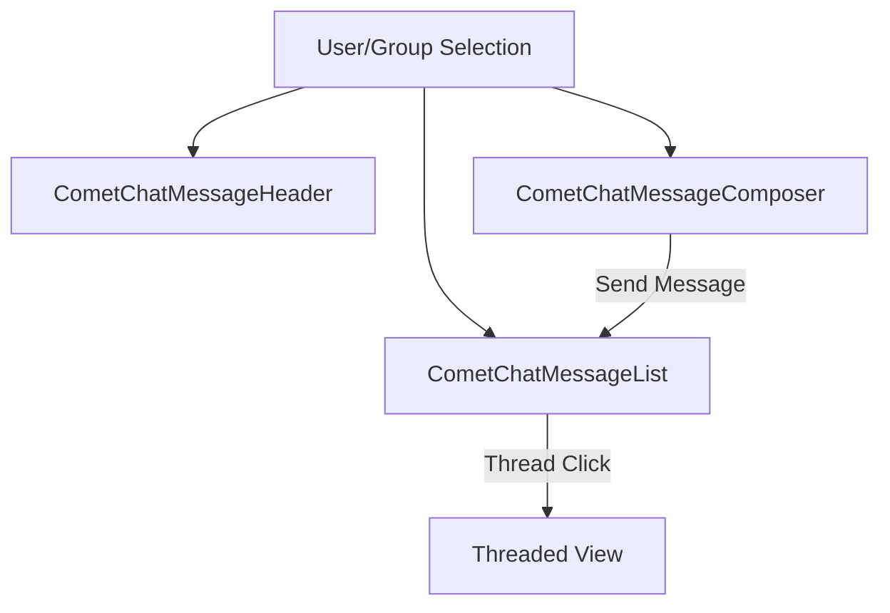

<Accordion title="AI Agent Component Spec">

| Field | Value |
| --- | --- |
| Package | `@cometchat/chat-uikit-react` |
| Combined Component | `CometChatMessages` — header, list, and composer in one |
| Header Component | `CometChatMessageHeader` — user/group info, call buttons |
| List Component | `CometChatMessageList` — scrollable message feed |
| Composer Component | `CometChatMessageComposer` — text input with attachments |
| Primary Output | `onSendButtonClick: (message: CometChat.BaseMessage) => void` |
| CSS Import | `@import url("@cometchat/chat-uikit-react/css-variables.css");` |
| CSS Root Classes | `.cometchat-message-header`, `.cometchat-message-list`, `.cometchat-message-composer` |

</Accordion>

## Overview

This guide shows you how to build messaging features in your React app. You'll learn to display messages, send text and media, handle reactions, and implement threaded conversations.

**Time estimate:** 20 minutes
**Difficulty:** Beginner

## Prerequisites

- [React.js Integration](/ui-kit/react/guides/getting-started/react-js) completed (CometChat initialized and user logged in)
- Basic familiarity with React hooks (`useState`, `useEffect`)

## Use Cases

The Messaging feature is ideal for:

- **One-on-one chat** — Direct messaging between two users
- **Group chat** — Multi-user conversations with shared message history
- **Support chat** — Customer service messaging with threaded replies
- **Collaborative apps** — Real-time messaging with media sharing and reactions

## Required Components

| Component | Purpose |
| --- | --- |
| `CometChatMessageHeader` | Displays user/group avatar, name, status, and call buttons |
| `CometChatMessageList` | Scrollable list of sent and received messages |
| `CometChatMessageComposer` | Rich text input for composing and sending messages |



## Steps

### Step 1: Basic Message View

Start with a complete message view for a user conversation:

```tsx title="MessageView.tsx"
import { useState, useEffect } from "react";
import { CometChat } from "@cometchat/chat-sdk-javascript";
import {
  CometChatMessageHeader,
  CometChatMessageList,
  CometChatMessageComposer,
} from "@cometchat/chat-uikit-react";
import "@cometchat/chat-uikit-react/css-variables.css";

function MessageView() {
  const [chatUser, setChatUser] = useState<CometChat.User>();

  useEffect(() => {
    // Replace "uid" with the actual user ID
    CometChat.getUser("uid").then((user) => setChatUser(user));
  }, []);

  if (!chatUser) return <div>Loading...</div>;

  return (
    <div style={{ height: "100vh", display: "flex", flexDirection: "column" }}>
      <CometChatMessageHeader user={chatUser} />
      <CometChatMessageList user={chatUser} />
      <CometChatMessageComposer user={chatUser} />
    </div>
  );
}

export default MessageView;
```

<Frame>
  
</Frame>

[](https://link.cometchat.com/react-one-on-one)

This renders:
- Header with user avatar, name, and online status
- Scrollable message list with text, media, and reactions
- Composer with text input, attachments, and emoji picker

### Step 2: Group Message View

For group conversations, pass a `group` prop instead of `user`:

```tsx title="GroupMessageView.tsx"
import { useState, useEffect } from "react";
import { CometChat } from "@cometchat/chat-sdk-javascript";
import {
  CometChatMessageHeader,
  CometChatMessageList,
  CometChatMessageComposer,
} from "@cometchat/chat-uikit-react";
import "@cometchat/chat-uikit-react/css-variables.css";

function GroupMessageView() {
  const [chatGroup, setChatGroup] = useState<CometChat.Group>();

  useEffect(() => {
    // Replace "guid" with the actual group ID
    CometChat.getGroup("guid").then((group) => setChatGroup(group));
  }, []);

  if (!chatGroup) return <div>Loading...</div>;

  return (
    <div style={{ height: "100vh", display: "flex", flexDirection: "column" }}>
      <CometChatMessageHeader group={chatGroup} />
      <CometChatMessageList group={chatGroup} />
      <CometChatMessageComposer group={chatGroup} />
    </div>
  );
}

export default GroupMessageView;
```

### Step 3: Sending Text Messages

The composer handles text message sending automatically. To customize the send behavior:

```tsx title="CustomSendMessage.tsx"
import { CometChat } from "@cometchat/chat-sdk-javascript";
import { CometChatMessageComposer } from "@cometchat/chat-uikit-react";

function CustomSendMessage({ user }: { user: CometChat.User }) {
  const handleSend = (message: CometChat.BaseMessage) => {
    console.log("Message sent:", message);
    // Add custom logic here (analytics, validation, etc.)
  };

  return (
    <CometChatMessageComposer
      user={user}
      onSendButtonClick={handleSend}
      placeholderText="Type your message..."
    />
  );
}
```

#### Track Text Input

Monitor what the user types in real-time:

```tsx
<CometChatMessageComposer
  user={user}
  onTextChange={(text: string) => {
    console.log("User is typing:", text);
  }}
/>
```

### Step 4: Sending Media Messages

The composer includes built-in attachment options for media:

```tsx title="MediaComposer.tsx"
import { CometChatMessageComposer } from "@cometchat/chat-uikit-react";
import { CometChat } from "@cometchat/chat-sdk-javascript";

function MediaComposer({ user }: { user: CometChat.User }) {
  return (
    <CometChatMessageComposer
      user={user}
      // All attachment options enabled by default
      // Hide specific options as needed:
      hideImageAttachmentOption={false}
      hideVideoAttachmentOption={false}
      hideAudioAttachmentOption={false}
      hideFileAttachmentOption={false}
    />
  );
}
```

<Frame>
  
</Frame>

#### Custom Attachment Options

Add custom attachment actions:

```tsx
import {
  CometChatMessageComposer,
  CometChatMessageComposerAction,
} from "@cometchat/chat-uikit-react";

function CustomAttachments({ user }: { user: CometChat.User }) {
  return (
    <CometChatMessageComposer
      user={user}
      attachmentOptions={[
        new CometChatMessageComposerAction({
          id: "location",
          title: "Share Location",
          iconURL: "location-icon-url",
          onClick: () => console.log("Share location"),
        }),
        new CometChatMessageComposerAction({
          id: "contact",
          title: "Share Contact",
          iconURL: "contact-icon-url",
          onClick: () => console.log("Share contact"),
        }),
      ]}
    />
  );
}
```

### Step 5: Message Reactions

Reactions are enabled by default. Handle reaction events:

```tsx title="ReactionsHandler.tsx"
import { CometChatMessageList } from "@cometchat/chat-uikit-react";
import { CometChat } from "@cometchat/chat-sdk-javascript";

function ReactionsHandler({ user }: { user: CometChat.User }) {
  return (
    <CometChatMessageList
      user={user}
      onReactionClick={(reaction: CometChat.ReactionCount, message: CometChat.BaseMessage) => {
        console.log("Reaction clicked:", reaction, "on message:", message.getId());
      }}
      onReactionListItemClick={(reaction: CometChat.Reaction, message: CometChat.BaseMessage) => {
        console.log("Reaction detail:", reaction, "on message:", message.getId());
      }}
    />
  );
}
```

#### Hide Reactions

To disable reactions entirely:

```tsx
<CometChatMessageList
  user={user}
  hideReactionOption={true}
/>
```

### Step 6: Threaded Messages

Enable threaded conversations by handling thread clicks:

```tsx title="ThreadedMessages.tsx"
import { useState } from "react";
import { CometChat } from "@cometchat/chat-sdk-javascript";
import {
  CometChatMessageHeader,
  CometChatMessageList,
  CometChatMessageComposer,
} from "@cometchat/chat-uikit-react";

function ThreadedMessages({ user }: { user: CometChat.User }) {
  const [parentMessage, setParentMessage] = useState<CometChat.BaseMessage>();

  if (parentMessage) {
    // Render threaded view
    return (
      <div style={{ height: "100vh", display: "flex", flexDirection: "column" }}>
        <div style={{ padding: 16, borderBottom: "1px solid #eee" }}>
          <button onClick={() => setParentMessage(undefined)}>← Back to main</button>
          <span style={{ marginLeft: 16 }}>Thread</span>
        </div>
        <CometChatMessageList
          user={user}
          parentMessageId={parentMessage.getId()}
        />
        <CometChatMessageComposer
          user={user}
          parentMessageId={parentMessage.getId()}
        />
      </div>
    );
  }

  // Render main message view
  return (
    <div style={{ height: "100vh", display: "flex", flexDirection: "column" }}>
      <CometChatMessageHeader user={user} />
      <CometChatMessageList
        user={user}
        onThreadRepliesClick={(message: CometChat.BaseMessage) => {
          setParentMessage(message);
        }}
      />
      <CometChatMessageComposer user={user} />
    </div>
  );
}

export default ThreadedMessages;
```

Key points:
- `onThreadRepliesClick` fires when a user clicks on thread reply count
- Pass `parentMessageId` to both `CometChatMessageList` and `CometChatMessageComposer` for threaded view
- Messages sent with `parentMessageId` become replies to that thread

## Complete Example

Here's a full implementation with user/group switching and threaded messages:

```tsx title="ChatMessaging.tsx"
import { useState, useEffect } from "react";
import { CometChat } from "@cometchat/chat-sdk-javascript";
import {
  CometChatMessageHeader,
  CometChatMessageList,
  CometChatMessageComposer,
} from "@cometchat/chat-uikit-react";
import "@cometchat/chat-uikit-react/css-variables.css";

interface ChatMessagingProps {
  userId?: string;
  groupId?: string;
}

function ChatMessaging({ userId, groupId }: ChatMessagingProps) {
  const [chatUser, setChatUser] = useState<CometChat.User>();
  const [chatGroup, setChatGroup] = useState<CometChat.Group>();
  const [parentMessage, setParentMessage] = useState<CometChat.BaseMessage>();

  useEffect(() => {
    if (userId) {
      CometChat.getUser(userId).then((user) => {
        setChatUser(user);
        setChatGroup(undefined);
        setParentMessage(undefined);
      });
    } else if (groupId) {
      CometChat.getGroup(groupId).then((group) => {
        setChatGroup(group);
        setChatUser(undefined);
        setParentMessage(undefined);
      });
    }
  }, [userId, groupId]);

  if (!chatUser && !chatGroup) {
    return <div style={{ padding: 40, textAlign: "center" }}>Select a user or group to start messaging</div>;
  }

  const handleThreadClick = (message: CometChat.BaseMessage) => {
    setParentMessage(message);
  };

  const handleBackToMain = () => {
    setParentMessage(undefined);
  };

  return (
    <div style={{ height: "100vh", display: "flex", flexDirection: "column" }}>
      {parentMessage ? (
        <>
          <div style={{ padding: "12px 16px", borderBottom: "1px solid #eee", display: "flex", alignItems: "center", gap: 12 }}>
            <button onClick={handleBackToMain} style={{ background: "none", border: "none", cursor: "pointer", fontSize: 16 }}>
              ← Back
            </button>
            <span>Thread</span>
          </div>
          <CometChatMessageList
            user={chatUser}
            group={chatGroup}
            parentMessageId={parentMessage.getId()}
          />
          <CometChatMessageComposer
            user={chatUser}
            group={chatGroup}
            parentMessageId={parentMessage.getId()}
          />
        </>
      ) : (
        <>
          <CometChatMessageHeader
            user={chatUser}
            group={chatGroup}
            showBackButton={true}
          />
          <CometChatMessageList
            user={chatUser}
            group={chatGroup}
            onThreadRepliesClick={handleThreadClick}
          />
          <CometChatMessageComposer
            user={chatUser}
            group={chatGroup}
          />
        </>
      )}
    </div>
  );
}

export default ChatMessaging;
```

<Accordion title="Customization Options">

### Custom Message Bubbles

Replace the default message bubble rendering using templates:

```tsx
import {
  CometChatMessageList,
  ChatConfigurator,
  CometChatActionsIcon,
} from "@cometchat/chat-uikit-react";

function CustomBubbles({ user }: { user: CometChat.User }) {
  const getTemplates = () => {
    const templates = ChatConfigurator.getDataSource().getAllMessageTemplates();
    templates.map((template) => {
      template.options = (loggedInUser, message, group) => {
        const defaults = ChatConfigurator.getDataSource().getMessageOptions(
          loggedInUser, message, group
        );
        defaults.push(
          new CometChatActionsIcon({
            id: "bookmark",
            title: "Bookmark",
            onClick: () => console.log("Bookmark message:", message.getId()),
          })
        );
        return defaults;
      };
    });
    return templates;
  };

  return <CometChatMessageList user={user} templates={getTemplates()} />;
}
```

### Custom Composer Actions

Replace the auxiliary button area:

```tsx
import { CometChatMessageComposer, CometChatButton } from "@cometchat/chat-uikit-react";

function CustomComposerActions({ user }: { user: CometChat.User }) {
  return (
    <CometChatMessageComposer
      user={user}
      auxiliaryButtonView={
        <CometChatButton
          iconURL="ai-icon-url"
          onClick={() => console.log("AI assist")}
        />
      }
    />
  );
}
```

### Message Templates

Customize how specific message types render. See [Message Template](/ui-kit/react/message-template) for full documentation.

### Event Handling

Listen to global message events:

```tsx
import { useEffect } from "react";
import { CometChatMessageEvents } from "@cometchat/chat-uikit-react";

function useMessageEvents() {
  useEffect(() => {
    const sentSub = CometChatMessageEvents.ccMessageSent.subscribe(
      (data) => console.log("Message sent:", data)
    );
    const editedSub = CometChatMessageEvents.ccMessageEdited.subscribe(
      (data) => console.log("Message edited:", data)
    );
    const deletedSub = CometChatMessageEvents.ccMessageDeleted.subscribe(
      (msg) => console.log("Message deleted:", msg)
    );

    return () => {
      sentSub?.unsubscribe();
      editedSub?.unsubscribe();
      deletedSub?.unsubscribe();
    };
  }, []);
}
```

| Event | Fires When |
| --- | --- |
| `ccMessageSent` | A message is sent |
| `ccMessageEdited` | A message is edited |
| `ccMessageDeleted` | A message is deleted |
| `ccMessageRead` | A message is read |
| `ccReplyToMessage` | User replies to a message |

</Accordion>

<Accordion title="CSS Customization">

### Key CSS Selectors

| Target | Selector |
| --- | --- |
| Message header root | `.cometchat-message-header` |
| Message list root | `.cometchat-message-list` |
| Message composer root | `.cometchat-message-composer` |
| Outgoing bubble | `.cometchat-message-bubble-outgoing` |
| Incoming bubble | `.cometchat-message-bubble-incoming` |
| Send button | `.cometchat-message-composer__send-button` |
| Thread replies | `.cometchat-message-bubble__thread-view-replies` |

### Example: Custom Bubble Colors

```css
.cometchat-message-bubble-outgoing {
  background: #6852d6;
}

.cometchat-message-bubble-incoming {
  background: #f5f5f5;
}

.cometchat-message-composer__send-button-active {
  background: #6852d6;
}
```

</Accordion>

## Common Issues

<Warning>
Components must not render until CometChat is initialized and the user is logged in. Gate rendering with state checks.
</Warning>

| Issue | Solution |
|-------|----------|
| Messages not loading | Ensure `user` or `group` prop is passed correctly; check console for errors |
| Send button not working | Verify `onSendButtonClick` callback doesn't prevent default behavior |
| Reactions not showing | Check `hideReactionOption` is not set to `true` |
| Thread view not opening | Ensure `onThreadRepliesClick` handler updates state correctly |
| Media attachments failing | Verify file size limits and supported formats |
| Typing indicator not showing | Check `disableTypingEvents` is not set to `true` on composer |

For more help, see the [Troubleshooting Guide](/ui-kit/react/troubleshooting) or contact [CometChat Support](https://help.cometchat.com/).

## Next Steps

<CardGroup cols={2}>
  <Card title="Conversations Guide" href="/ui-kit/react/guides/chat-features/conversations" icon="comments">
    Build a conversation list with messaging
  </Card>
  <Card title="Groups Guide" href="/ui-kit/react/guides/chat-features/groups" icon="users">
    Manage group conversations
  </Card>
  <Card title="Theming Guide" href="/ui-kit/react/guides/advanced/theming" icon="paintbrush">
    Customize colors, fonts, and styles
  </Card>
  <Card title="Voice/Video Calling" href="/ui-kit/react/guides/calling-features/voice-video" icon="video">
    Add calling to your chat app
  </Card>
</CardGroup>

## Related Guides

<CardGroup>
  <Card title="Message List Reference" href="/ui-kit/react/message-list" />
  <Card title="Message Composer Reference" href="/ui-kit/react/message-composer" />
  <Card title="Message Header Reference" href="/ui-kit/react/message-header" />
  <Card title="Message Template" href="/ui-kit/react/message-template" />
</CardGroup>
