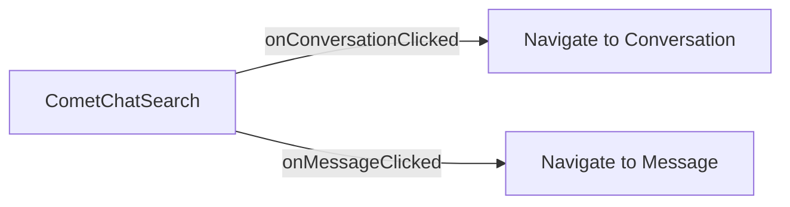

<Accordion title="AI Agent Component Spec">

| Field | Value |
| --- | --- |
| Package | `@cometchat/chat-uikit-react` |
| Primary Component | `CometChatSearch` — dual-scope search across conversations and messages |
| Primary Output | `onConversationClicked`, `onMessageClicked` callbacks |
| CSS Import | `@import url("@cometchat/chat-uikit-react/css-variables.css");` |
| CSS Root Class | `.cometchat-search` |
| Search Scopes | `CometChatSearchScope.Conversations`, `CometChatSearchScope.Messages` |

</Accordion>

## Overview

This guide shows you how to build search functionality in your React app. You'll learn to search across conversations and messages, apply filters, scope searches to specific users or groups, and handle search result navigation.

**Time estimate:** 15 minutes
**Difficulty:** Beginner

## Prerequisites

- [React.js Integration](/ui-kit/react/guides/getting-started/react-js) completed (CometChat initialized and user logged in)
- Basic familiarity with React hooks (`useState`)

## Use Cases

The Search feature is ideal for:

- **Finding conversations** — Quickly locate specific chats by name or content
- **Message search** — Find specific messages across all conversations
- **Media discovery** — Search for photos, videos, documents, and links
- **Contextual search** — Search within a specific user or group conversation

## Required Components

| Component | Purpose |
| --- | --- |
| `CometChatSearch` | Unified search panel with filters and results |



## Steps

### Step 1: Basic Search Panel

Start with a simple search panel that searches across all conversations and messages:

```tsx title="SearchPanel.tsx"
import { CometChatSearch } from "@cometchat/chat-uikit-react";
import "@cometchat/chat-uikit-react/css-variables.css";

function SearchPanel() {
  return (
    <div style={{ width: "100%", height: "100vh" }}>
      <CometChatSearch />
    </div>
  );
}

export default SearchPanel;
```

<Frame>
  
</Frame>

This renders a search interface with:
- Search input with auto-focus
- Filter chips (Messages, Conversations, Unread, Groups, Photos, Videos, etc.)
- Conversation results section
- Message results section
- Keyword highlighting in results

### Step 2: Handle Search Results

Wire up callbacks to navigate when users click on search results:

```tsx title="SearchWithNavigation.tsx"
import { useState } from "react";
import { CometChatSearch } from "@cometchat/chat-uikit-react";
import { CometChat } from "@cometchat/chat-sdk-javascript";
import "@cometchat/chat-uikit-react/css-variables.css";

function SearchWithNavigation() {
  const [selectedConversation, setSelectedConversation] = useState<CometChat.Conversation>();
  const [selectedMessage, setSelectedMessage] = useState<CometChat.BaseMessage>();

  const handleConversationClicked = (
    conversation: CometChat.Conversation,
    searchKeyword?: string
  ) => {
    console.log("Navigate to conversation:", conversation.getConversationId());
    console.log("Search keyword:", searchKeyword);
    setSelectedConversation(conversation);
  };

  const handleMessageClicked = (
    message: CometChat.BaseMessage,
    searchKeyword?: string
  ) => {
    console.log("Navigate to message:", message.getId());
    console.log("Search keyword:", searchKeyword);
    setSelectedMessage(message);
  };

  return (
    <div style={{ width: "100%", height: "100vh" }}>
      <CometChatSearch
        onConversationClicked={handleConversationClicked}
        onMessageClicked={handleMessageClicked}
      />
    </div>
  );
}

export default SearchWithNavigation;
```

The `searchKeyword` parameter is passed to callbacks so you can highlight the search term in the destination view.

### Step 3: Control Search Scope

Limit what gets searched using `searchIn` with `CometChatSearchScope`:

```tsx title="MessagesOnlySearch.tsx"
import {
  CometChatSearch,
  CometChatSearchScope,
} from "@cometchat/chat-uikit-react";

function MessagesOnlySearch() {
  return (
    <CometChatSearch
      searchIn={[CometChatSearchScope.Messages]}
    />
  );
}
```

Available scopes:
- `CometChatSearchScope.Conversations` — Search conversation names only
- `CometChatSearchScope.Messages` — Search message content only

### Step 4: Control Filter Chips

Customize which filter chips appear using `searchFilters`:

```tsx title="MediaSearch.tsx"
import {
  CometChatSearch,
  CometChatSearchFilter,
} from "@cometchat/chat-uikit-react";

function MediaSearch() {
  return (
    <CometChatSearch
      searchFilters={[
        CometChatSearchFilter.Photos,
        CometChatSearchFilter.Videos,
        CometChatSearchFilter.Documents,
        CometChatSearchFilter.Audio,
      ]}
      initialSearchFilter={CometChatSearchFilter.Photos}
    />
  );
}
```

Available filters:

| Filter | Description |
| --- | --- |
| `CometChatSearchFilter.Messages` | All text messages |
| `CometChatSearchFilter.Conversations` | Conversation names |
| `CometChatSearchFilter.Unread` | Unread conversations |
| `CometChatSearchFilter.Groups` | Group conversations |
| `CometChatSearchFilter.Photos` | Image attachments |
| `CometChatSearchFilter.Videos` | Video attachments |
| `CometChatSearchFilter.Links` | URLs in messages |
| `CometChatSearchFilter.Documents` | File attachments |
| `CometChatSearchFilter.Audio` | Audio attachments |

### Step 5: Scoped Search (User or Group)

Limit search to a specific conversation using `uid` or `guid`:

```tsx title="UserScopedSearch.tsx"
import { CometChatSearch } from "@cometchat/chat-uikit-react";

// Search within a specific user's conversation
function UserScopedSearch({ userId }: { userId: string }) {
  return <CometChatSearch uid={userId} />;
}

// Search within a specific group's conversation
function GroupScopedSearch({ groupId }: { groupId: string }) {
  return <CometChatSearch guid={groupId} />;
}
```

<Note>
When `uid` or `guid` is set, search results are limited to messages within that specific conversation.
</Note>

### Step 6: Custom Request Builders

Fine-tune search queries using SDK request builders:

```tsx title="CustomBuilderSearch.tsx"
import { CometChat } from "@cometchat/chat-sdk-javascript";
import { CometChatSearch } from "@cometchat/chat-uikit-react";

function CustomBuilderSearch() {
  return (
    <CometChatSearch
      conversationsRequestBuilder={
        new CometChat.ConversationsRequestBuilder()
          .setLimit(5)
      }
      messagesRequestBuilder={
        new CometChat.MessagesRequestBuilder()
          .setLimit(10)
          .setCategories(["message"])
          .setTypes(["text"])
      }
    />
  );
}
```

### Step 7: Integrate with Chat Layout

Add search to your chat application layout:

```tsx title="ChatWithSearch.tsx"
import { useState } from "react";
import {
  CometChatSearch,
  CometChatConversationsWithMessages,
} from "@cometchat/chat-uikit-react";
import { CometChat } from "@cometchat/chat-sdk-javascript";
import "@cometchat/chat-uikit-react/css-variables.css";

function ChatWithSearch() {
  const [showSearch, setShowSearch] = useState(false);
  const [activeConversation, setActiveConversation] = useState<CometChat.Conversation>();

  const handleConversationClicked = (
    conversation: CometChat.Conversation,
    searchKeyword?: string
  ) => {
    setActiveConversation(conversation);
    setShowSearch(false);
  };

  const handleMessageClicked = (
    message: CometChat.BaseMessage,
    searchKeyword?: string
  ) => {
    // Navigate to the message's conversation
    // You may need to fetch the conversation from the message
    console.log("Navigate to message:", message.getId());
    setShowSearch(false);
  };

  return (
    <div style={{ width: "100vw", height: "100vh" }}>
      {showSearch ? (
        <CometChatSearch
          onConversationClicked={handleConversationClicked}
          onMessageClicked={handleMessageClicked}
          onBack={() => setShowSearch(false)}
        />
      ) : (
        <div>
          <button onClick={() => setShowSearch(true)}>
            🔍 Search
          </button>
          <CometChatConversationsWithMessages />
        </div>
      )}
    </div>
  );
}

export default ChatWithSearch;
```

## Complete Example

Here's a full implementation with search integrated into a chat layout:

```tsx title="SearchIntegration.tsx"
import { useState } from "react";
import {
  CometChatSearch,
  CometChatSearchFilter,
  CometChatConversations,
  CometChatMessageHeader,
  CometChatMessageList,
  CometChatMessageComposer,
} from "@cometchat/chat-uikit-react";
import { CometChat } from "@cometchat/chat-sdk-javascript";
import "@cometchat/chat-uikit-react/css-variables.css";

function SearchIntegration() {
  const [showSearch, setShowSearch] = useState(false);
  const [selectedConversation, setSelectedConversation] = useState<CometChat.Conversation>();

  const handleConversationClicked = (
    conversation: CometChat.Conversation,
    searchKeyword?: string
  ) => {
    setSelectedConversation(conversation);
    setShowSearch(false);
  };

  const handleMessageClicked = async (
    message: CometChat.BaseMessage,
    searchKeyword?: string
  ) => {
    // Get the conversation for this message
    const receiverId = message.getReceiverId();
    const receiverType = message.getReceiverType();
    
    try {
      const conversation = await CometChat.getConversation(
        receiverId,
        receiverType
      );
      setSelectedConversation(conversation);
      setShowSearch(false);
    } catch (error) {
      console.error("Failed to get conversation:", error);
    }
  };

  // Extract user or group from conversation
  const getConversationWith = () => {
    if (!selectedConversation) return null;
    const type = selectedConversation.getConversationType();
    if (type === "user") {
      return { user: selectedConversation.getConversationWith() as CometChat.User };
    }
    return { group: selectedConversation.getConversationWith() as CometChat.Group };
  };

  const conversationWith = getConversationWith();

  if (showSearch) {
    return (
      <div style={{ width: "100vw", height: "100vh" }}>
        <CometChatSearch
          onConversationClicked={handleConversationClicked}
          onMessageClicked={handleMessageClicked}
          onBack={() => setShowSearch(false)}
          searchFilters={[
            CometChatSearchFilter.Messages,
            CometChatSearchFilter.Conversations,
            CometChatSearchFilter.Photos,
            CometChatSearchFilter.Videos,
            CometChatSearchFilter.Documents,
          ]}
        />
      </div>
    );
  }

  return (
    <div style={{ display: "flex", height: "100vh", width: "100vw" }}>
      {/* Conversations Panel */}
      <div style={{ width: 400, height: "100%", borderRight: "1px solid #eee" }}>
        <div style={{ padding: "8px 16px", borderBottom: "1px solid #eee" }}>
          <button
            onClick={() => setShowSearch(true)}
            style={{
              width: "100%",
              padding: "8px 12px",
              border: "1px solid #ddd",
              borderRadius: 8,
              background: "#f5f5f5",
              cursor: "pointer",
              textAlign: "left",
              color: "#727272",
            }}
          >
            🔍 Search messages and conversations...
          </button>
        </div>
        <CometChatConversations
          onItemClick={(conversation) => setSelectedConversation(conversation)}
          activeConversation={selectedConversation}
        />
      </div>

      {/* Message Panel */}
      {conversationWith ? (
        <div style={{ flex: 1, display: "flex", flexDirection: "column" }}>
          <CometChatMessageHeader {...conversationWith} />
          <CometChatMessageList {...conversationWith} />
          <CometChatMessageComposer {...conversationWith} />
        </div>
      ) : (
        <div style={{ flex: 1, display: "grid", placeItems: "center", background: "#f5f5f5", color: "#727272" }}>
          Select a conversation to start messaging
        </div>
      )}
    </div>
  );
}

export default SearchIntegration;
```

<Accordion title="Customization Options">

### Custom Message Item View

Replace how message results are displayed:

```tsx
import { CometChatSearch } from "@cometchat/chat-uikit-react";
import { CometChat } from "@cometchat/chat-sdk-javascript";

function CustomMessageItemSearch() {
  const getMessageItemView = (message: CometChat.BaseMessage) => (
    <div style={{ padding: "8px 16px", borderBottom: "1px solid #eee" }}>
      <div style={{ fontWeight: 500 }}>
        {message.getSender()?.getName()}
      </div>
      <div style={{ color: "#727272", fontSize: 14 }}>
        {message instanceof CometChat.TextMessage
          ? (message as CometChat.TextMessage).getText()
          : message.getType()}
      </div>
    </div>
  );

  return <CometChatSearch messageItemView={getMessageItemView} />;
}
```

### Custom Conversation Item View

Replace how conversation results are displayed:

```tsx
import { CometChatSearch } from "@cometchat/chat-uikit-react";
import { CometChat } from "@cometchat/chat-sdk-javascript";

function CustomConversationItemSearch() {
  const getConversationItemView = (conversation: CometChat.Conversation) => {
    const conversationWith = conversation.getConversationWith();
    const name = conversationWith instanceof CometChat.User
      ? conversationWith.getName()
      : (conversationWith as CometChat.Group).getName();

    return (
      <div style={{ padding: "8px 16px", borderBottom: "1px solid #eee" }}>
        <div style={{ fontWeight: 500 }}>{name}</div>
        <div style={{ color: "#727272", fontSize: 12 }}>
          {conversation.getConversationType()}
        </div>
      </div>
    );
  };

  return <CometChatSearch conversationItemView={getConversationItemView} />;
}
```

### Custom Empty State

Show a custom message when no results are found:

```tsx
import { CometChatSearch } from "@cometchat/chat-uikit-react";

function CustomEmptySearch() {
  return (
    <CometChatSearch
      emptyView={
        <div style={{ textAlign: "center", padding: 40 }}>
          <p style={{ fontSize: 48 }}>🔍</p>
          <p style={{ fontWeight: 500 }}>No results found</p>
          <p style={{ color: "#727272" }}>Try a different search term</p>
        </div>
      }
    />
  );
}
```

### Visibility Options

Control which UI elements are visible:

```tsx
import { CometChatSearch } from "@cometchat/chat-uikit-react";

function MinimalSearch() {
  return (
    <CometChatSearch
      hideBackButton={true}      // Hide back button
      hideUserStatus={true}      // Hide online/offline indicators
      hideGroupType={true}       // Hide group type icons
      hideReceipts={true}        // Hide read/delivery receipts
    />
  );
}
```

</Accordion>

<Accordion title="CSS Customization">

### Key CSS Selectors

| Target | Selector |
| --- | --- |
| Search root | `.cometchat-search` |
| Header | `.cometchat-search__header` |
| Search input | `.cometchat-search__input` |
| Back button | `.cometchat-search__back-button` |
| Filter bar | `.cometchat-search__body-filters` |
| Filter chip | `.cometchat-search__body-filter` |
| Active filter | `.cometchat-search__body-filter-active` |
| Conversations section | `.cometchat-search__conversations` |
| Messages section | `.cometchat-search__messages` |
| Message list item | `.cometchat-search-messages__list-item` |
| Text highlight | `.cometchat-search .cometchat-text-highlight` |
| Empty view | `.cometchat-search__empty-view` |

### Example: Brand-Themed Search

```css
.cometchat-search__header {
  background-color: #6852d6;
}

.cometchat-search__back-button .cometchat-button .cometchat-button__icon {
  background: white;
}

.cometchat-search__body-filter-active {
  background-color: #6852d6;
  color: white;
}

.cometchat-search .cometchat-text-highlight {
  background-color: #edeafa;
  color: #6852d6;
  font-weight: 600;
}
```

</Accordion>

## Common Issues

<Warning>
Components must not render until CometChat is initialized and the user is logged in. Gate rendering with state checks.
</Warning>

| Issue | Solution |
|-------|----------|
| No search results | Ensure messages exist in the app; check search keyword spelling |
| Filters not showing | Verify `searchFilters` array contains valid `CometChatSearchFilter` values |
| Scoped search not working | Ensure `uid` or `guid` matches an existing user/group |
| Callbacks not firing | Verify `onConversationClicked` and `onMessageClicked` are passed correctly |
| Styles missing | Add `@import url("@cometchat/chat-uikit-react/css-variables.css");` to global CSS |

For more help, see the [Troubleshooting Guide](/ui-kit/react/troubleshooting) or contact [CometChat Support](https://help.cometchat.com/).

## Next Steps

<CardGroup cols={2}>
  <Card title="Conversations Guide" href="/ui-kit/react/guides/chat-features/conversations" icon="comments">
    Build a conversation list with messaging
  </Card>
  <Card title="Messaging Guide" href="/ui-kit/react/guides/chat-features/messaging" icon="message">
    Customize message sending and display
  </Card>
  <Card title="Users Guide" href="/ui-kit/react/guides/chat-features/users" icon="user">
    Build user list features
  </Card>
  <Card title="Groups Guide" href="/ui-kit/react/guides/chat-features/groups" icon="users">
    Build group chat features
  </Card>
</CardGroup>

## Related Guides

<CardGroup>
  <Card title="Search Component Reference" href="/ui-kit/react/search" />
  <Card title="Conversations Reference" href="/ui-kit/react/conversations" />
  <Card title="Message List Reference" href="/ui-kit/react/message-list" />
</CardGroup>
