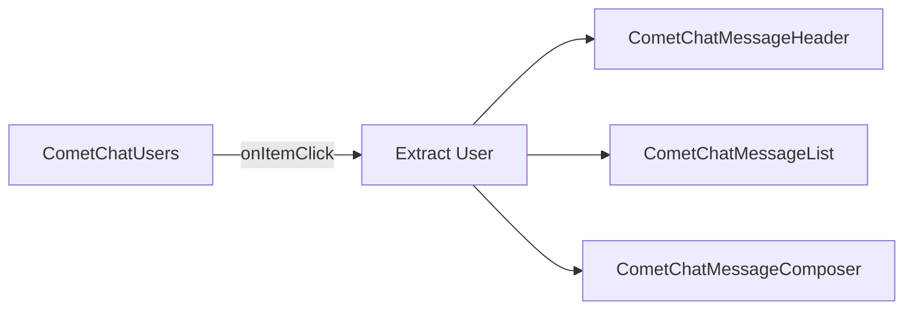

<Accordion title="AI Agent Component Spec">

| Field | Value |
| --- | --- |
| Package | `@cometchat/chat-uikit-react` |
| Primary Component | `CometChatUsers` — scrollable list of available users |
| Combined Component | `CometChatUsersWithMessages` — two-panel layout with users + messages |
| Primary Output | `onItemClick: (user: CometChat.User) => void` |
| CSS Import | `@import url("@cometchat/chat-uikit-react/css-variables.css");` |
| CSS Root Class | `.cometchat-users` |
| Filtering | `usersRequestBuilder` prop accepts `CometChat.UsersRequestBuilder` |

</Accordion>

## Overview

This guide shows you how to build user list features in your React app. You'll learn to display contact lists, show online/offline presence, handle user selection, and implement blocking functionality.

**Time estimate:** 15 minutes
**Difficulty:** Beginner

## Prerequisites

- [React.js Integration](/ui-kit/react/guides/getting-started/react-js) completed (CometChat initialized and user logged in)
- Basic familiarity with React hooks (`useState`)

## Use Cases

The Users feature is ideal for:

- **Contact lists** — Display all available users for direct messaging
- **Friend lists** — Show only friends or connections
- **User directories** — Browse and search through organization members
- **Presence awareness** — Show who's online and available to chat

## Required Components

| Component | Purpose |
| --- | --- |
| `CometChatUsers` | Scrollable list of available users with search |
| `CometChatUsersWithMessages` | Pre-built two-panel layout (users + messages) |



## Steps

### Step 1: Basic User List

Start with a simple user list that displays all available users:

```tsx title="UserList.tsx"
import { CometChatUsers } from "@cometchat/chat-uikit-react";
import "@cometchat/chat-uikit-react/css-variables.css";

function UserList() {
  return (
    <div style={{ width: "100%", height: "100vh" }}>
      <CometChatUsers />
    </div>
  );
}

export default UserList;
```

<Frame>
  
</Frame>

This renders a scrollable list with:
- User avatars and names
- Online/offline status indicators
- Alphabetical section headers (A, B, C...)
- Built-in search functionality

### Step 2: Two-Panel Layout (Quick Start)

For a complete chat experience with minimal code, use `CometChatUsersWithMessages`:

```tsx title="UserChatApp.tsx"
import { CometChatUsersWithMessages } from "@cometchat/chat-uikit-react";
import "@cometchat/chat-uikit-react/css-variables.css";

function UserChatApp() {
  return (
    <div style={{ width: "100vw", height: "100vh" }}>
      <CometChatUsersWithMessages />
    </div>
  );
}

export default UserChatApp;
```

This component handles:
- User list rendering
- User selection
- Message view switching
- Real-time presence updates

### Step 3: Custom Two-Panel Layout

For more control, build your own two-panel layout using individual components:

```tsx title="CustomUserLayout.tsx"
import { useState } from "react";
import {
  CometChatUsers,
  CometChatMessageHeader,
  CometChatMessageList,
  CometChatMessageComposer,
} from "@cometchat/chat-uikit-react";
import { CometChat } from "@cometchat/chat-sdk-javascript";
import "@cometchat/chat-uikit-react/css-variables.css";

function CustomUserLayout() {
  const [selectedUser, setSelectedUser] = useState<CometChat.User>();

  return (
    <div style={{ display: "flex", height: "100vh", width: "100vw" }}>
      {/* User List Panel */}
      <div style={{ width: 400, height: "100%", borderRight: "1px solid #eee" }}>
        <CometChatUsers
          onItemClick={(user: CometChat.User) => setSelectedUser(user)}
        />
      </div>

      {/* Message Panel */}
      {selectedUser ? (
        <div style={{ flex: 1, display: "flex", flexDirection: "column" }}>
          <CometChatMessageHeader user={selectedUser} />
          <CometChatMessageList user={selectedUser} />
          <CometChatMessageComposer user={selectedUser} />
        </div>
      ) : (
        <div style={{ flex: 1, display: "grid", placeItems: "center", background: "#f5f5f5", color: "#727272" }}>
          Select a user to start messaging
        </div>
      )}
    </div>
  );
}

export default CustomUserLayout;
```

### Step 4: Filtering Users

Use `UsersRequestBuilder` to filter which users appear:

```tsx title="FilteredUsers.tsx"
import { CometChatUsers } from "@cometchat/chat-uikit-react";
import { CometChat } from "@cometchat/chat-sdk-javascript";

function FilteredUsers() {
  return (
    <CometChatUsers
      usersRequestBuilder={
        new CometChat.UsersRequestBuilder()
          .friendsOnly(true)  // Only show friends
          .setLimit(20)       // Limit to 20 per page
      }
    />
  );
}
```

<Note>
Pass the builder instance directly — not the result of `.build()`. The component calls `.build()` internally.
</Note>

#### Common Filter Recipes

| Filter | Code |
| --- | --- |
| Friends only | `new CometChat.UsersRequestBuilder().friendsOnly(true)` |
| Online users only | `new CometChat.UsersRequestBuilder().setStatus("online")` |
| Limit results per page | `new CometChat.UsersRequestBuilder().setLimit(15)` |
| Search by keyword | `new CometChat.UsersRequestBuilder().setSearchKeyword("alice")` |
| Hide blocked users | `new CometChat.UsersRequestBuilder().hideBlockedUsers(true)` |
| Filter by roles | `new CometChat.UsersRequestBuilder().setRoles(["admin", "moderator"])` |
| Filter by tags | `new CometChat.UsersRequestBuilder().setTags(["vip"])` |
| Specific UIDs | `new CometChat.UsersRequestBuilder().setUIDs(["uid1", "uid2"])` |

See [UsersRequestBuilder](/sdk/javascript/retrieve-users) for the full API.

### Step 5: Multi-Select Users

Enable user selection for batch operations like creating group chats:

```tsx title="MultiSelectUsers.tsx"
import { useState } from "react";
import {
  CometChatUsers,
  SelectionMode,
} from "@cometchat/chat-uikit-react";
import { CometChat } from "@cometchat/chat-sdk-javascript";

function MultiSelectUsers() {
  const [selectedUsers, setSelectedUsers] = useState<Set<string>>(new Set());

  const handleSelect = (user: CometChat.User, isSelected: boolean) => {
    setSelectedUsers((prev) => {
      const next = new Set(prev);
      const uid = user.getUid();
      isSelected ? next.add(uid) : next.delete(uid);
      return next;
    });
  };

  return (
    <div>
      <CometChatUsers
        selectionMode={SelectionMode.multiple}
        showSelectedUsersPreview={true}
        onSelect={handleSelect}
      />
      <div style={{ padding: 16 }}>
        Selected: {selectedUsers.size} users
      </div>
    </div>
  );
}

export default MultiSelectUsers;
```

Selection modes:
- `SelectionMode.none` — Default, no checkboxes
- `SelectionMode.single` — Single selection with radio buttons
- `SelectionMode.multiple` — Multi-select with checkboxes

### Step 6: Blocking and Unblocking Users

Implement user blocking functionality:

```tsx title="BlockUser.tsx"
import { CometChat } from "@cometchat/chat-sdk-javascript";
import { CometChatUserEvents } from "@cometchat/chat-uikit-react";

async function blockUser(uid: string) {
  try {
    await CometChat.blockUsers([uid]);
    
    // Fetch the blocked user to emit the event
    const user = await CometChat.getUser(uid);
    CometChatUserEvents.ccUserBlocked.next(user);
    
    console.log("User blocked successfully");
  } catch (error) {
    console.error("Failed to block user:", error);
  }
}

async function unblockUser(uid: string) {
  try {
    await CometChat.unblockUsers([uid]);
    
    // Fetch the unblocked user to emit the event
    const user = await CometChat.getUser(uid);
    CometChatUserEvents.ccUserUnblocked.next(user);
    
    console.log("User unblocked successfully");
  } catch (error) {
    console.error("Failed to unblock user:", error);
  }
}

// Usage
// blockUser("user_uid");
// unblockUser("user_uid");
```

### Step 7: Custom Context Menu Options

Add custom actions to the user list items:

```tsx title="CustomOptionsUsers.tsx"
import {
  CometChatUsers,
  CometChatOption,
} from "@cometchat/chat-uikit-react";
import { CometChat } from "@cometchat/chat-sdk-javascript";

function CustomOptionsUsers() {
  const getOptions = (user: CometChat.User) => [
    new CometChatOption({
      id: "message",
      title: "Send Message",
      onClick: () => console.log("Message", user.getName()),
    }),
    new CometChatOption({
      id: "call",
      title: "Start Call",
      onClick: () => console.log("Call", user.getName()),
    }),
    new CometChatOption({
      id: "block",
      title: "Block User",
      onClick: () => console.log("Block", user.getUid()),
    }),
  ];

  return <CometChatUsers options={getOptions} />;
}

export default CustomOptionsUsers;
```

<Frame>
  
</Frame>

## Complete Example

Here's a full implementation with user list, selection, and messaging:

```tsx title="UserChatComplete.tsx"
import { useState } from "react";
import {
  CometChatUsers,
  CometChatMessageHeader,
  CometChatMessageList,
  CometChatMessageComposer,
  CometChatOption,
} from "@cometchat/chat-uikit-react";
import { CometChat } from "@cometchat/chat-sdk-javascript";
import "@cometchat/chat-uikit-react/css-variables.css";

function UserChatComplete() {
  const [selectedUser, setSelectedUser] = useState<CometChat.User>();

  const handleUserClick = (user: CometChat.User) => {
    setSelectedUser(user);
  };

  const getOptions = (user: CometChat.User) => [
    new CometChatOption({
      id: "view-profile",
      title: "View Profile",
      onClick: () => console.log("View profile:", user.getName()),
    }),
    new CometChatOption({
      id: "block",
      title: "Block User",
      onClick: async () => {
        await CometChat.blockUsers([user.getUid()]);
        console.log("Blocked:", user.getName());
      },
    }),
  ];

  return (
    <div style={{ display: "flex", height: "100vh", width: "100vw" }}>
      {/* User List Panel */}
      <div style={{ width: 400, height: "100%", borderRight: "1px solid #eee" }}>
        <CometChatUsers
          onItemClick={handleUserClick}
          activeUser={selectedUser}
          options={getOptions}
          usersRequestBuilder={
            new CometChat.UsersRequestBuilder()
              .hideBlockedUsers(true)
              .setLimit(30)
          }
        />
      </div>

      {/* Message Panel */}
      {selectedUser ? (
        <div style={{ flex: 1, display: "flex", flexDirection: "column" }}>
          <CometChatMessageHeader user={selectedUser} />
          <CometChatMessageList user={selectedUser} />
          <CometChatMessageComposer user={selectedUser} />
        </div>
      ) : (
        <div style={{ flex: 1, display: "grid", placeItems: "center", background: "#f5f5f5", color: "#727272" }}>
          Select a user to start messaging
        </div>
      )}
    </div>
  );
}

export default UserChatComplete;
```

<Accordion title="Customization Options">

### Custom User List Items

Replace the entire user list item:

```tsx
import { CometChatUsers, CometChatListItem } from "@cometchat/chat-uikit-react";
import { CometChat } from "@cometchat/chat-sdk-javascript";

function CustomItemUsers() {
  const getItemView = (user: CometChat.User) => {
    const status = user.getStatus();

    return (
      <div
        className={`cometchat-users__list-item cometchat-users__list-item-${status}
          ${status === "online" ? `cometchat-users__list-item-active` : ""}
        `}
      >
        <CometChatListItem
          title={user.getName()}
          subtitleView={status}
          avatarURL={user.getAvatar()}
          avatarName={user.getName()}
        />
      </div>
    );
  };

  return <CometChatUsers itemView={getItemView} />;
}
```

### Custom Header

Replace the header bar:

```tsx
import { CometChatUsers, CometChatButton, getLocalizedString } from "@cometchat/chat-uikit-react";

function CustomHeaderUsers() {
  return (
    <CometChatUsers
      headerView={
        <div style={{ display: "flex", padding: "8px 16px", justifyContent: "space-between", alignItems: "center" }}>
          <h2>{getLocalizedString("user_title")}</h2>
          <CometChatButton onClick={() => console.log("Add user")} />
        </div>
      }
    />
  );
}
```

### Visibility Options

Control which UI elements are visible:

```tsx
import { CometChatUsers } from "@cometchat/chat-uikit-react";

function MinimalUsers() {
  return (
    <CometChatUsers
      hideSearch={true}           // Hide search bar
      hideUserStatus={true}       // Hide online/offline indicators
      showSectionHeader={false}   // Hide alphabetical headers
      showScrollbar={true}        // Show scrollbar
    />
  );
}
```

### Custom Subtitle View

Show additional user information:

```tsx
import { CometChatUsers } from "@cometchat/chat-uikit-react";
import { CometChat } from "@cometchat/chat-sdk-javascript";

function SubtitleViewUsers() {
  const getSubtitleView = (user: CometChat.User) => {
    return (
      <div style={{ fontSize: 12, color: "#727272" }}>
        Last Active: {new Date(user.getLastActiveAt() * 1000).toLocaleString()}
      </div>
    );
  };

  return <CometChatUsers subtitleView={getSubtitleView} />;
}
```

</Accordion>

<Accordion title="Event Handling">

### User Events

Listen to user events for real-time updates:

```tsx
import { useEffect } from "react";
import { CometChatUserEvents } from "@cometchat/chat-uikit-react";
import { CometChat } from "@cometchat/chat-sdk-javascript";

function useUserEvents() {
  useEffect(() => {
    const blockedSub = CometChatUserEvents.ccUserBlocked.subscribe(
      (user: CometChat.User) => {
        console.log("User blocked:", user.getName());
      }
    );

    const unblockedSub = CometChatUserEvents.ccUserUnblocked.subscribe(
      (user: CometChat.User) => {
        console.log("User unblocked:", user.getName());
      }
    );

    return () => {
      blockedSub?.unsubscribe();
      unblockedSub?.unsubscribe();
    };
  }, []);
}
```

| Event | Fires When |
| --- | --- |
| `ccUserBlocked` | A user is blocked |
| `ccUserUnblocked` | A user is unblocked |

### SDK Listeners (Automatic)

The component automatically listens to these SDK events:

| SDK Listener | Internal Behavior |
| --- | --- |
| `onUserOnline` | Updates the user's status dot to online |
| `onUserOffline` | Updates the user's status dot to offline |

</Accordion>

<Accordion title="CSS Customization">

### Key CSS Selectors

| Target | Selector |
| --- | --- |
| Users root | `.cometchat-users` |
| Header title | `.cometchat-users .cometchat-list__header-title` |
| List item | `.cometchat-users__list-item` |
| Avatar | `.cometchat-users__list-item .cometchat-avatar` |
| Active item | `.cometchat-users__list-item-active .cometchat-list-item` |
| Online status | `.cometchat-users__list-item-online .cometchat-list-item__status` |
| Empty state | `.cometchat-users__empty-state-view` |
| Selected preview | `.cometchat-users__selected-preview` |

### Example: Brand-Themed Users

```css
.cometchat .cometchat-users .cometchat-list__header-title {
  background-color: #edeafa;
  color: #6852d6;
  border-bottom: 2px solid #6852d6;
}

.cometchat .cometchat-users__list-item .cometchat-avatar {
  background-color: #aa9ee8;
  border-radius: 8px;
}

.cometchat .cometchat-users .cometchat-list-item__body-title {
  font-weight: 500;
}
```

<Frame>
  
</Frame>

</Accordion>

## Common Issues

<Warning>
Components must not render until CometChat is initialized and the user is logged in. Gate rendering with state checks.
</Warning>

| Issue | Solution |
|-------|----------|
| Blank user list | Ensure `CometChatUIKit.init()` and `login()` complete before rendering |
| `onItemClick` not firing | Verify the callback is passed correctly; check for JavaScript errors in console |
| Status indicators not updating | SDK listeners are automatic; ensure WebSocket connection is active |
| Filter not working | Pass the builder instance, not `.build()` result |
| Selection not working | Ensure `selectionMode` is set to `single` or `multiple` |
| Blocked users still showing | Use `hideBlockedUsers(true)` in the request builder |
| Styles missing | Add `@import url("@cometchat/chat-uikit-react/css-variables.css");` to global CSS |

For more help, see the [Troubleshooting Guide](/ui-kit/react/troubleshooting) or contact [CometChat Support](https://help.cometchat.com/).

## Next Steps

<CardGroup cols={2}>
  <Card title="Conversations Guide" href="/ui-kit/react/guides/chat-features/conversations" icon="comments">
    Build a conversation list with messaging
  </Card>
  <Card title="Messaging Guide" href="/ui-kit/react/guides/chat-features/messaging" icon="message">
    Customize message sending and display
  </Card>
  <Card title="Groups Guide" href="/ui-kit/react/guides/chat-features/groups" icon="users">
    Build group chat features
  </Card>
  <Card title="Theming Guide" href="/ui-kit/react/guides/advanced/theming" icon="paintbrush">
    Customize colors, fonts, and styles
  </Card>
</CardGroup>

## Related Guides

<CardGroup>
  <Card title="Users Component Reference" href="/ui-kit/react/users" />
  <Card title="Search Guide" href="/ui-kit/react/guides/chat-features/search" />
  <Card title="Voice/Video Calling" href="/ui-kit/react/guides/calling-features/voice-video" />
</CardGroup>
